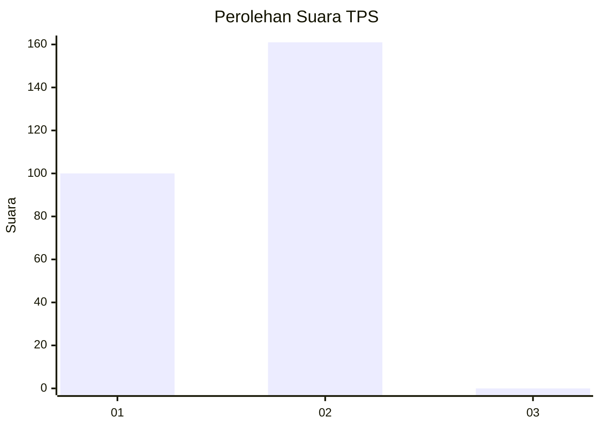
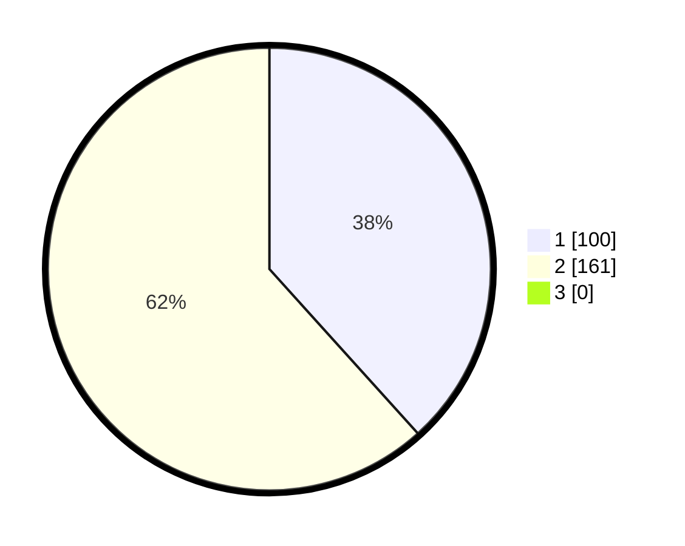

# Hasil

## Grafik

## Tabel

| No. | Nama Paslon    | Suara | Suara (raw) | Persentase |
|:--- |:-------------- | -----:| -----------:| ----------:|
| 1   | ANIES MUHAIMIN | 100   | [100][p-1]  | 38,31      |
| 2   | PRABOWO GIBRAN | 161   | [161][p-2]  | 61,69      |
| 3   | GANJAR MAHFUD  | 0     | [0][p-3]    | 0,00       |

[p-1]: https://github.com/gigit-pemilu/pemilu-2024/blob/main/pilpres/hitung-suara/sub/35-jawa-timur/sub/27-sampang/sub/05-omben/sub/2001-kebun-sareh/sub/001-tps/sub/paslon-1.txt
[p-2]: https://github.com/gigit-pemilu/pemilu-2024/blob/main/pilpres/hitung-suara/sub/35-jawa-timur/sub/27-sampang/sub/05-omben/sub/2001-kebun-sareh/sub/001-tps/sub/paslon-2.txt
[p-3]: https://github.com/gigit-pemilu/pemilu-2024/blob/main/pilpres/hitung-suara/sub/35-jawa-timur/sub/27-sampang/sub/05-omben/sub/2001-kebun-sareh/sub/001-tps/sub/paslon-3.txt

## Foto C Plano

https://sirekap-obj-formc.kpu.go.id/2194/pemilu/ppwp/35/27/05/20/01/3527052001001-20240215-105339--6387d9ed-14cc-43cd-a302-b95ae0d94f66.jpg

https://sirekap-obj-formc.kpu.go.id/2194/pemilu/ppwp/35/27/05/20/01/3527052001001-20240215-105553--e2a2e54a-0bd7-473f-96b0-6c87c101775c.jpg

https://sirekap-obj-formc.kpu.go.id/2194/pemilu/ppwp/35/27/05/20/01/3527052001001-20240215-105440--984bafc0-16af-49ee-b9ef-b7da829a84b4.jpg

## Metadata

| Key        | Value               |
| ---------- | ------------------- |
| Time Stamp | 2024-02-17 09:30:03 |

