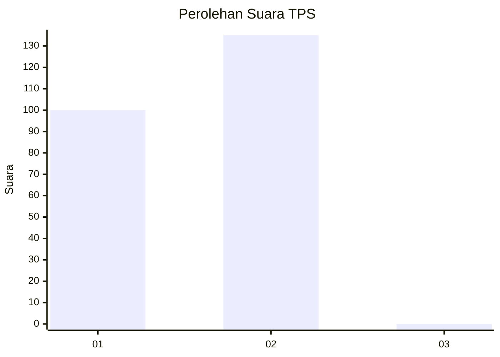
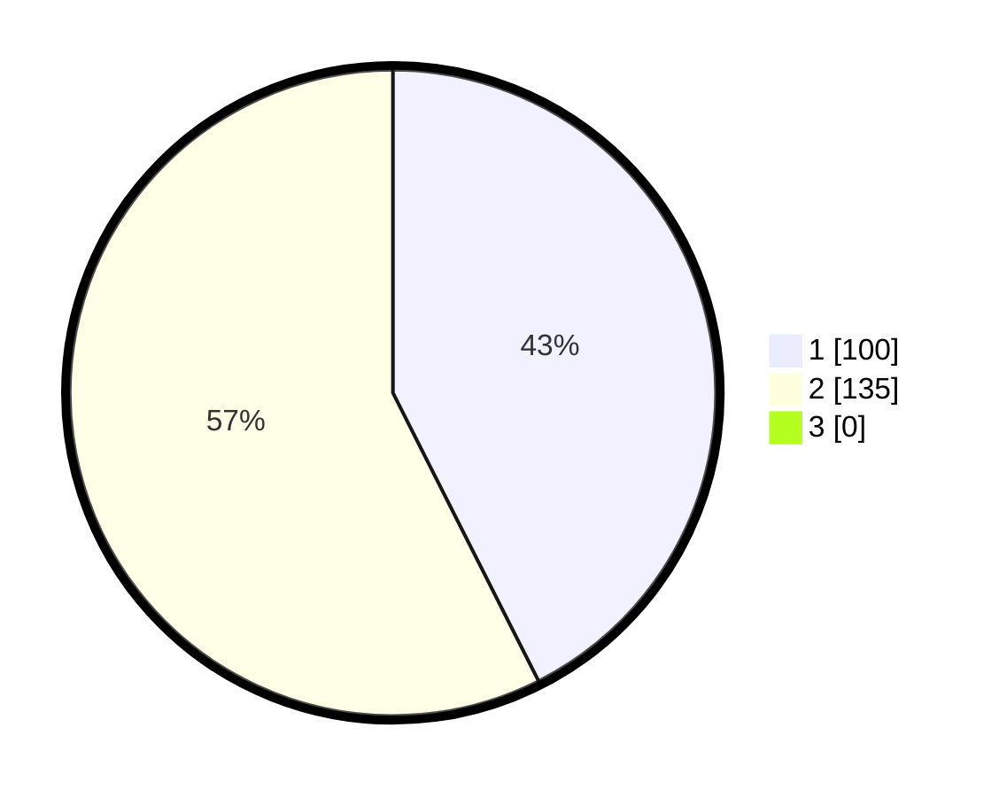

# Hasil

## Grafik

## Tabel

| No. | Nama Paslon    | Suara | Suara (raw) | Persentase |
|:--- |:-------------- | -----:| -----------:| ----------:|
| 1   | ANIES MUHAIMIN | 100   | [100][p-1]  | 42,55      |
| 2   | PRABOWO GIBRAN | 135   | [135][p-2]  | 57,45      |
| 3   | GANJAR MAHFUD  | 0     | [0][p-3]    | 0,00       |

[p-1]: https://github.com/gigit-pemilu/pemilu-2024/blob/main/pilpres/hitung-suara/sub/35-jawa-timur/sub/27-sampang/sub/05-omben/sub/2001-kebun-sareh/sub/002-tps/sub/paslon-1.txt
[p-2]: https://github.com/gigit-pemilu/pemilu-2024/blob/main/pilpres/hitung-suara/sub/35-jawa-timur/sub/27-sampang/sub/05-omben/sub/2001-kebun-sareh/sub/002-tps/sub/paslon-2.txt
[p-3]: https://github.com/gigit-pemilu/pemilu-2024/blob/main/pilpres/hitung-suara/sub/35-jawa-timur/sub/27-sampang/sub/05-omben/sub/2001-kebun-sareh/sub/002-tps/sub/paslon-3.txt

## Foto C Plano

https://sirekap-obj-formc.kpu.go.id/563f/pemilu/ppwp/35/27/05/20/01/3527052001002-20240215-125031--72b7f6ed-c332-4c97-8086-25b2696f128e.jpg

https://sirekap-obj-formc.kpu.go.id/563f/pemilu/ppwp/35/27/05/20/01/3527052001002-20240215-125145--2a1a997a-67fe-42e7-a813-86842a0b713a.jpg

https://sirekap-obj-formc.kpu.go.id/563f/pemilu/ppwp/35/27/05/20/01/3527052001002-20240215-125226--aee595cc-dc72-45a2-a4ca-2484b6ea4a16.jpg

## Metadata

| Key        | Value               |
| ---------- | ------------------- |
| Time Stamp | 2024-02-17 09:30:03 |

