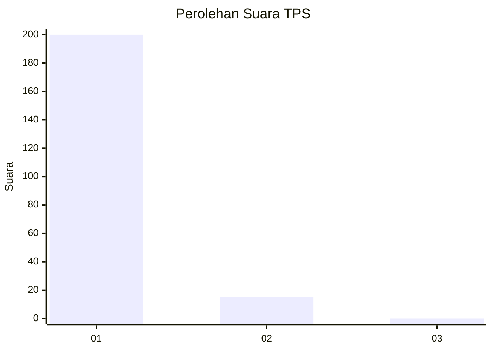
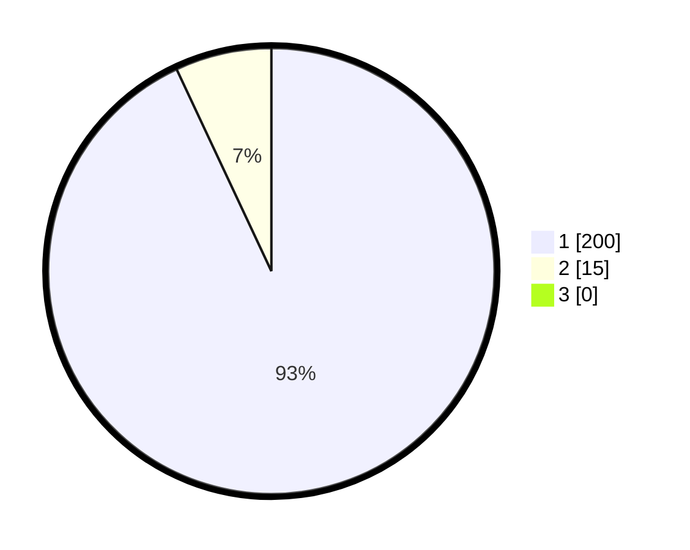

# Hasil

## Grafik

## Tabel

| No. | Nama Paslon    | Suara | Suara (raw) | Persentase |
|:--- |:-------------- | -----:| -----------:| ----------:|
| 1   | ANIES MUHAIMIN | 200   | [200][p-1]  | 93,02      |
| 2   | PRABOWO GIBRAN | 15    | [15][p-2]   | 6,98       |
| 3   | GANJAR MAHFUD  | 0     | [0][p-3]    | 0,00       |

[p-1]: https://github.com/gigit-pemilu/pemilu-2024/blob/main/pilpres/hitung-suara/sub/35-jawa-timur/sub/27-sampang/sub/05-omben/sub/2001-kebun-sareh/sub/004-tps/sub/paslon-1.txt
[p-2]: https://github.com/gigit-pemilu/pemilu-2024/blob/main/pilpres/hitung-suara/sub/35-jawa-timur/sub/27-sampang/sub/05-omben/sub/2001-kebun-sareh/sub/004-tps/sub/paslon-2.txt
[p-3]: https://github.com/gigit-pemilu/pemilu-2024/blob/main/pilpres/hitung-suara/sub/35-jawa-timur/sub/27-sampang/sub/05-omben/sub/2001-kebun-sareh/sub/004-tps/sub/paslon-3.txt

## Foto C Plano

https://sirekap-obj-formc.kpu.go.id/9a58/pemilu/ppwp/35/27/05/20/01/3527052001004-20240215-104407--b413cfd4-c109-4395-9eee-3e5a1bbf8688.jpg

https://sirekap-obj-formc.kpu.go.id/9a58/pemilu/ppwp/35/27/05/20/01/3527052001004-20240215-103437--d4a8bcea-953c-48b7-8438-cc9bcbd9b60d.jpg

https://sirekap-obj-formc.kpu.go.id/9a58/pemilu/ppwp/35/27/05/20/01/3527052001004-20240215-103840--e288e6fc-9b81-42f7-bb1e-c92dc246838e.jpg

## Metadata

| Key        | Value               |
| ---------- | ------------------- |
| Time Stamp | 2024-02-25 16:00:00 |

