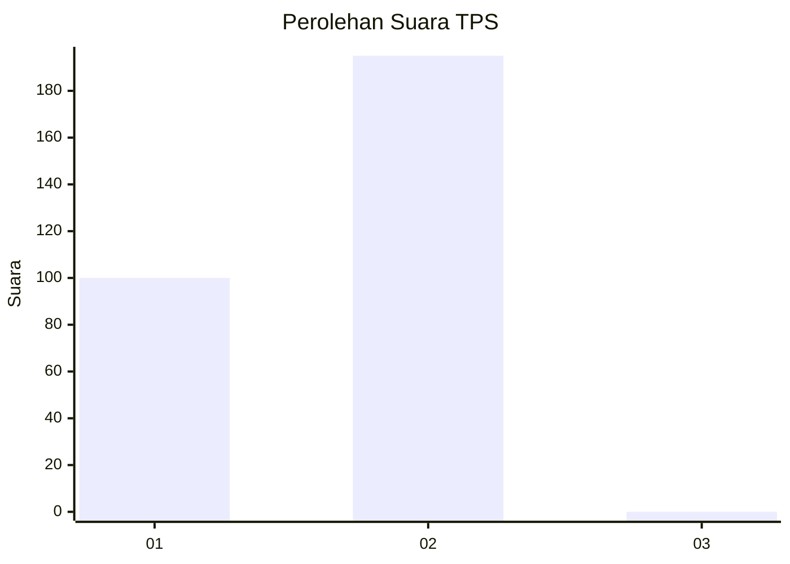
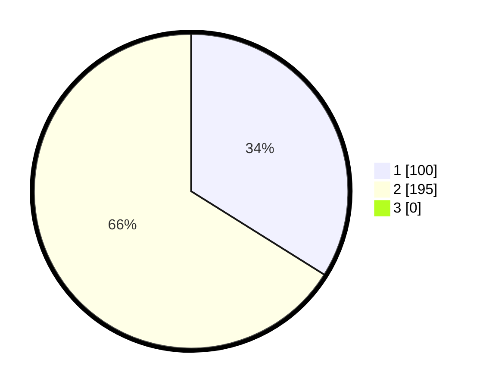

# Hasil

## Grafik

## Tabel

| No. | Nama Paslon    | Suara | Suara (raw) | Persentase |
|:--- |:-------------- | -----:| -----------:| ----------:|
| 1   | ANIES MUHAIMIN | 100   | [100][p-1]  | 33,90      |
| 2   | PRABOWO GIBRAN | 195   | [195][p-2]  | 66,10      |
| 3   | GANJAR MAHFUD  | 0     | [0][p-3]    | 0,00       |

[p-1]: https://github.com/gigit-pemilu/pemilu-2024/blob/main/pilpres/hitung-suara/sub/35-jawa-timur/sub/27-sampang/sub/05-omben/sub/2001-kebun-sareh/sub/005-tps/sub/paslon-1.txt
[p-2]: https://github.com/gigit-pemilu/pemilu-2024/blob/main/pilpres/hitung-suara/sub/35-jawa-timur/sub/27-sampang/sub/05-omben/sub/2001-kebun-sareh/sub/005-tps/sub/paslon-2.txt
[p-3]: https://github.com/gigit-pemilu/pemilu-2024/blob/main/pilpres/hitung-suara/sub/35-jawa-timur/sub/27-sampang/sub/05-omben/sub/2001-kebun-sareh/sub/005-tps/sub/paslon-3.txt

## Foto C Plano

https://sirekap-obj-formc.kpu.go.id/3bf5/pemilu/ppwp/35/27/05/20/01/3527052001005-20240215-111714--ef61ae25-e3d7-4cd6-9e15-0499c2595ab3.jpg

https://sirekap-obj-formc.kpu.go.id/3bf5/pemilu/ppwp/35/27/05/20/01/3527052001005-20240215-112409--2c1a1cf8-0741-4802-b126-e1ae0493a088.jpg

https://sirekap-obj-formc.kpu.go.id/3bf5/pemilu/ppwp/35/27/05/20/01/3527052001005-20240215-112859--a769ddc1-b736-491f-97e1-ed619f032e2d.jpg

## Metadata

| Key        | Value               |
| ---------- | ------------------- |
| Time Stamp | 2024-02-16 10:00:28 |

