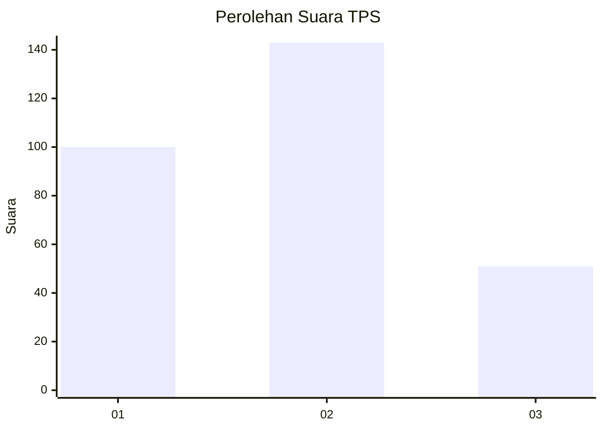
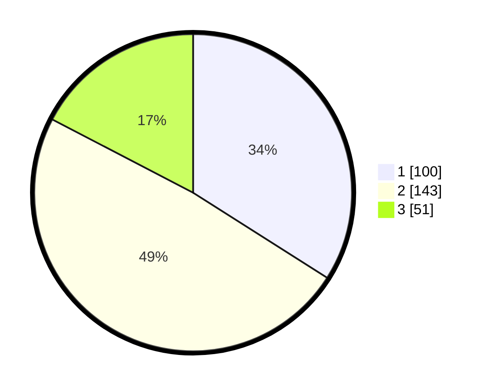

# Hasil

## Grafik

## Tabel

| No. | Nama Paslon    | Suara | Suara (raw) | Persentase |
|:--- |:-------------- | -----:| -----------:| ----------:|
| 1   | ANIES MUHAIMIN | 100   | [100][p-1]  | 34,01      |
| 2   | PRABOWO GIBRAN | 143   | [143][p-2]  | 48,64      |
| 3   | GANJAR MAHFUD  | 51    | [51][p-3]   | 17,35      |

[p-1]: https://github.com/gigit-pemilu/pemilu-2024-35-jawa-timur/blob/main/pilpres/hitung-suara/sub/35-jawa-timur/sub/27-sampang/sub/05-omben/sub/2001-kebun-sareh/sub/007-tps/sub/paslon-1.txt
[p-2]: https://github.com/gigit-pemilu/pemilu-2024-35-jawa-timur/blob/main/pilpres/hitung-suara/sub/35-jawa-timur/sub/27-sampang/sub/05-omben/sub/2001-kebun-sareh/sub/007-tps/sub/paslon-2.txt
[p-3]: https://github.com/gigit-pemilu/pemilu-2024-35-jawa-timur/blob/main/pilpres/hitung-suara/sub/35-jawa-timur/sub/27-sampang/sub/05-omben/sub/2001-kebun-sareh/sub/007-tps/sub/paslon-3.txt

## Foto C Plano

https://sirekap-obj-formc.kpu.go.id/530b/pemilu/ppwp/35/27/05/20/01/3527052001007-20240215-122453--1bd957a3-f836-4b59-97e3-dfc74e840909.jpg

https://sirekap-obj-formc.kpu.go.id/530b/pemilu/ppwp/35/27/05/20/01/3527052001007-20240215-130445--a52e9561-70c5-4a81-9ace-1e4abc6b75f7.jpg

https://sirekap-obj-formc.kpu.go.id/530b/pemilu/ppwp/35/27/05/20/01/3527052001007-20240215-130528--bf20cc58-8743-4be1-bfb4-8d4ce7ff6267.jpg

## Metadata

| Key        | Value               |
| ---------- | ------------------- |
| Time Stamp | 2024-02-17 10:00:02 |

