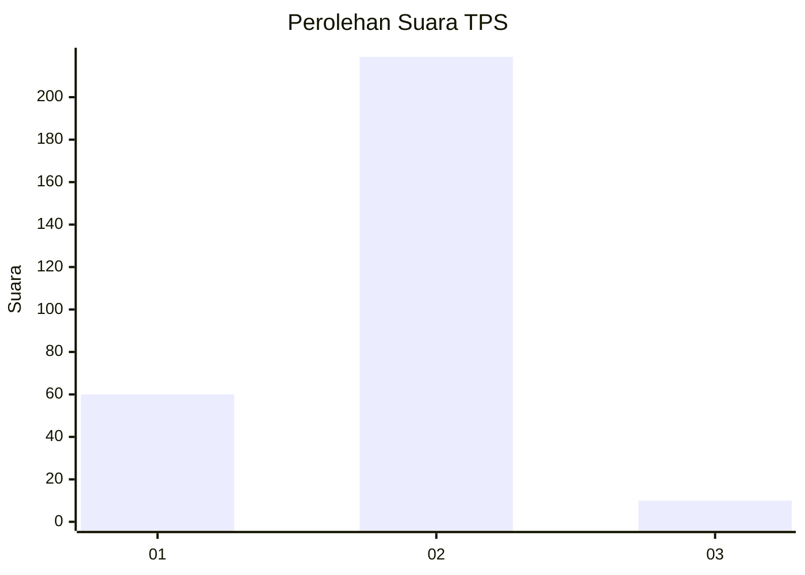

# Hasil

## Grafik

## Tabel

| No. | Nama Paslon    | Suara | Suara (raw) | Persentase |
|:--- |:-------------- | -----:| -----------:| ----------:|
| 1   | ANIES MUHAIMIN | 60    | [60][p-1]   | 20,76      |
| 2   | PRABOWO GIBRAN | 219   | [219][p-2]  | 75,78      |
| 3   | GANJAR MAHFUD  | 10    | [10][p-3]   | 3,46       |

[p-1]: https://github.com/gigit-pemilu/pemilu-2024/blob/main/pilpres/hitung-suara/sub/35-jawa-timur/sub/27-sampang/sub/05-omben/sub/2002-karangnangger/sub/004-tps/sub/paslon-1.txt
[p-2]: https://github.com/gigit-pemilu/pemilu-2024/blob/main/pilpres/hitung-suara/sub/35-jawa-timur/sub/27-sampang/sub/05-omben/sub/2002-karangnangger/sub/004-tps/sub/paslon-2.txt
[p-3]: https://github.com/gigit-pemilu/pemilu-2024/blob/main/pilpres/hitung-suara/sub/35-jawa-timur/sub/27-sampang/sub/05-omben/sub/2002-karangnangger/sub/004-tps/sub/paslon-3.txt

## Foto C Plano

https://sirekap-obj-formc.kpu.go.id/67fc/pemilu/ppwp/35/27/05/20/02/3527052002004-20240214-212203--76934033-9f05-4791-970b-82dd537ce213.jpg

https://sirekap-obj-formc.kpu.go.id/67fc/pemilu/ppwp/35/27/05/20/02/3527052002004-20240214-235806--97f0f964-8d1b-408d-ae5a-0022afdc9ece.jpg

https://sirekap-obj-formc.kpu.go.id/67fc/pemilu/ppwp/35/27/05/20/02/3527052002004-20240214-212505--2c47462c-e53e-4558-aa12-5af191e0e6f2.jpg

## Metadata

| Key        | Value               |
| ---------- | ------------------- |
| Time Stamp | 2024-02-16 10:00:28 |

