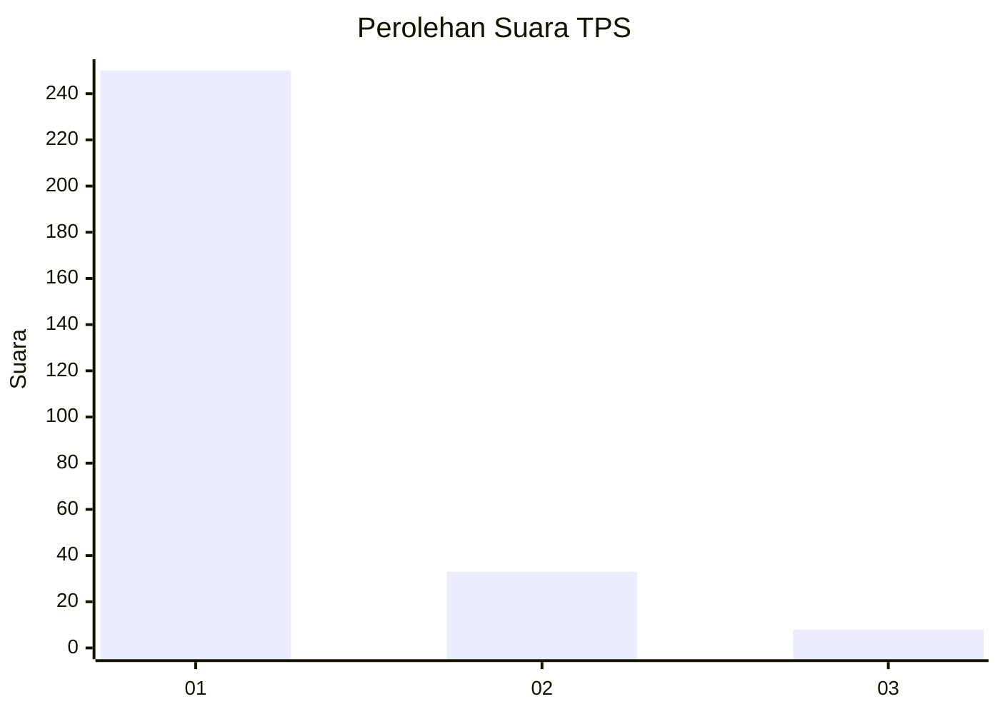
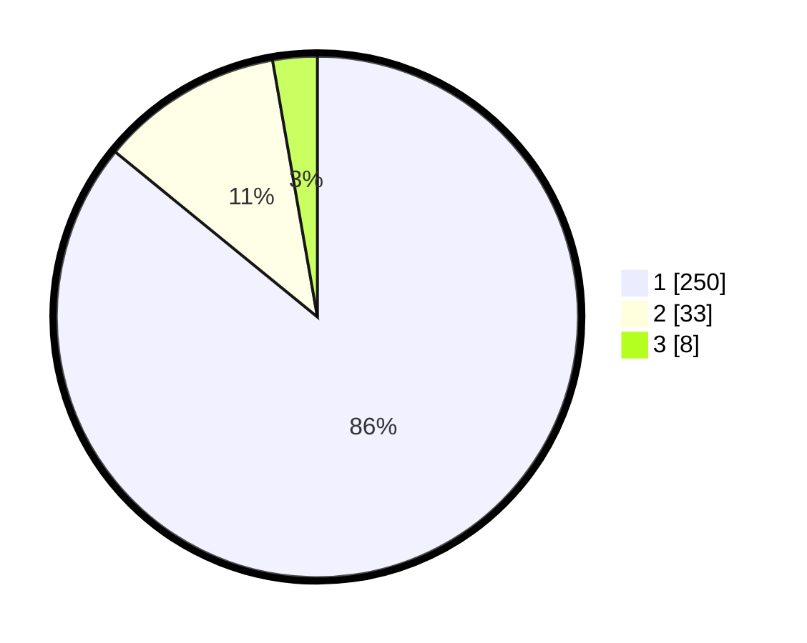

# Hasil

## Grafik

## Tabel

| No. | Nama Paslon    | Suara | Suara (raw) | Persentase |
|:--- |:-------------- | -----:| -----------:| ----------:|
| 1   | ANIES MUHAIMIN | 250   | [250][p-1]  | 85,91      |
| 2   | PRABOWO GIBRAN | 33    | [33][p-2]   | 11,34      |
| 3   | GANJAR MAHFUD  | 8     | [8][p-3]    | 2,75       |

[p-1]: https://github.com/gigit-pemilu/pemilu-2024-35-jawa-timur/blob/main/pilpres/hitung-suara/sub/35-jawa-timur/sub/27-sampang/sub/05-omben/sub/2003-rapa-laok/sub/002-tps/sub/paslon-1.txt
[p-2]: https://github.com/gigit-pemilu/pemilu-2024-35-jawa-timur/blob/main/pilpres/hitung-suara/sub/35-jawa-timur/sub/27-sampang/sub/05-omben/sub/2003-rapa-laok/sub/002-tps/sub/paslon-2.txt
[p-3]: https://github.com/gigit-pemilu/pemilu-2024-35-jawa-timur/blob/main/pilpres/hitung-suara/sub/35-jawa-timur/sub/27-sampang/sub/05-omben/sub/2003-rapa-laok/sub/002-tps/sub/paslon-3.txt

## Foto C Plano

https://sirekap-obj-formc.kpu.go.id/f037/pemilu/ppwp/35/27/05/20/03/3527052003002-20240215-103355--149348c9-09f8-4196-b2e2-7b931fd2ca70.jpg

https://sirekap-obj-formc.kpu.go.id/f037/pemilu/ppwp/35/27/05/20/03/3527052003002-20240215-103617--6ebae4cf-4164-4a4c-9644-f13f6ddbc608.jpg

https://sirekap-obj-formc.kpu.go.id/f037/pemilu/ppwp/35/27/05/20/03/3527052003002-20240215-103740--ff679f94-382a-48a0-be42-62f41b0bcd42.jpg

## Metadata

| Key        | Value               |
| ---------- | ------------------- |
| Time Stamp | 2024-02-16 16:25:10 |

