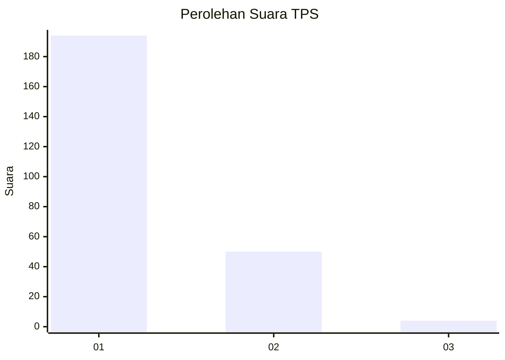
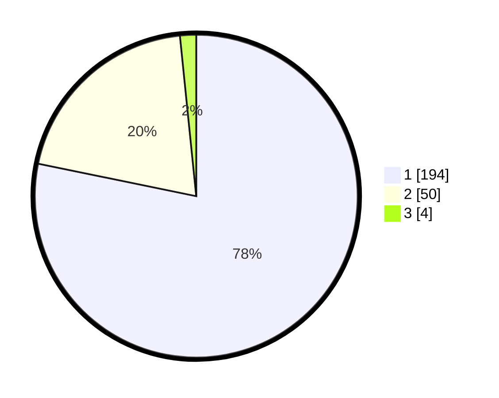

# Hasil

## Grafik

## Tabel

| No. | Nama Paslon    | Suara | Suara (raw) | Persentase |
|:--- |:-------------- | -----:| -----------:| ----------:|
| 1   | ANIES MUHAIMIN | 194   | [194][p-1]  | 78,23      |
| 2   | PRABOWO GIBRAN | 50    | [50][p-2]   | 20,16      |
| 3   | GANJAR MAHFUD  | 4     | [4][p-3]    | 1,61       |

[p-1]: https://github.com/gigit-pemilu/pemilu-2024/blob/main/pilpres/hitung-suara/sub/35-jawa-timur/sub/27-sampang/sub/05-omben/sub/2003-rapa-laok/sub/010-tps/sub/paslon-1.txt
[p-2]: https://github.com/gigit-pemilu/pemilu-2024/blob/main/pilpres/hitung-suara/sub/35-jawa-timur/sub/27-sampang/sub/05-omben/sub/2003-rapa-laok/sub/010-tps/sub/paslon-2.txt
[p-3]: https://github.com/gigit-pemilu/pemilu-2024/blob/main/pilpres/hitung-suara/sub/35-jawa-timur/sub/27-sampang/sub/05-omben/sub/2003-rapa-laok/sub/010-tps/sub/paslon-3.txt

## Foto C Plano

https://sirekap-obj-formc.kpu.go.id/9749/pemilu/ppwp/35/27/05/20/03/3527052003010-20240215-062054--fcb2a4b9-3b93-4e6e-b3d6-1abbdb7ba48b.jpg

https://sirekap-obj-formc.kpu.go.id/9749/pemilu/ppwp/35/27/05/20/03/3527052003010-20240215-062456--e6ca7a22-d986-41ea-a80f-9590973c3c49.jpg

https://sirekap-obj-formc.kpu.go.id/9749/pemilu/ppwp/35/27/05/20/03/3527052003010-20240215-062759--a68ce69b-5a9e-4e55-8630-a5823732ecfc.jpg

## Metadata

| Key        | Value               |
| ---------- | ------------------- |
| Time Stamp | 2024-02-15 22:30:27 |

