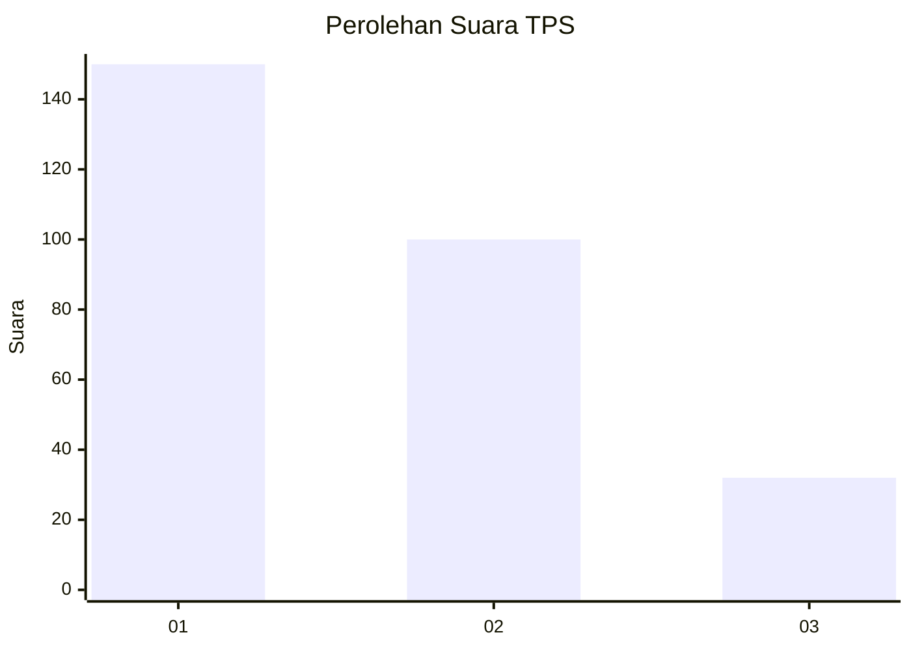
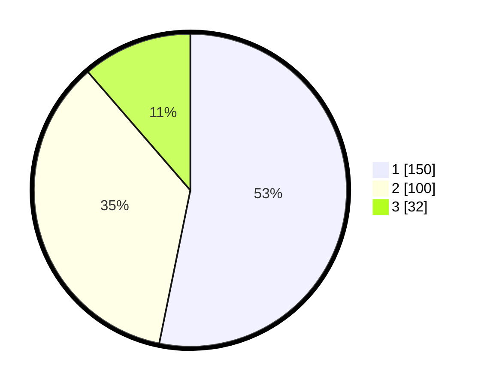

# Hasil

## Grafik

## Tabel

| No. | Nama Paslon    | Suara | Suara (raw) | Persentase |
|:--- |:-------------- | -----:| -----------:| ----------:|
| 1   | ANIES MUHAIMIN | 150   | [150][p-1]  | 53,19      |
| 2   | PRABOWO GIBRAN | 100   | [100][p-2]  | 35,46      |
| 3   | GANJAR MAHFUD  | 32    | [32][p-3]   | 11,35      |

[p-1]: https://github.com/gigit-pemilu/pemilu-2024-35-jawa-timur/blob/main/pilpres/hitung-suara/sub/35-jawa-timur/sub/27-sampang/sub/05-omben/sub/2003-rapa-laok/sub/012-tps/sub/paslon-1.txt
[p-2]: https://github.com/gigit-pemilu/pemilu-2024-35-jawa-timur/blob/main/pilpres/hitung-suara/sub/35-jawa-timur/sub/27-sampang/sub/05-omben/sub/2003-rapa-laok/sub/012-tps/sub/paslon-2.txt
[p-3]: https://github.com/gigit-pemilu/pemilu-2024-35-jawa-timur/blob/main/pilpres/hitung-suara/sub/35-jawa-timur/sub/27-sampang/sub/05-omben/sub/2003-rapa-laok/sub/012-tps/sub/paslon-3.txt

## Foto C Plano

https://sirekap-obj-formc.kpu.go.id/ec85/pemilu/ppwp/35/27/05/20/03/3527052003012-20240214-214150--66607402-55a9-4a87-84bd-3a366775d6e3.jpg

https://sirekap-obj-formc.kpu.go.id/ec85/pemilu/ppwp/35/27/05/20/03/3527052003012-20240214-214350--2923f1fb-643d-4dd7-8811-9d17fe88fccd.jpg

https://sirekap-obj-formc.kpu.go.id/ec85/pemilu/ppwp/35/27/05/20/03/3527052003012-20240214-214449--0c78927b-f2b6-44f3-8a7c-d7f7cb1b483e.jpg

## Metadata

| Key        | Value               |
| ---------- | ------------------- |
| Time Stamp | 2024-02-17 09:30:03 |

