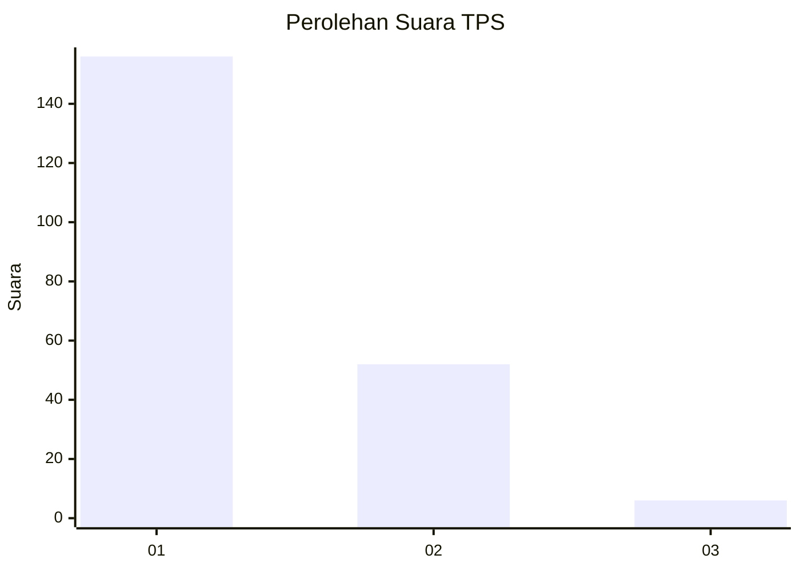
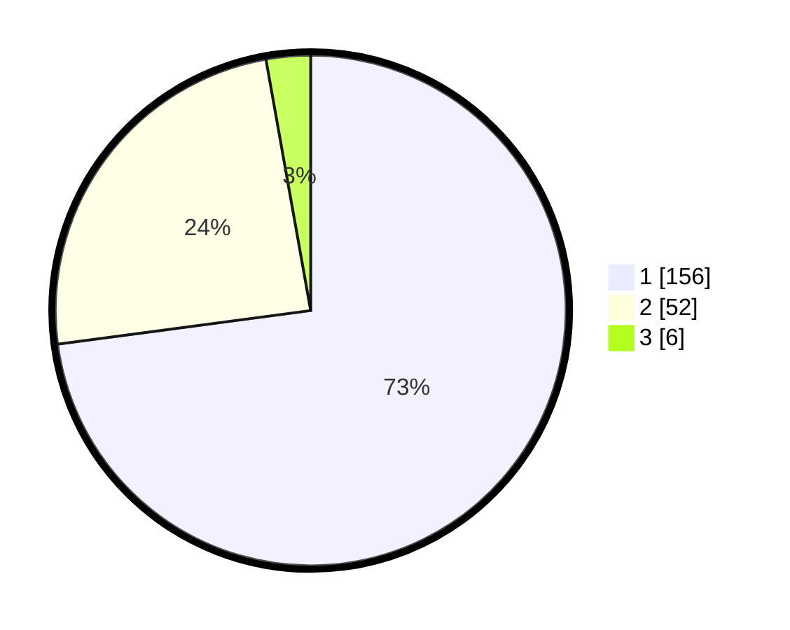

# Hasil

## Grafik

## Tabel

| No. | Nama Paslon    | Suara | Suara (raw) | Persentase |
|:--- |:-------------- | -----:| -----------:| ----------:|
| 1   | ANIES MUHAIMIN | 156   | [156][p-1]  | 72,90      |
| 2   | PRABOWO GIBRAN | 52    | [52][p-2]   | 24,30      |
| 3   | GANJAR MAHFUD  | 6     | [6][p-3]    | 2,80       |

[p-1]: https://github.com/gigit-pemilu/pemilu-2024-35-jawa-timur/blob/main/pilpres/hitung-suara/sub/35-jawa-timur/sub/27-sampang/sub/05-omben/sub/2004-rapa-daya/sub/001-tps/sub/paslon-1.txt
[p-2]: https://github.com/gigit-pemilu/pemilu-2024-35-jawa-timur/blob/main/pilpres/hitung-suara/sub/35-jawa-timur/sub/27-sampang/sub/05-omben/sub/2004-rapa-daya/sub/001-tps/sub/paslon-2.txt
[p-3]: https://github.com/gigit-pemilu/pemilu-2024-35-jawa-timur/blob/main/pilpres/hitung-suara/sub/35-jawa-timur/sub/27-sampang/sub/05-omben/sub/2004-rapa-daya/sub/001-tps/sub/paslon-3.txt

## Foto C Plano

https://sirekap-obj-formc.kpu.go.id/d42c/pemilu/ppwp/35/27/05/20/04/3527052004001-20240214-224817--cc1eb5e4-4a20-4f3b-b747-9e6a416876f8.jpg

https://sirekap-obj-formc.kpu.go.id/d42c/pemilu/ppwp/35/27/05/20/04/3527052004001-20240214-224828--d2b2605e-cff1-4cd8-8e60-dcf88b7b39f0.jpg

https://sirekap-obj-formc.kpu.go.id/d42c/pemilu/ppwp/35/27/05/20/04/3527052004001-20240214-224833--c9e2c83a-9a39-403c-9a0f-cd19734f9919.jpg

## Metadata

| Key        | Value               |
| ---------- | ------------------- |
| Time Stamp | 2024-02-15 21:30:27 |

