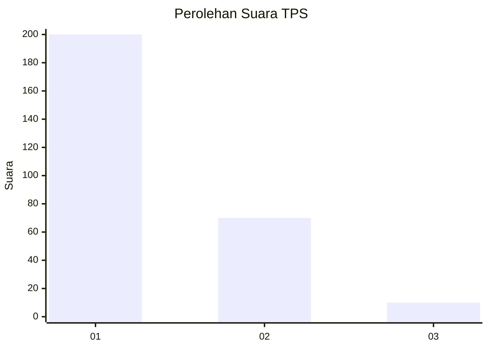
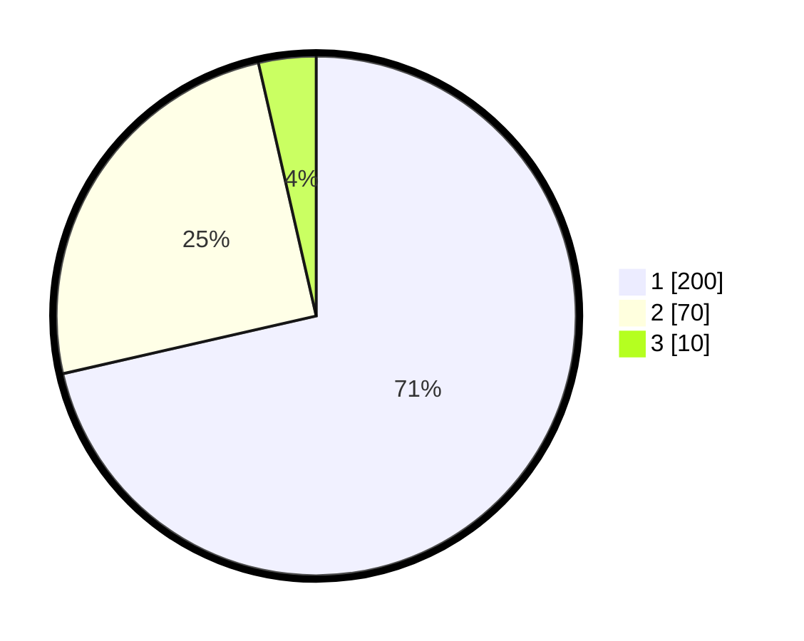

# Hasil

## Grafik

## Tabel

| No. | Nama Paslon    | Suara | Suara (raw) | Persentase |
|:--- |:-------------- | -----:| -----------:| ----------:|
| 1   | ANIES MUHAIMIN | 200   | [200][p-1]  | 71,43      |
| 2   | PRABOWO GIBRAN | 70    | [70][p-2]   | 25,00      |
| 3   | GANJAR MAHFUD  | 10    | [10][p-3]   | 3,57       |

[p-1]: https://github.com/gigit-pemilu/pemilu-2024-35-jawa-timur/blob/main/pilpres/hitung-suara/sub/35-jawa-timur/sub/27-sampang/sub/05-omben/sub/2004-rapa-daya/sub/003-tps/sub/paslon-1.txt
[p-2]: https://github.com/gigit-pemilu/pemilu-2024-35-jawa-timur/blob/main/pilpres/hitung-suara/sub/35-jawa-timur/sub/27-sampang/sub/05-omben/sub/2004-rapa-daya/sub/003-tps/sub/paslon-2.txt
[p-3]: https://github.com/gigit-pemilu/pemilu-2024-35-jawa-timur/blob/main/pilpres/hitung-suara/sub/35-jawa-timur/sub/27-sampang/sub/05-omben/sub/2004-rapa-daya/sub/003-tps/sub/paslon-3.txt

## Foto C Plano

https://sirekap-obj-formc.kpu.go.id/14eb/pemilu/ppwp/35/27/05/20/04/3527052004003-20240214-231327--6263f1e3-86b6-4c4b-8ea9-7e44fc8e860a.jpg

https://sirekap-obj-formc.kpu.go.id/14eb/pemilu/ppwp/35/27/05/20/04/3527052004003-20240215-011120--1a286f84-41e0-450c-b7d8-68994d8b505e.jpg

https://sirekap-obj-formc.kpu.go.id/14eb/pemilu/ppwp/35/27/05/20/04/3527052004003-20240215-011010--2e342b4b-ecd0-417e-9c7e-5be2a0605006.jpg

## Metadata

| Key        | Value               |
| ---------- | ------------------- |
| Time Stamp | 2024-02-16 16:25:10 |

