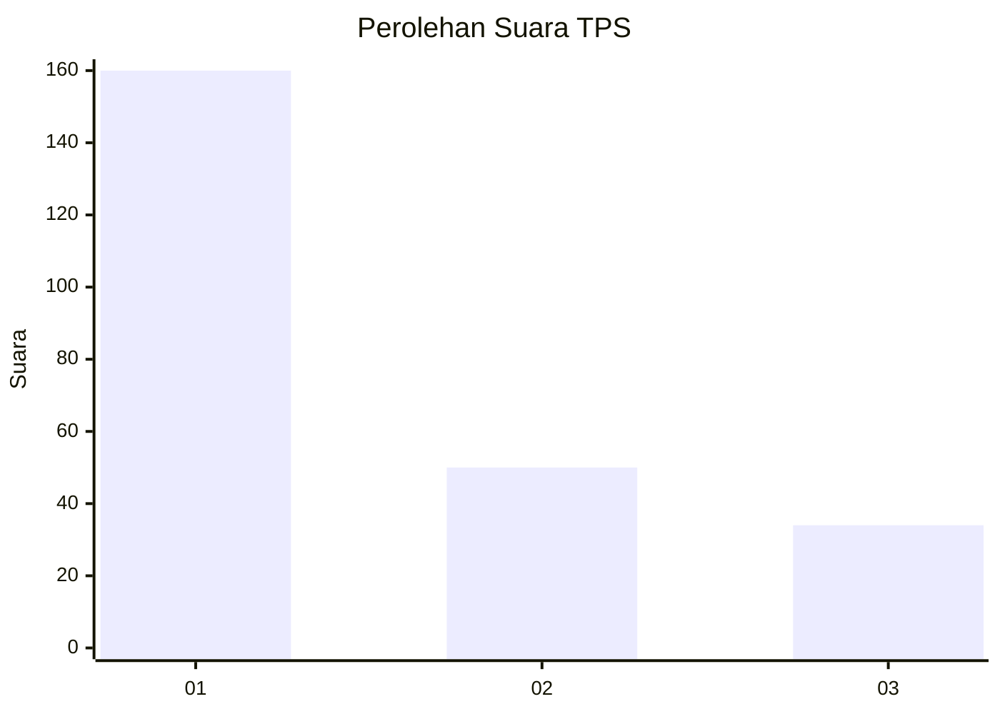
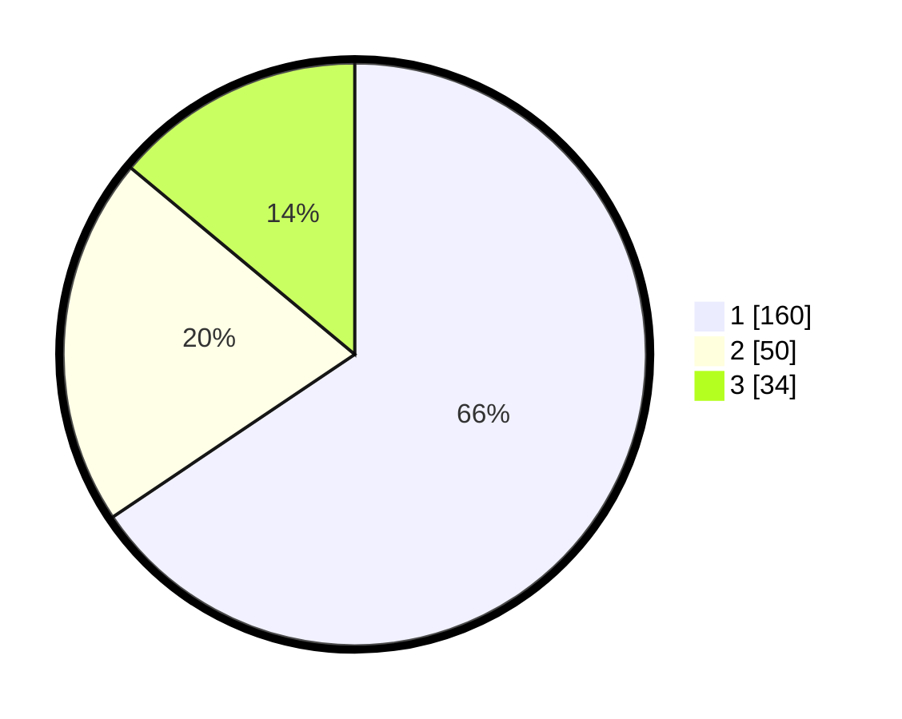

# Hasil

## Grafik

## Tabel

| No. | Nama Paslon    | Suara | Suara (raw) | Persentase |
|:--- |:-------------- | -----:| -----------:| ----------:|
| 1   | ANIES MUHAIMIN | 160   | [160][p-1]  | 65,57      |
| 2   | PRABOWO GIBRAN | 50    | [50][p-2]   | 20,49      |
| 3   | GANJAR MAHFUD  | 34    | [34][p-3]   | 13,93      |

[p-1]: https://github.com/gigit-pemilu/pemilu-2024/blob/main/pilpres/hitung-suara/sub/35-jawa-timur/sub/27-sampang/sub/05-omben/sub/2004-rapa-daya/sub/005-tps/sub/paslon-1.txt
[p-2]: https://github.com/gigit-pemilu/pemilu-2024/blob/main/pilpres/hitung-suara/sub/35-jawa-timur/sub/27-sampang/sub/05-omben/sub/2004-rapa-daya/sub/005-tps/sub/paslon-2.txt
[p-3]: https://github.com/gigit-pemilu/pemilu-2024/blob/main/pilpres/hitung-suara/sub/35-jawa-timur/sub/27-sampang/sub/05-omben/sub/2004-rapa-daya/sub/005-tps/sub/paslon-3.txt

## Foto C Plano

https://sirekap-obj-formc.kpu.go.id/643c/pemilu/ppwp/35/27/05/20/04/3527052004005-20240214-230151--5f758d69-55f6-42fc-9496-ecc5e82b241e.jpg

https://sirekap-obj-formc.kpu.go.id/643c/pemilu/ppwp/35/27/05/20/04/3527052004005-20240214-230253--cbc8b35f-9dfc-4af0-9e75-1c7934827877.jpg

https://sirekap-obj-formc.kpu.go.id/643c/pemilu/ppwp/35/27/05/20/04/3527052004005-20240214-230333--4f701bcc-211f-4692-89d9-ec0c57689efc.jpg

## Metadata

| Key        | Value               |
| ---------- | ------------------- |
| Time Stamp | 2024-02-16 16:25:10 |

