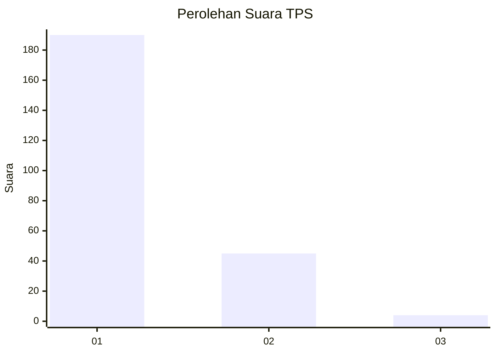
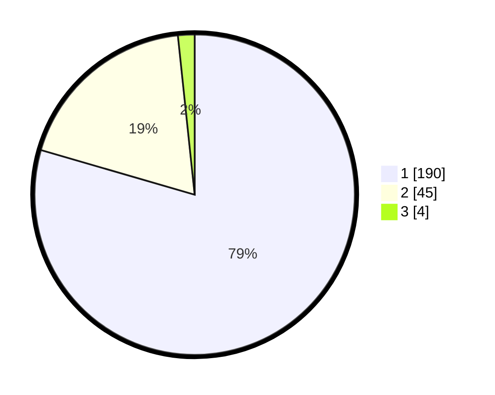

# Hasil

## Grafik

## Tabel

| No. | Nama Paslon    | Suara | Suara (raw) | Persentase |
|:--- |:-------------- | -----:| -----------:| ----------:|
| 1   | ANIES MUHAIMIN | 190   | [190][p-1]  | 79,50      |
| 2   | PRABOWO GIBRAN | 45    | [45][p-2]   | 18,83      |
| 3   | GANJAR MAHFUD  | 4     | [4][p-3]    | 1,67       |

[p-1]: https://github.com/gigit-pemilu/pemilu-2024-35-jawa-timur/blob/main/pilpres/hitung-suara/sub/35-jawa-timur/sub/27-sampang/sub/05-omben/sub/2006-sogian/sub/004-tps/sub/paslon-1.txt
[p-2]: https://github.com/gigit-pemilu/pemilu-2024-35-jawa-timur/blob/main/pilpres/hitung-suara/sub/35-jawa-timur/sub/27-sampang/sub/05-omben/sub/2006-sogian/sub/004-tps/sub/paslon-2.txt
[p-3]: https://github.com/gigit-pemilu/pemilu-2024-35-jawa-timur/blob/main/pilpres/hitung-suara/sub/35-jawa-timur/sub/27-sampang/sub/05-omben/sub/2006-sogian/sub/004-tps/sub/paslon-3.txt

## Foto C Plano

https://sirekap-obj-formc.kpu.go.id/77f7/pemilu/ppwp/35/27/05/20/06/3527052006004-20240215-032553--6904af8c-7c81-41c0-975e-4e5d22c34869.jpg

https://sirekap-obj-formc.kpu.go.id/77f7/pemilu/ppwp/35/27/05/20/06/3527052006004-20240215-032812--d1119c46-0b99-42ff-9eff-5c4ead4bc0a9.jpg

https://sirekap-obj-formc.kpu.go.id/77f7/pemilu/ppwp/35/27/05/20/06/3527052006004-20240215-033112--2db8c0de-998c-48c6-9c76-08ebc878ddd5.jpg

## Metadata

| Key        | Value               |
| ---------- | ------------------- |
| Time Stamp | 2024-02-17 10:00:02 |

