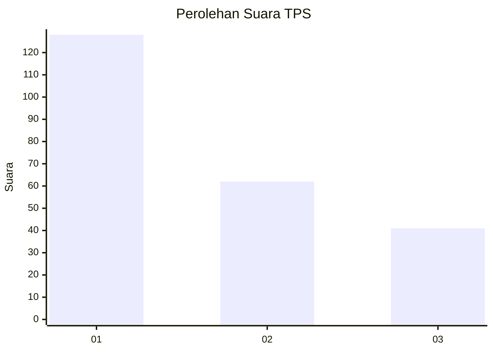
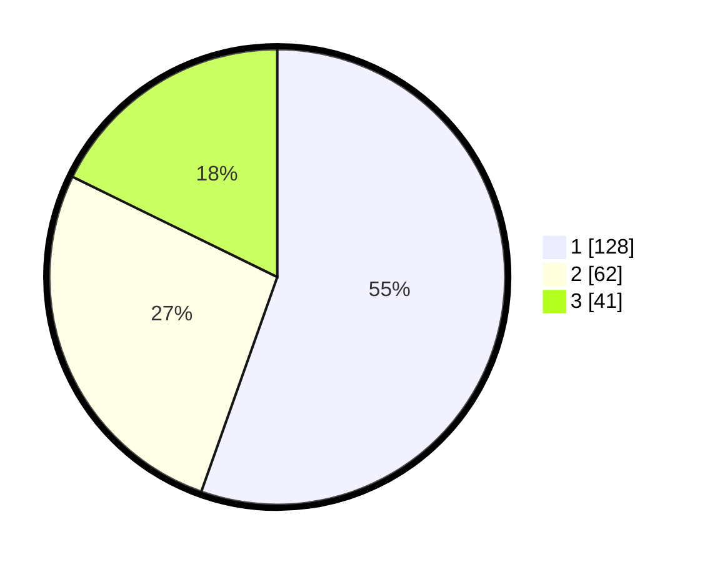

# Hasil

## Grafik

## Tabel

| No. | Nama Paslon    | Suara | Suara (raw) | Persentase |
|:--- |:-------------- | -----:| -----------:| ----------:|
| 1   | ANIES MUHAIMIN | 128   | [128][p-1]  | 55,41      |
| 2   | PRABOWO GIBRAN | 62    | [62][p-2]   | 26,84      |
| 3   | GANJAR MAHFUD  | 41    | [41][p-3]   | 17,75      |

[p-1]: https://github.com/gigit-pemilu/pemilu-2024-35-jawa-timur/blob/main/pilpres/hitung-suara/sub/35-jawa-timur/sub/27-sampang/sub/05-omben/sub/2006-sogian/sub/006-tps/sub/paslon-1.txt
[p-2]: https://github.com/gigit-pemilu/pemilu-2024-35-jawa-timur/blob/main/pilpres/hitung-suara/sub/35-jawa-timur/sub/27-sampang/sub/05-omben/sub/2006-sogian/sub/006-tps/sub/paslon-2.txt
[p-3]: https://github.com/gigit-pemilu/pemilu-2024-35-jawa-timur/blob/main/pilpres/hitung-suara/sub/35-jawa-timur/sub/27-sampang/sub/05-omben/sub/2006-sogian/sub/006-tps/sub/paslon-3.txt

## Foto C Plano

https://sirekap-obj-formc.kpu.go.id/b410/pemilu/ppwp/35/27/05/20/06/3527052006006-20240215-022218--301410fc-f811-4651-9937-7244731c78cd.jpg

https://sirekap-obj-formc.kpu.go.id/b410/pemilu/ppwp/35/27/05/20/06/3527052006006-20240215-023120--3bb386b4-b1eb-4fc7-9169-27cab75e0533.jpg

https://sirekap-obj-formc.kpu.go.id/b410/pemilu/ppwp/35/27/05/20/06/3527052006006-20240215-023440--2d820cf3-e0ac-4f98-b0ad-1ecc9eb8c5eb.jpg

## Metadata

| Key        | Value               |
| ---------- | ------------------- |
| Time Stamp | 2024-02-16 10:00:28 |

