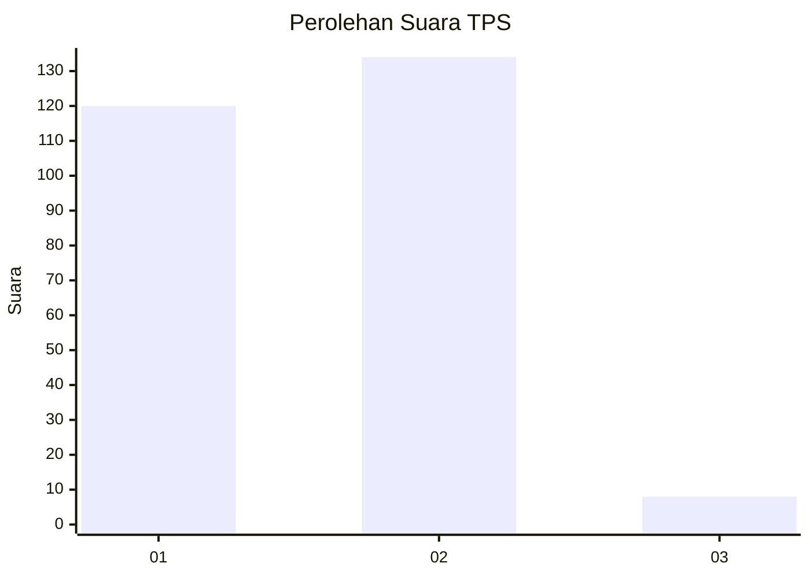
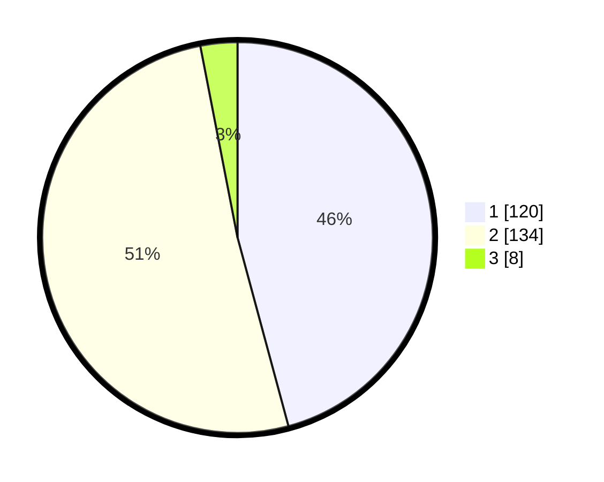

# Hasil

## Grafik

## Tabel

| No. | Nama Paslon    | Suara | Suara (raw) | Persentase |
|:--- |:-------------- | -----:| -----------:| ----------:|
| 1   | ANIES MUHAIMIN | 120   | [120][p-1]  | 45,80      |
| 2   | PRABOWO GIBRAN | 134   | [134][p-2]  | 51,15      |
| 3   | GANJAR MAHFUD  | 8     | [8][p-3]    | 3,05       |

[p-1]: https://github.com/gigit-pemilu/pemilu-2024/blob/main/pilpres/hitung-suara/sub/35-jawa-timur/sub/27-sampang/sub/05-omben/sub/2006-sogian/sub/007-tps/sub/paslon-1.txt
[p-2]: https://github.com/gigit-pemilu/pemilu-2024/blob/main/pilpres/hitung-suara/sub/35-jawa-timur/sub/27-sampang/sub/05-omben/sub/2006-sogian/sub/007-tps/sub/paslon-2.txt
[p-3]: https://github.com/gigit-pemilu/pemilu-2024/blob/main/pilpres/hitung-suara/sub/35-jawa-timur/sub/27-sampang/sub/05-omben/sub/2006-sogian/sub/007-tps/sub/paslon-3.txt

## Foto C Plano

https://sirekap-obj-formc.kpu.go.id/e85a/pemilu/ppwp/35/27/05/20/06/3527052006007-20240215-013648--e4515ebf-34da-45e9-8016-29e2b887bc86.jpg

https://sirekap-obj-formc.kpu.go.id/e85a/pemilu/ppwp/35/27/05/20/06/3527052006007-20240215-021748--4852a6c7-e35b-4740-90ab-75f02056ee62.jpg

https://sirekap-obj-formc.kpu.go.id/e85a/pemilu/ppwp/35/27/05/20/06/3527052006007-20240215-021852--f8373df4-8bcc-42c1-bcf0-670cd4df6c6a.jpg

## Metadata

| Key        | Value               |
| ---------- | ------------------- |
| Time Stamp | 2024-02-16 16:25:10 |

