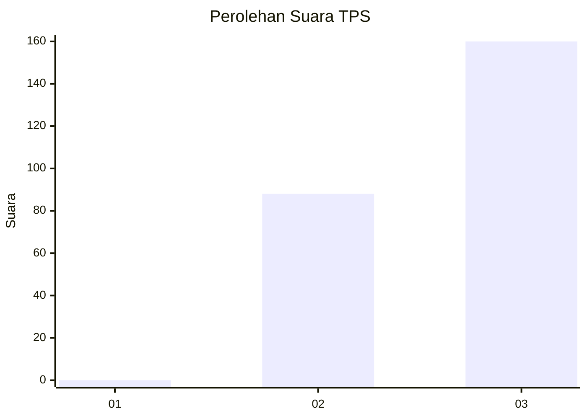
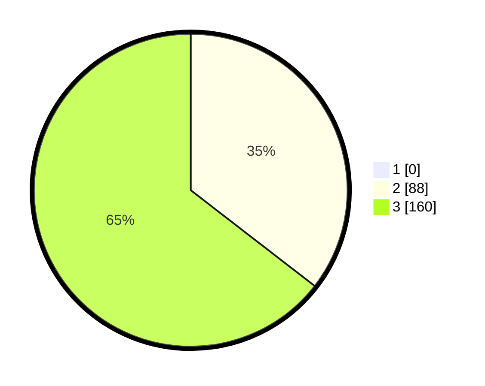

# Hasil

## Grafik

## Tabel

| No. | Nama Paslon    | Suara | Suara (raw) | Persentase |
|:--- |:-------------- | -----:| -----------:| ----------:|
| 1   | ANIES MUHAIMIN | 0     | [0][p-1]    | 0,00       |
| 2   | PRABOWO GIBRAN | 88    | [88][p-2]   | 35,48      |
| 3   | GANJAR MAHFUD  | 160   | [160][p-3]  | 64,52      |

[p-1]: https://github.com/gigit-pemilu/pemilu-2024/blob/main/pilpres/hitung-suara/sub/35-jawa-timur/sub/27-sampang/sub/05-omben/sub/2007-gersempal/sub/002-tps/sub/paslon-1.txt
[p-2]: https://github.com/gigit-pemilu/pemilu-2024/blob/main/pilpres/hitung-suara/sub/35-jawa-timur/sub/27-sampang/sub/05-omben/sub/2007-gersempal/sub/002-tps/sub/paslon-2.txt
[p-3]: https://github.com/gigit-pemilu/pemilu-2024/blob/main/pilpres/hitung-suara/sub/35-jawa-timur/sub/27-sampang/sub/05-omben/sub/2007-gersempal/sub/002-tps/sub/paslon-3.txt

## Foto C Plano

https://sirekap-obj-formc.kpu.go.id/642b/pemilu/ppwp/35/27/05/20/07/3527052007002-20240215-003625--350535f8-95b7-47d3-9997-d514b4c79d11.jpg

https://sirekap-obj-formc.kpu.go.id/642b/pemilu/ppwp/35/27/05/20/07/3527052007002-20240215-003932--de508c9f-fc47-4a9e-a856-60defd745581.jpg

https://sirekap-obj-formc.kpu.go.id/642b/pemilu/ppwp/35/27/05/20/07/3527052007002-20240215-004129--dde8c0a1-0014-4da3-a734-c739989b9406.jpg

## Metadata

| Key        | Value               |
| ---------- | ------------------- |
| Time Stamp | 2024-02-16 16:25:10 |

