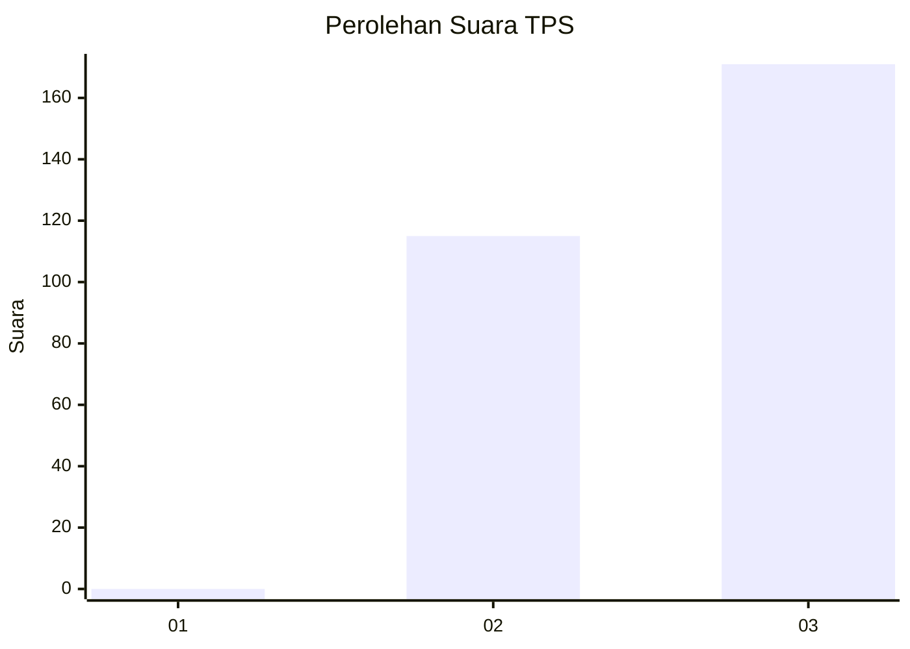
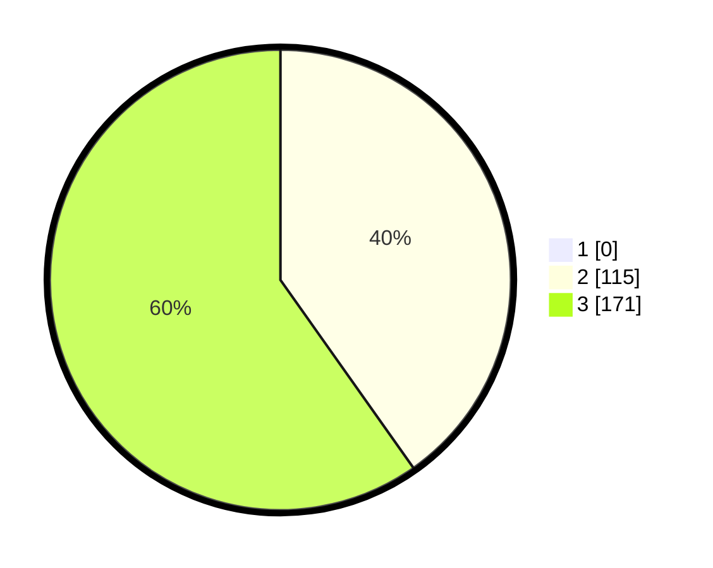

# Hasil

## Grafik

## Tabel

| No. | Nama Paslon    | Suara | Suara (raw) | Persentase |
|:--- |:-------------- | -----:| -----------:| ----------:|
| 1   | ANIES MUHAIMIN | 0     | [0][p-1]    | 0,00       |
| 2   | PRABOWO GIBRAN | 115   | [115][p-2]  | 40,21      |
| 3   | GANJAR MAHFUD  | 171   | [171][p-3]  | 59,79      |

[p-1]: https://github.com/gigit-pemilu/pemilu-2024/blob/main/pilpres/hitung-suara/sub/35-jawa-timur/sub/27-sampang/sub/05-omben/sub/2007-gersempal/sub/003-tps/sub/paslon-1.txt
[p-2]: https://github.com/gigit-pemilu/pemilu-2024/blob/main/pilpres/hitung-suara/sub/35-jawa-timur/sub/27-sampang/sub/05-omben/sub/2007-gersempal/sub/003-tps/sub/paslon-2.txt
[p-3]: https://github.com/gigit-pemilu/pemilu-2024/blob/main/pilpres/hitung-suara/sub/35-jawa-timur/sub/27-sampang/sub/05-omben/sub/2007-gersempal/sub/003-tps/sub/paslon-3.txt

## Foto C Plano

https://sirekap-obj-formc.kpu.go.id/b9a2/pemilu/ppwp/35/27/05/20/07/3527052007003-20240215-073727--8eb63e5f-6789-4c21-9f48-3245ac3a2546.jpg

https://sirekap-obj-formc.kpu.go.id/b9a2/pemilu/ppwp/35/27/05/20/07/3527052007003-20240214-210434--a02e4a01-6d03-40d1-b551-85b87acf7bec.jpg

https://sirekap-obj-formc.kpu.go.id/b9a2/pemilu/ppwp/35/27/05/20/07/3527052007003-20240215-073902--66cc366e-1142-4369-8007-97f47be3d633.jpg

## Metadata

| Key        | Value               |
| ---------- | ------------------- |
| Time Stamp | 2024-02-15 22:30:27 |

