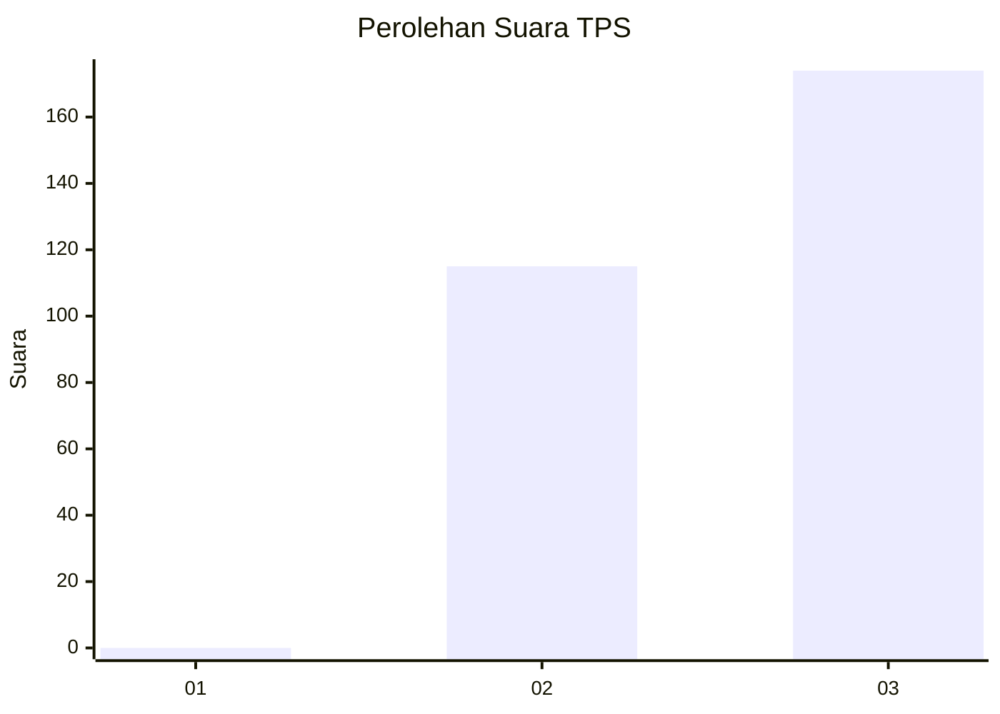
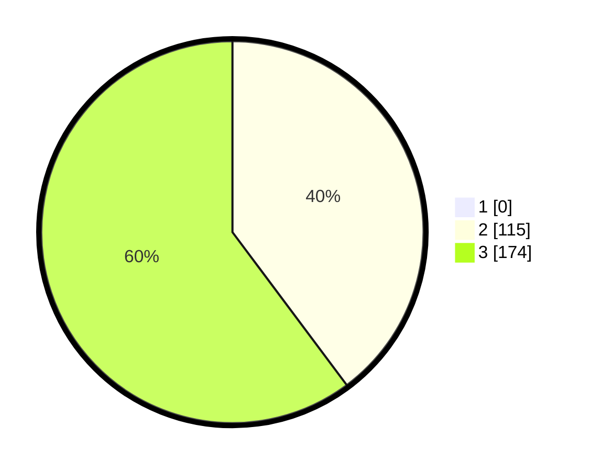

# Hasil

## Grafik

## Tabel

| No. | Nama Paslon    | Suara | Suara (raw) | Persentase |
|:--- |:-------------- | -----:| -----------:| ----------:|
| 1   | ANIES MUHAIMIN | 0     | [0][p-1]    | 0,00       |
| 2   | PRABOWO GIBRAN | 115   | [115][p-2]  | 39,79      |
| 3   | GANJAR MAHFUD  | 174   | [174][p-3]  | 60,21      |

[p-1]: https://github.com/gigit-pemilu/pemilu-2024/blob/main/pilpres/hitung-suara/sub/35-jawa-timur/sub/27-sampang/sub/05-omben/sub/2007-gersempal/sub/006-tps/sub/paslon-1.txt
[p-2]: https://github.com/gigit-pemilu/pemilu-2024/blob/main/pilpres/hitung-suara/sub/35-jawa-timur/sub/27-sampang/sub/05-omben/sub/2007-gersempal/sub/006-tps/sub/paslon-2.txt
[p-3]: https://github.com/gigit-pemilu/pemilu-2024/blob/main/pilpres/hitung-suara/sub/35-jawa-timur/sub/27-sampang/sub/05-omben/sub/2007-gersempal/sub/006-tps/sub/paslon-3.txt

## Foto C Plano

https://sirekap-obj-formc.kpu.go.id/d4ab/pemilu/ppwp/35/27/05/20/07/3527052007006-20240215-001313--a02035a1-3063-447e-9374-ccaca07ddd45.jpg

https://sirekap-obj-formc.kpu.go.id/d4ab/pemilu/ppwp/35/27/05/20/07/3527052007006-20240215-000738--292c7bae-3a22-4ca9-8359-d7f7f91929f2.jpg

https://sirekap-obj-formc.kpu.go.id/d4ab/pemilu/ppwp/35/27/05/20/07/3527052007006-20240215-001018--037260d4-e193-4dac-82c0-ad08b2bc45bc.jpg

## Metadata

| Key        | Value               |
| ---------- | ------------------- |
| Time Stamp | 2024-02-16 16:25:10 |

