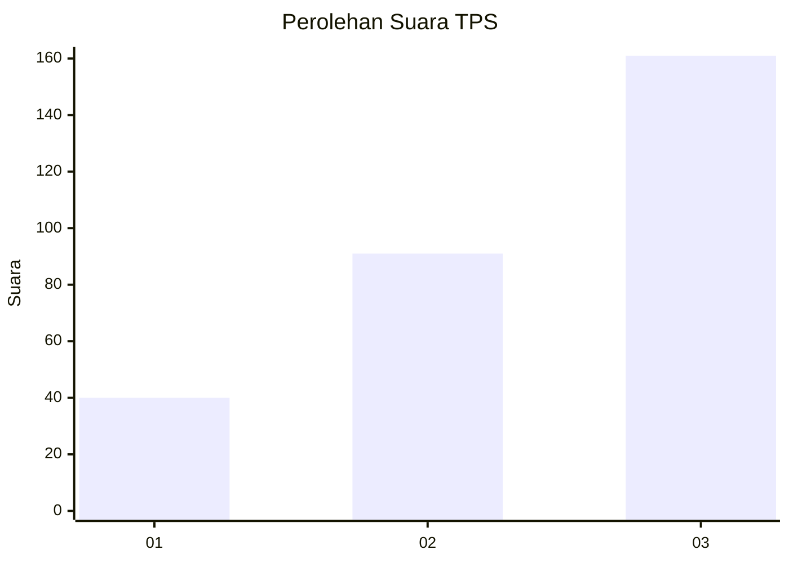
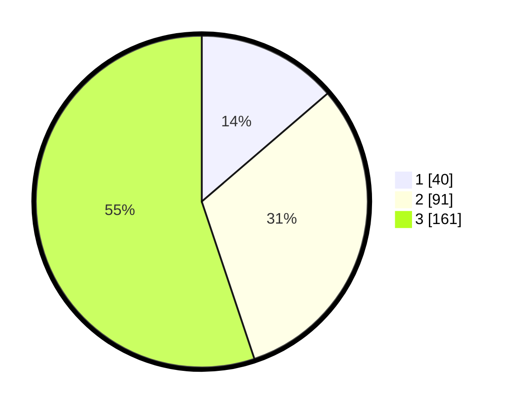

# Hasil

## Grafik

## Tabel

| No. | Nama Paslon    | Suara | Suara (raw) | Persentase |
|:--- |:-------------- | -----:| -----------:| ----------:|
| 1   | ANIES MUHAIMIN | 40    | [40][p-1]   | 13,70      |
| 2   | PRABOWO GIBRAN | 91    | [91][p-2]   | 31,16      |
| 3   | GANJAR MAHFUD  | 161   | [161][p-3]  | 55,14      |

[p-1]: https://github.com/gigit-pemilu/pemilu-2024-35-jawa-timur/blob/main/pilpres/hitung-suara/sub/35-jawa-timur/sub/27-sampang/sub/05-omben/sub/2007-gersempal/sub/008-tps/sub/paslon-1.txt
[p-2]: https://github.com/gigit-pemilu/pemilu-2024-35-jawa-timur/blob/main/pilpres/hitung-suara/sub/35-jawa-timur/sub/27-sampang/sub/05-omben/sub/2007-gersempal/sub/008-tps/sub/paslon-2.txt
[p-3]: https://github.com/gigit-pemilu/pemilu-2024-35-jawa-timur/blob/main/pilpres/hitung-suara/sub/35-jawa-timur/sub/27-sampang/sub/05-omben/sub/2007-gersempal/sub/008-tps/sub/paslon-3.txt

## Foto C Plano

https://sirekap-obj-formc.kpu.go.id/8ae9/pemilu/ppwp/35/27/05/20/07/3527052007008-20240215-075328--8f45f8d9-94c4-42a1-963b-6caf2c50bc49.jpg

https://sirekap-obj-formc.kpu.go.id/8ae9/pemilu/ppwp/35/27/05/20/07/3527052007008-20240215-075436--b8f41a35-bee3-413f-8480-4de4ba500630.jpg

https://sirekap-obj-formc.kpu.go.id/8ae9/pemilu/ppwp/35/27/05/20/07/3527052007008-20240215-075526--8c700f68-7cfe-4624-9806-c9138a11f795.jpg

## Metadata

| Key        | Value               |
| ---------- | ------------------- |
| Time Stamp | 2024-02-16 17:30:00 |

