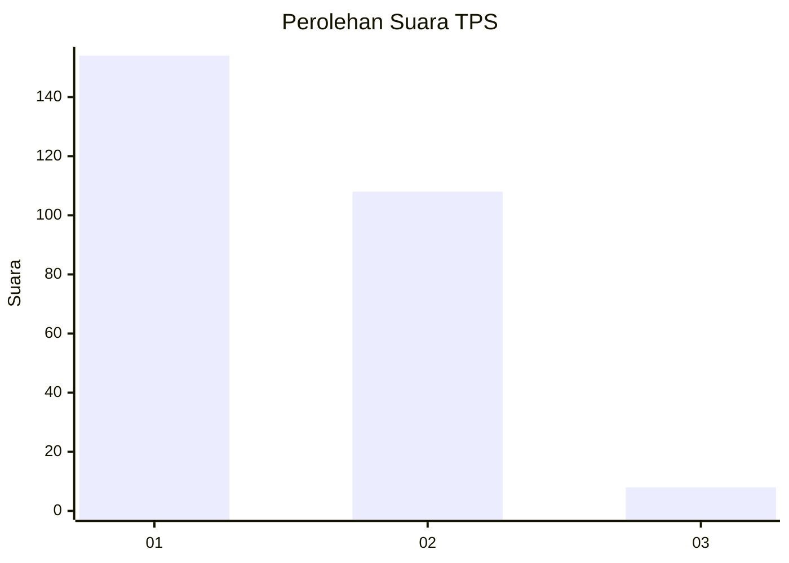
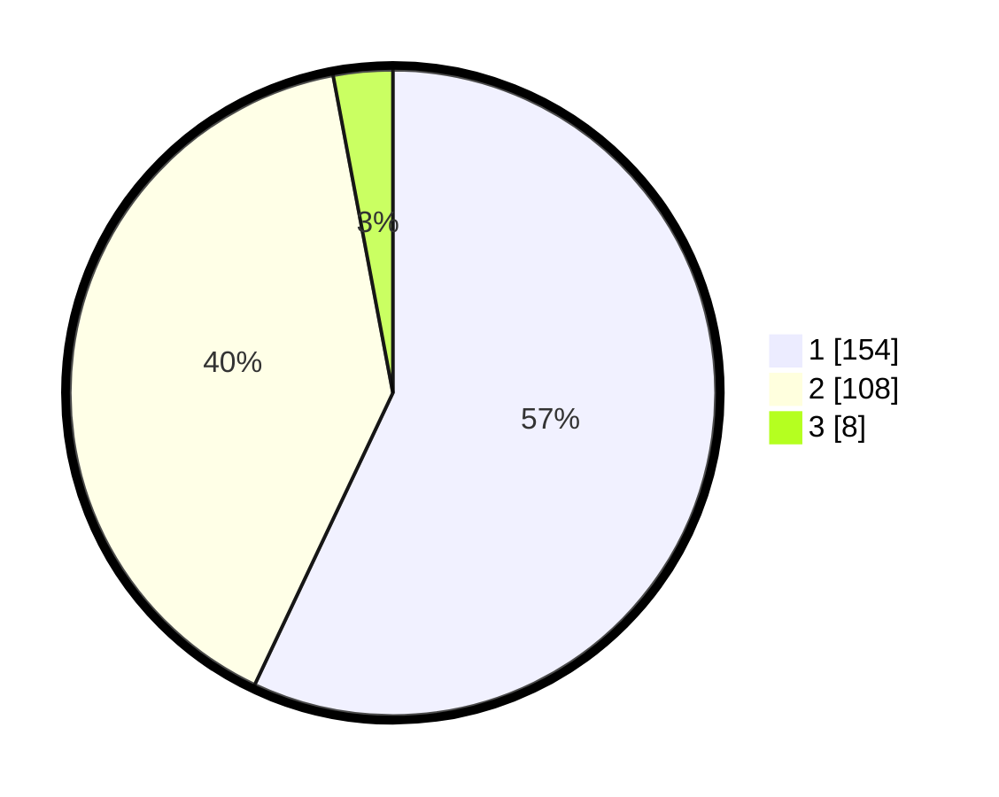

# Hasil

## Grafik

## Tabel

| No. | Nama Paslon    | Suara | Suara (raw) | Persentase |
|:--- |:-------------- | -----:| -----------:| ----------:|
| 1   | ANIES MUHAIMIN | 154   | [154][p-1]  | 57,04      |
| 2   | PRABOWO GIBRAN | 108   | [108][p-2]  | 40,00      |
| 3   | GANJAR MAHFUD  | 8     | [8][p-3]    | 2,96       |

[p-1]: https://github.com/gigit-pemilu/pemilu-2024/blob/main/pilpres/hitung-suara/sub/35-jawa-timur/sub/27-sampang/sub/05-omben/sub/2008-temoran/sub/001-tps/sub/paslon-1.txt
[p-2]: https://github.com/gigit-pemilu/pemilu-2024/blob/main/pilpres/hitung-suara/sub/35-jawa-timur/sub/27-sampang/sub/05-omben/sub/2008-temoran/sub/001-tps/sub/paslon-2.txt
[p-3]: https://github.com/gigit-pemilu/pemilu-2024/blob/main/pilpres/hitung-suara/sub/35-jawa-timur/sub/27-sampang/sub/05-omben/sub/2008-temoran/sub/001-tps/sub/paslon-3.txt

## Foto C Plano

https://sirekap-obj-formc.kpu.go.id/acf3/pemilu/ppwp/35/27/05/20/08/3527052008001-20240214-191549--54e842b9-b8a4-477e-9c25-4183dd905c7d.jpg

https://sirekap-obj-formc.kpu.go.id/acf3/pemilu/ppwp/35/27/05/20/08/3527052008001-20240214-191716--999777df-62ce-4d5c-96ee-8d5a0a22eb89.jpg

https://sirekap-obj-formc.kpu.go.id/acf3/pemilu/ppwp/35/27/05/20/08/3527052008001-20240214-191818--e98fa209-b5db-4e0d-97fc-e7174b09da6c.jpg

## Metadata

| Key        | Value               |
| ---------- | ------------------- |
| Time Stamp | 2024-02-16 22:01:00 |

