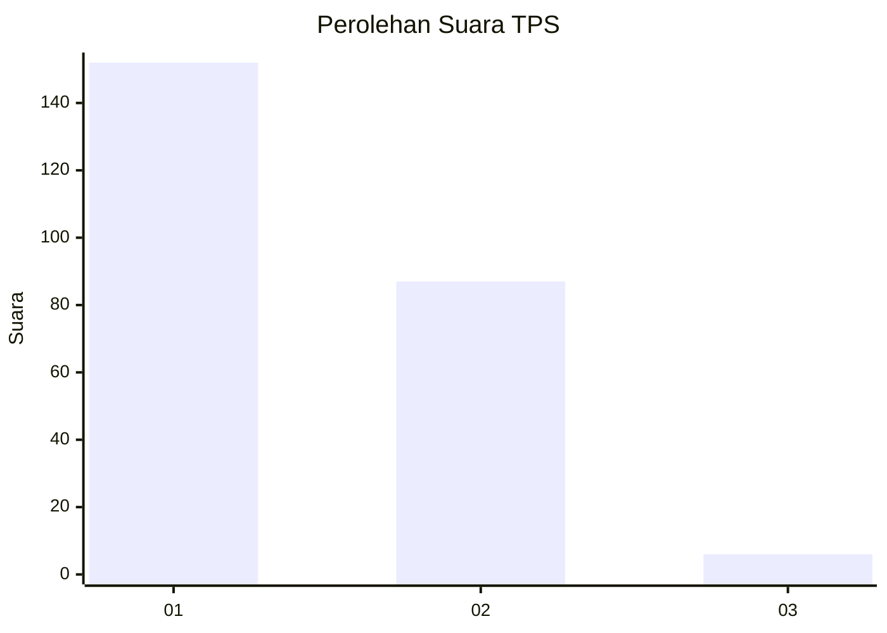
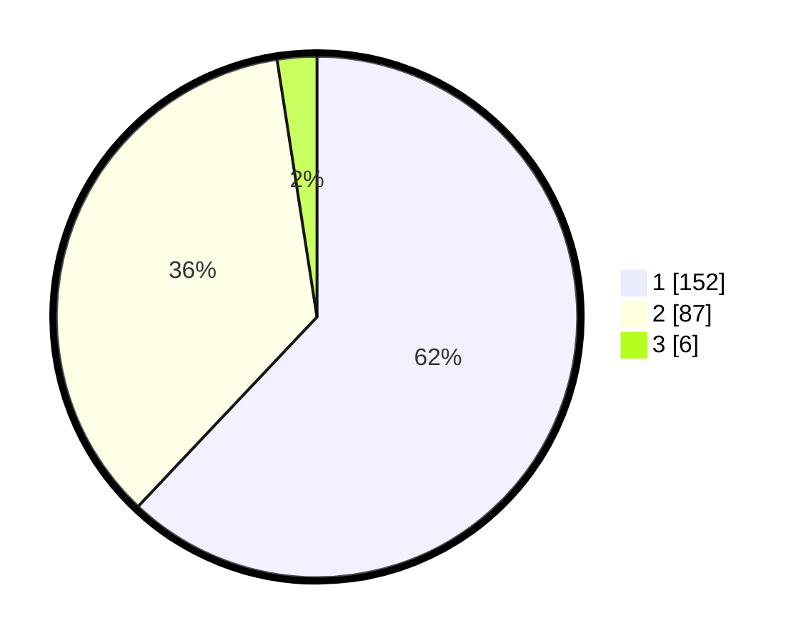

# Hasil

## Grafik

## Tabel

| No. | Nama Paslon    | Suara | Suara (raw) | Persentase |
|:--- |:-------------- | -----:| -----------:| ----------:|
| 1   | ANIES MUHAIMIN | 152   | [152][p-1]  | 62,04      |
| 2   | PRABOWO GIBRAN | 87    | [87][p-2]   | 35,51      |
| 3   | GANJAR MAHFUD  | 6     | [6][p-3]    | 2,45       |

[p-1]: https://github.com/gigit-pemilu/pemilu-2024-35-jawa-timur/blob/main/pilpres/hitung-suara/sub/35-jawa-timur/sub/27-sampang/sub/05-omben/sub/2008-temoran/sub/002-tps/sub/paslon-1.txt
[p-2]: https://github.com/gigit-pemilu/pemilu-2024-35-jawa-timur/blob/main/pilpres/hitung-suara/sub/35-jawa-timur/sub/27-sampang/sub/05-omben/sub/2008-temoran/sub/002-tps/sub/paslon-2.txt
[p-3]: https://github.com/gigit-pemilu/pemilu-2024-35-jawa-timur/blob/main/pilpres/hitung-suara/sub/35-jawa-timur/sub/27-sampang/sub/05-omben/sub/2008-temoran/sub/002-tps/sub/paslon-3.txt

## Foto C Plano

https://sirekap-obj-formc.kpu.go.id/87ee/pemilu/ppwp/35/27/05/20/08/3527052008002-20240214-185850--4f1da4bf-81b8-4fef-8673-836e4533bd59.jpg

https://sirekap-obj-formc.kpu.go.id/87ee/pemilu/ppwp/35/27/05/20/08/3527052008002-20240214-190032--21f728ff-fa8b-4657-89cc-fef2d1bc35fa.jpg

https://sirekap-obj-formc.kpu.go.id/87ee/pemilu/ppwp/35/27/05/20/08/3527052008002-20240214-190426--6ccf5fe1-57bc-4c2d-ae9e-3c9a95a5076d.jpg

## Metadata

| Key        | Value               |
| ---------- | ------------------- |
| Time Stamp | 2024-02-16 22:01:00 |

