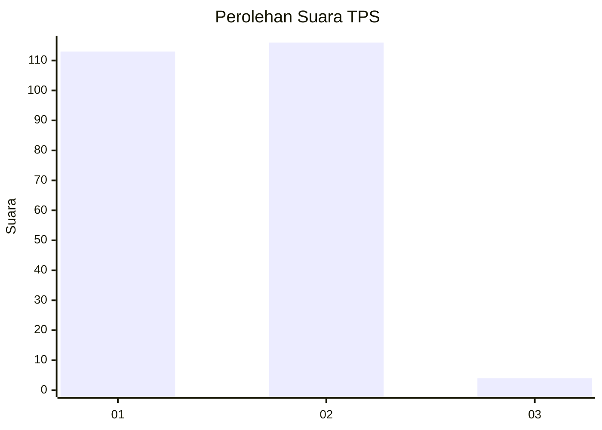
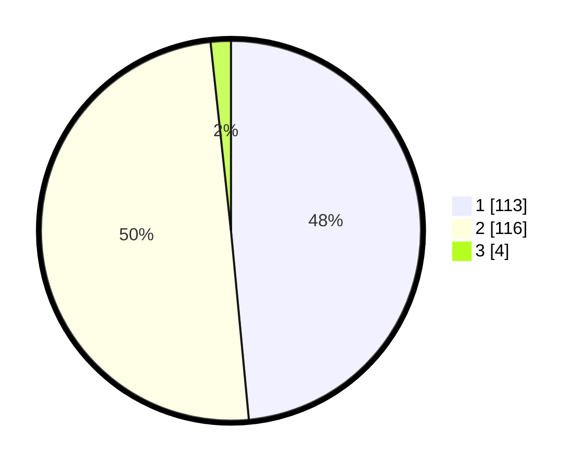

# Hasil

## Grafik

## Tabel

| No. | Nama Paslon    | Suara | Suara (raw) | Persentase |
|:--- |:-------------- | -----:| -----------:| ----------:|
| 1   | ANIES MUHAIMIN | 113   | [113][p-1]  | 48,50      |
| 2   | PRABOWO GIBRAN | 116   | [116][p-2]  | 49,79      |
| 3   | GANJAR MAHFUD  | 4     | [4][p-3]    | 1,72       |

[p-1]: https://github.com/gigit-pemilu/pemilu-2024/blob/main/pilpres/hitung-suara/sub/35-jawa-timur/sub/27-sampang/sub/05-omben/sub/2008-temoran/sub/003-tps/sub/paslon-1.txt
[p-2]: https://github.com/gigit-pemilu/pemilu-2024/blob/main/pilpres/hitung-suara/sub/35-jawa-timur/sub/27-sampang/sub/05-omben/sub/2008-temoran/sub/003-tps/sub/paslon-2.txt
[p-3]: https://github.com/gigit-pemilu/pemilu-2024/blob/main/pilpres/hitung-suara/sub/35-jawa-timur/sub/27-sampang/sub/05-omben/sub/2008-temoran/sub/003-tps/sub/paslon-3.txt

## Foto C Plano

https://sirekap-obj-formc.kpu.go.id/95a3/pemilu/ppwp/35/27/05/20/08/3527052008003-20240214-185347--f215ad6a-02a6-4a80-b8b6-114ef16ff35f.jpg

https://sirekap-obj-formc.kpu.go.id/95a3/pemilu/ppwp/35/27/05/20/08/3527052008003-20240214-185443--c96c5138-58a1-42bd-8490-8824f8cad443.jpg

https://sirekap-obj-formc.kpu.go.id/95a3/pemilu/ppwp/35/27/05/20/08/3527052008003-20240214-185519--0e5cb321-2f8b-4b9d-9bdf-ecff4bc2d4d7.jpg

## Metadata

| Key        | Value               |
| ---------- | ------------------- |
| Time Stamp | 2024-02-16 22:01:00 |

