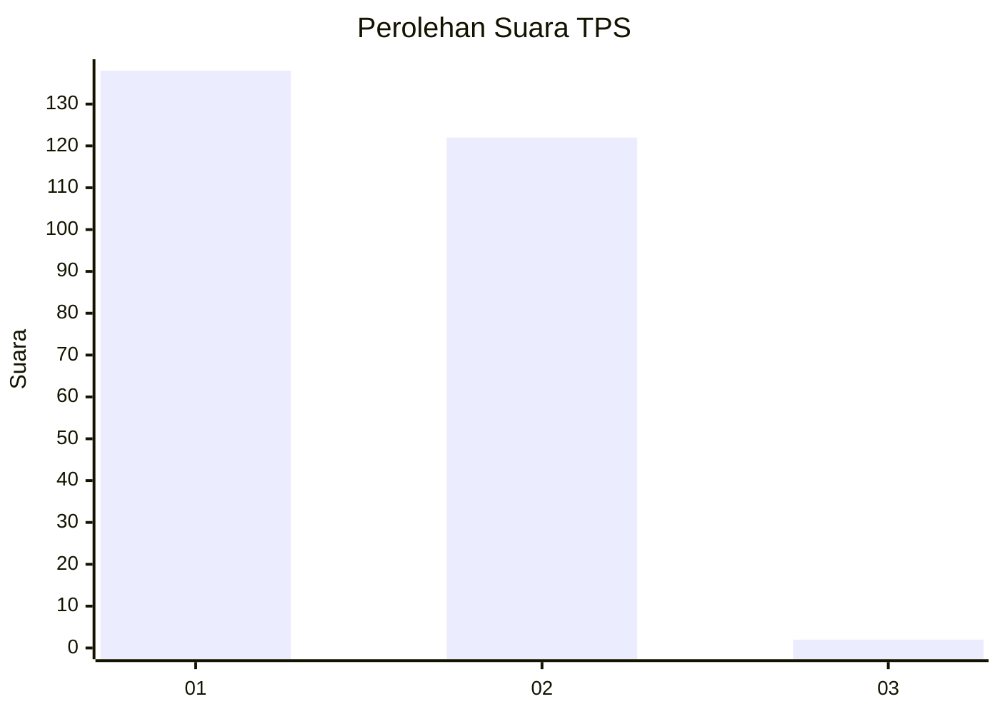
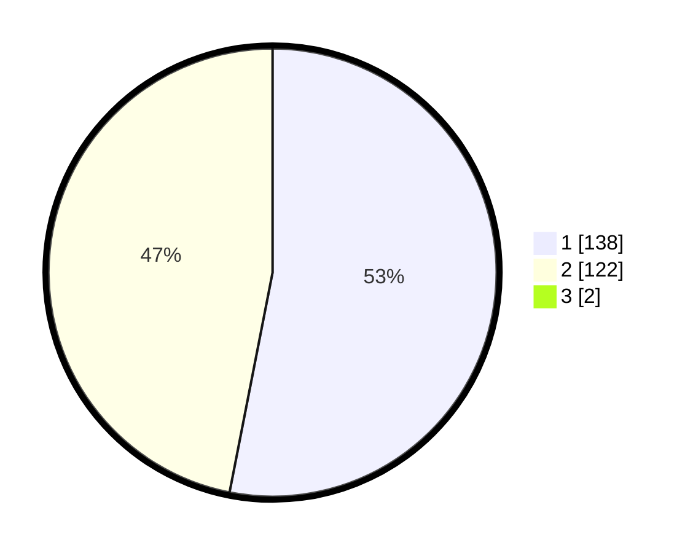

# Hasil

## Grafik

## Tabel

| No. | Nama Paslon    | Suara | Suara (raw) | Persentase |
|:--- |:-------------- | -----:| -----------:| ----------:|
| 1   | ANIES MUHAIMIN | 138   | [138][p-1]  | 52,67      |
| 2   | PRABOWO GIBRAN | 122   | [122][p-2]  | 46,56      |
| 3   | GANJAR MAHFUD  | 2     | [2][p-3]    | 0,76       |

[p-1]: https://github.com/gigit-pemilu/pemilu-2024/blob/main/pilpres/hitung-suara/sub/35-jawa-timur/sub/27-sampang/sub/05-omben/sub/2009-meteng/sub/001-tps/sub/paslon-1.txt
[p-2]: https://github.com/gigit-pemilu/pemilu-2024/blob/main/pilpres/hitung-suara/sub/35-jawa-timur/sub/27-sampang/sub/05-omben/sub/2009-meteng/sub/001-tps/sub/paslon-2.txt
[p-3]: https://github.com/gigit-pemilu/pemilu-2024/blob/main/pilpres/hitung-suara/sub/35-jawa-timur/sub/27-sampang/sub/05-omben/sub/2009-meteng/sub/001-tps/sub/paslon-3.txt

## Foto C Plano

https://sirekap-obj-formc.kpu.go.id/d2d9/pemilu/ppwp/35/27/05/20/09/3527052009001-20240215-104346--dcb9b4e2-8f84-4388-9124-3dd78d00eea5.jpg

https://sirekap-obj-formc.kpu.go.id/d2d9/pemilu/ppwp/35/27/05/20/09/3527052009001-20240215-104456--82483466-1a28-408a-aaca-62a09fa5c7e1.jpg

https://sirekap-obj-formc.kpu.go.id/d2d9/pemilu/ppwp/35/27/05/20/09/3527052009001-20240214-185034--7fefc0a9-79cd-4d72-8c02-e72e8effa94c.jpg

## Metadata

| Key        | Value               |
| ---------- | ------------------- |
| Time Stamp | 2024-02-16 10:00:28 |

