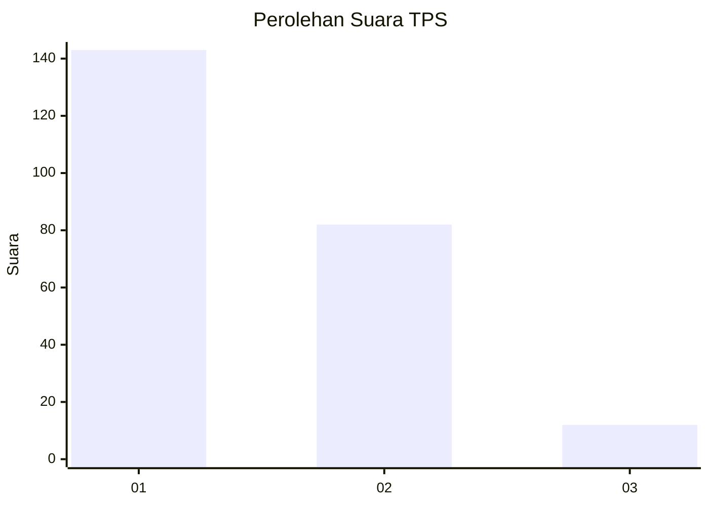
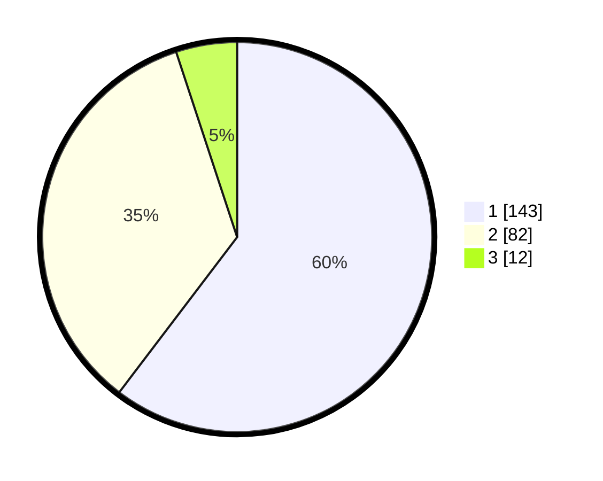

# Hasil

## Grafik

## Tabel

| No. | Nama Paslon    | Suara | Suara (raw) | Persentase |
|:--- |:-------------- | -----:| -----------:| ----------:|
| 1   | ANIES MUHAIMIN | 143   | [143][p-1]  | 60,34      |
| 2   | PRABOWO GIBRAN | 82    | [82][p-2]   | 34,60      |
| 3   | GANJAR MAHFUD  | 12    | [12][p-3]   | 5,06       |

[p-1]: https://github.com/gigit-pemilu/pemilu-2024/blob/main/pilpres/hitung-suara/sub/35-jawa-timur/sub/27-sampang/sub/05-omben/sub/2009-meteng/sub/003-tps/sub/paslon-1.txt
[p-2]: https://github.com/gigit-pemilu/pemilu-2024/blob/main/pilpres/hitung-suara/sub/35-jawa-timur/sub/27-sampang/sub/05-omben/sub/2009-meteng/sub/003-tps/sub/paslon-2.txt
[p-3]: https://github.com/gigit-pemilu/pemilu-2024/blob/main/pilpres/hitung-suara/sub/35-jawa-timur/sub/27-sampang/sub/05-omben/sub/2009-meteng/sub/003-tps/sub/paslon-3.txt

## Foto C Plano

https://sirekap-obj-formc.kpu.go.id/2211/pemilu/ppwp/35/27/05/20/09/3527052009003-20240215-084259--dad8cc14-1728-40f9-9954-9047afadf736.jpg

https://sirekap-obj-formc.kpu.go.id/2211/pemilu/ppwp/35/27/05/20/09/3527052009003-20240215-084635--665348e0-31a5-45fc-802c-f1febb7564cb.jpg

https://sirekap-obj-formc.kpu.go.id/2211/pemilu/ppwp/35/27/05/20/09/3527052009003-20240215-084718--65575d3b-9af3-4d4d-ab4b-560aa12495ca.jpg

## Metadata

| Key        | Value               |
| ---------- | ------------------- |
| Time Stamp | 2024-02-16 22:01:00 |

