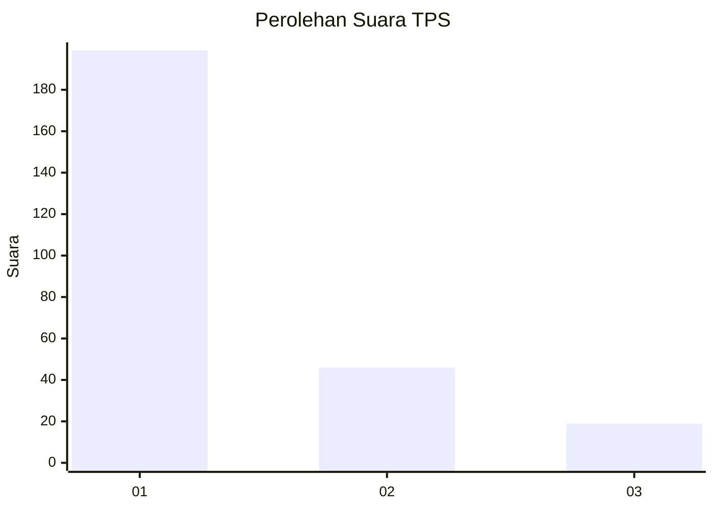
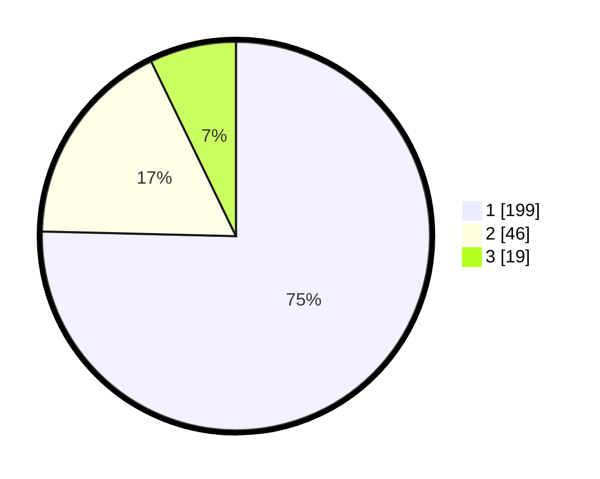

# Hasil

## Grafik

## Tabel

| No. | Nama Paslon    | Suara | Suara (raw) | Persentase |
|:--- |:-------------- | -----:| -----------:| ----------:|
| 1   | ANIES MUHAIMIN | 199   | [199][p-1]  | 75,38      |
| 2   | PRABOWO GIBRAN | 46    | [46][p-2]   | 17,42      |
| 3   | GANJAR MAHFUD  | 19    | [19][p-3]   | 7,20       |

[p-1]: https://github.com/gigit-pemilu/pemilu-2024-35-jawa-timur/blob/main/pilpres/hitung-suara/sub/35-jawa-timur/sub/27-sampang/sub/05-omben/sub/2009-meteng/sub/007-tps/sub/paslon-1.txt
[p-2]: https://github.com/gigit-pemilu/pemilu-2024-35-jawa-timur/blob/main/pilpres/hitung-suara/sub/35-jawa-timur/sub/27-sampang/sub/05-omben/sub/2009-meteng/sub/007-tps/sub/paslon-2.txt
[p-3]: https://github.com/gigit-pemilu/pemilu-2024-35-jawa-timur/blob/main/pilpres/hitung-suara/sub/35-jawa-timur/sub/27-sampang/sub/05-omben/sub/2009-meteng/sub/007-tps/sub/paslon-3.txt

## Foto C Plano

https://sirekap-obj-formc.kpu.go.id/96d7/pemilu/ppwp/35/27/05/20/09/3527052009007-20240215-053303--dc58d098-1865-4e1a-9e25-2245ea205847.jpg

https://sirekap-obj-formc.kpu.go.id/96d7/pemilu/ppwp/35/27/05/20/09/3527052009007-20240215-053419--29c5b4ef-08db-403f-9010-9a6a5d131e69.jpg

https://sirekap-obj-formc.kpu.go.id/96d7/pemilu/ppwp/35/27/05/20/09/3527052009007-20240215-053524--ddbbc936-c10c-4e2c-9d15-e7d9261ed133.jpg

## Metadata

| Key        | Value               |
| ---------- | ------------------- |
| Time Stamp | 2024-02-16 22:30:00 |

