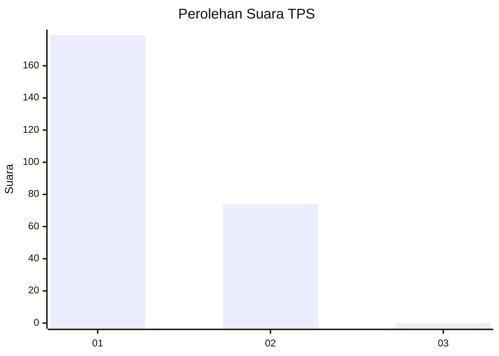
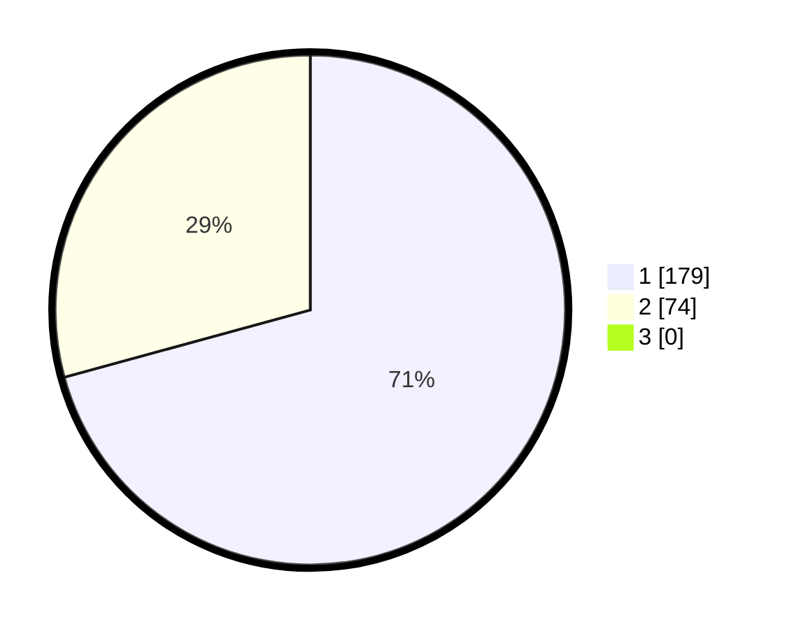

# Hasil

## Grafik

## Tabel

| No. | Nama Paslon    | Suara | Suara (raw) | Persentase |
|:--- |:-------------- | -----:| -----------:| ----------:|
| 1   | ANIES MUHAIMIN | 179   | [179][p-1]  | 70,75      |
| 2   | PRABOWO GIBRAN | 74    | [74][p-2]   | 29,25      |
| 3   | GANJAR MAHFUD  | 0     | [0][p-3]    | 0,00       |

[p-1]: https://github.com/gigit-pemilu/pemilu-2024-35-jawa-timur/blob/main/pilpres/hitung-suara/sub/35-jawa-timur/sub/27-sampang/sub/05-omben/sub/2009-meteng/sub/009-tps/sub/paslon-1.txt
[p-2]: https://github.com/gigit-pemilu/pemilu-2024-35-jawa-timur/blob/main/pilpres/hitung-suara/sub/35-jawa-timur/sub/27-sampang/sub/05-omben/sub/2009-meteng/sub/009-tps/sub/paslon-2.txt
[p-3]: https://github.com/gigit-pemilu/pemilu-2024-35-jawa-timur/blob/main/pilpres/hitung-suara/sub/35-jawa-timur/sub/27-sampang/sub/05-omben/sub/2009-meteng/sub/009-tps/sub/paslon-3.txt

## Foto C Plano

https://sirekap-obj-formc.kpu.go.id/95db/pemilu/ppwp/35/27/05/20/09/3527052009009-20240215-110017--fe5ab0fd-733c-47a9-a2c3-8fdbbb9a3198.jpg

https://sirekap-obj-formc.kpu.go.id/95db/pemilu/ppwp/35/27/05/20/09/3527052009009-20240215-110252--48b9abea-d46f-499e-aa6b-c3f60ff74124.jpg

https://sirekap-obj-formc.kpu.go.id/95db/pemilu/ppwp/35/27/05/20/09/3527052009009-20240215-110654--7b8b4614-13ff-4a6a-a617-ad9af07876a9.jpg

## Metadata

| Key        | Value               |
| ---------- | ------------------- |
| Time Stamp | 2024-02-17 10:00:02 |

