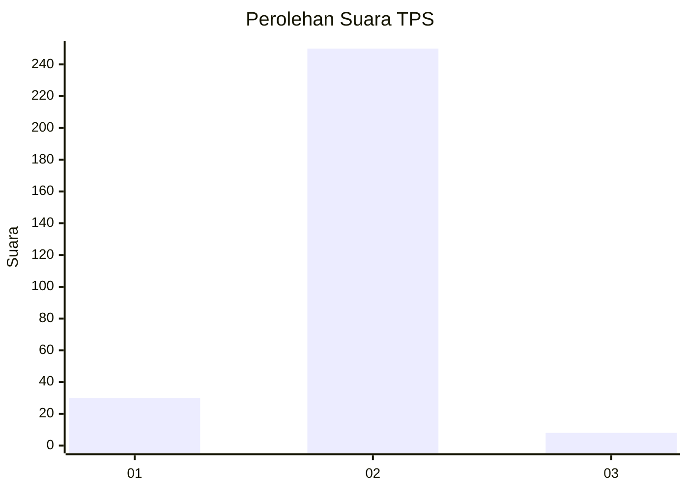
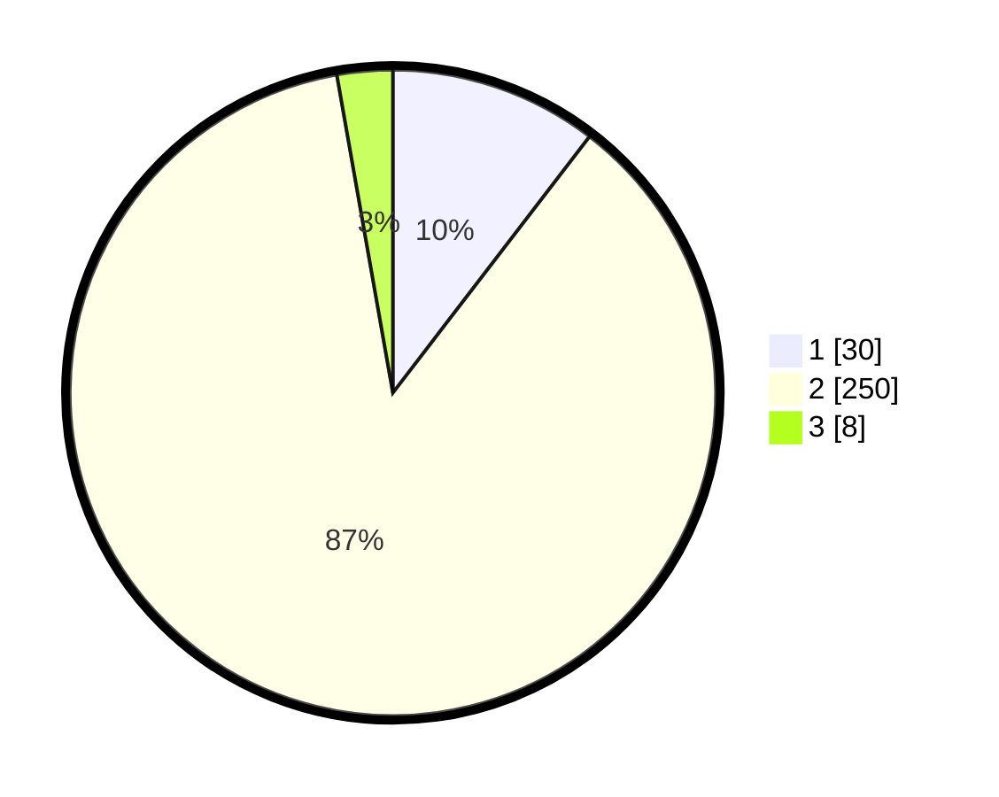

# Hasil

## Grafik

## Tabel

| No. | Nama Paslon    | Suara | Suara (raw) | Persentase |
|:--- |:-------------- | -----:| -----------:| ----------:|
| 1   | ANIES MUHAIMIN | 30    | [30][p-1]   | 10,42      |
| 2   | PRABOWO GIBRAN | 250   | [250][p-2]  | 86,81      |
| 3   | GANJAR MAHFUD  | 8     | [8][p-3]    | 2,78       |

[p-1]: https://github.com/gigit-pemilu/pemilu-2024/blob/main/pilpres/hitung-suara/sub/35-jawa-timur/sub/27-sampang/sub/05-omben/sub/2009-meteng/sub/010-tps/sub/paslon-1.txt
[p-2]: https://github.com/gigit-pemilu/pemilu-2024/blob/main/pilpres/hitung-suara/sub/35-jawa-timur/sub/27-sampang/sub/05-omben/sub/2009-meteng/sub/010-tps/sub/paslon-2.txt
[p-3]: https://github.com/gigit-pemilu/pemilu-2024/blob/main/pilpres/hitung-suara/sub/35-jawa-timur/sub/27-sampang/sub/05-omben/sub/2009-meteng/sub/010-tps/sub/paslon-3.txt

## Foto C Plano

https://sirekap-obj-formc.kpu.go.id/0b7f/pemilu/ppwp/35/27/05/20/09/3527052009010-20240215-104142--753ab9e6-24f0-4008-b7c6-a7ee5b3c5f88.jpg

https://sirekap-obj-formc.kpu.go.id/0b7f/pemilu/ppwp/35/27/05/20/09/3527052009010-20240215-104306--aa2e2a57-d37d-45d9-84de-513b48028e00.jpg

https://sirekap-obj-formc.kpu.go.id/0b7f/pemilu/ppwp/35/27/05/20/09/3527052009010-20240215-104415--17f3639f-8f38-4b4e-8e60-2ad176ae0043.jpg

## Metadata

| Key        | Value               |
| ---------- | ------------------- |
| Time Stamp | 2024-02-17 10:00:02 |

