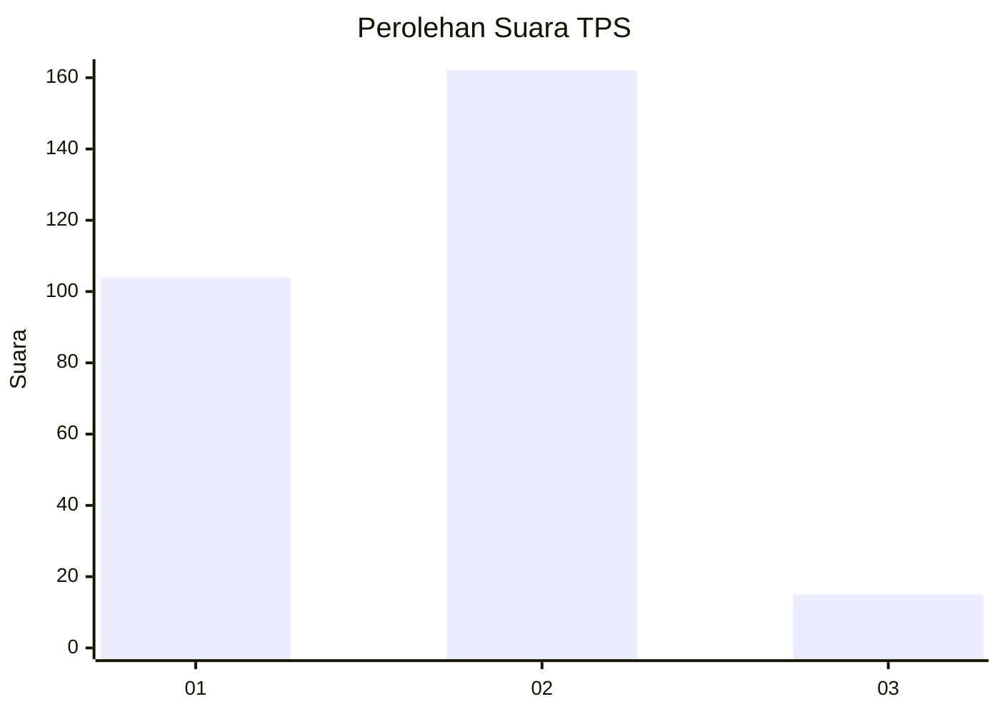
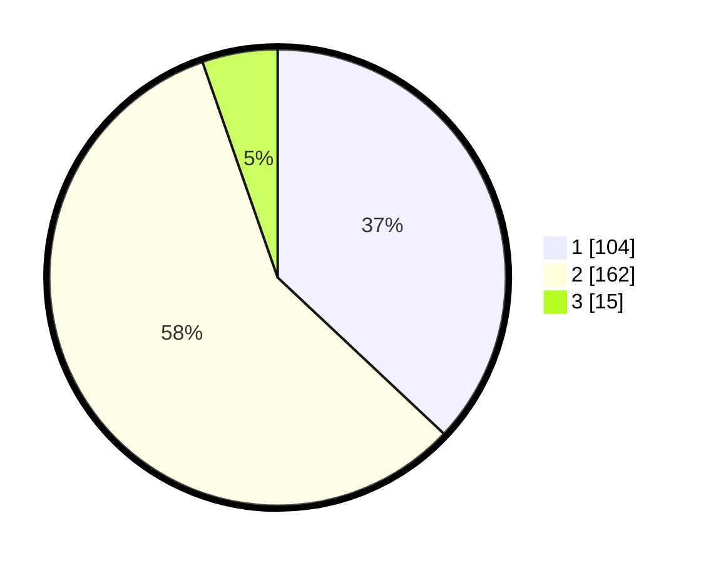

# Hasil

## Grafik

## Tabel

| No. | Nama Paslon    | Suara | Suara (raw) | Persentase |
|:--- |:-------------- | -----:| -----------:| ----------:|
| 1   | ANIES MUHAIMIN | 104   | [104][p-1]  | 37,01      |
| 2   | PRABOWO GIBRAN | 162   | [162][p-2]  | 57,65      |
| 3   | GANJAR MAHFUD  | 15    | [15][p-3]   | 5,34       |

[p-1]: https://github.com/gigit-pemilu/pemilu-2024-35-jawa-timur/blob/main/pilpres/hitung-suara/sub/35-jawa-timur/sub/27-sampang/sub/05-omben/sub/2009-meteng/sub/012-tps/sub/paslon-1.txt
[p-2]: https://github.com/gigit-pemilu/pemilu-2024-35-jawa-timur/blob/main/pilpres/hitung-suara/sub/35-jawa-timur/sub/27-sampang/sub/05-omben/sub/2009-meteng/sub/012-tps/sub/paslon-2.txt
[p-3]: https://github.com/gigit-pemilu/pemilu-2024-35-jawa-timur/blob/main/pilpres/hitung-suara/sub/35-jawa-timur/sub/27-sampang/sub/05-omben/sub/2009-meteng/sub/012-tps/sub/paslon-3.txt

## Foto C Plano

https://sirekap-obj-formc.kpu.go.id/fb3f/pemilu/ppwp/35/27/05/20/09/3527052009012-20240215-084440--e65b5744-0409-42e4-8afb-931d3dc6a456.jpg

https://sirekap-obj-formc.kpu.go.id/fb3f/pemilu/ppwp/35/27/05/20/09/3527052009012-20240215-084624--89f2dbbe-f4df-40c7-a2c7-be425f9f708f.jpg

https://sirekap-obj-formc.kpu.go.id/fb3f/pemilu/ppwp/35/27/05/20/09/3527052009012-20240215-084944--60a172f6-6ca0-4518-8981-9bfce30ac6a0.jpg

## Metadata

| Key        | Value               |
| ---------- | ------------------- |
| Time Stamp | 2024-02-16 22:30:00 |

