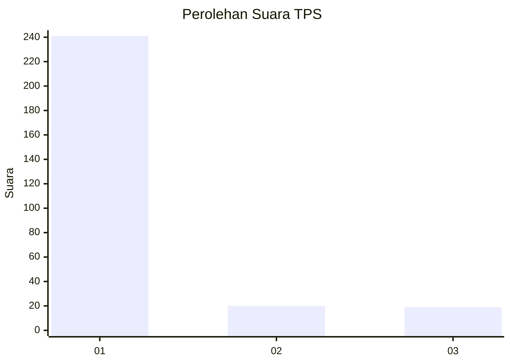
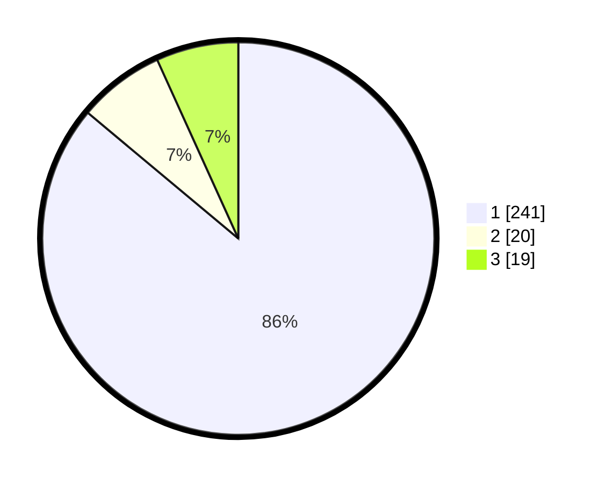

# Hasil

## Grafik

## Tabel

| No. | Nama Paslon    | Suara | Suara (raw) | Persentase |
|:--- |:-------------- | -----:| -----------:| ----------:|
| 1   | ANIES MUHAIMIN | 241   | [241][p-1]  | 86,07      |
| 2   | PRABOWO GIBRAN | 20    | [20][p-2]   | 7,14       |
| 3   | GANJAR MAHFUD  | 19    | [19][p-3]   | 6,79       |

[p-1]: https://github.com/gigit-pemilu/pemilu-2024-35-jawa-timur/blob/main/pilpres/hitung-suara/sub/35-jawa-timur/sub/27-sampang/sub/05-omben/sub/2011-kamondung/sub/001-tps/sub/paslon-1.txt
[p-2]: https://github.com/gigit-pemilu/pemilu-2024-35-jawa-timur/blob/main/pilpres/hitung-suara/sub/35-jawa-timur/sub/27-sampang/sub/05-omben/sub/2011-kamondung/sub/001-tps/sub/paslon-2.txt
[p-3]: https://github.com/gigit-pemilu/pemilu-2024-35-jawa-timur/blob/main/pilpres/hitung-suara/sub/35-jawa-timur/sub/27-sampang/sub/05-omben/sub/2011-kamondung/sub/001-tps/sub/paslon-3.txt

## Foto C Plano

https://sirekap-obj-formc.kpu.go.id/72e3/pemilu/ppwp/35/27/05/20/11/3527052011001-20240215-120440--f85dd5fe-6c87-4767-ab3d-3f9bb7f9473f.jpg

https://sirekap-obj-formc.kpu.go.id/72e3/pemilu/ppwp/35/27/05/20/11/3527052011001-20240215-120504--7fd84838-fc38-4dd8-b503-aa973662786f.jpg

https://sirekap-obj-formc.kpu.go.id/72e3/pemilu/ppwp/35/27/05/20/11/3527052011001-20240215-120543--27ba4eaa-ea3c-4086-ac7a-3b214678fbb9.jpg

## Metadata

| Key        | Value               |
| ---------- | ------------------- |
| Time Stamp | 2024-02-16 22:30:00 |

