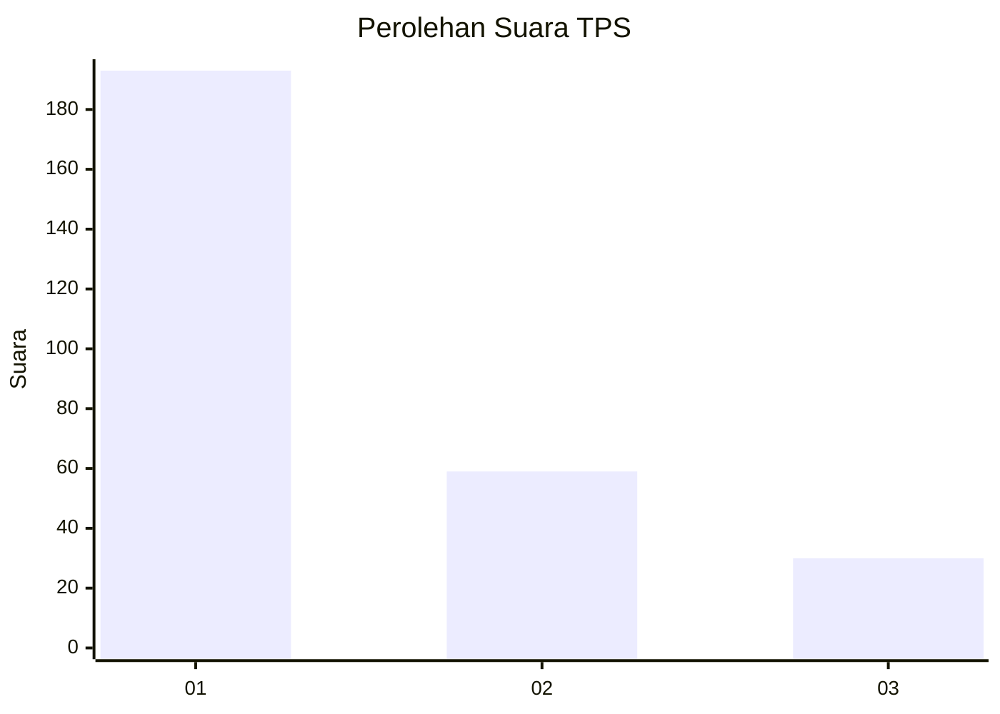
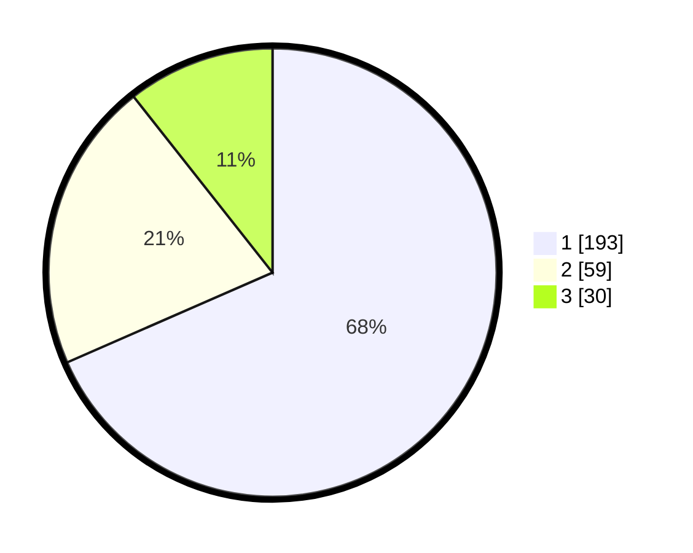

# Hasil

## Grafik

## Tabel

| No. | Nama Paslon    | Suara | Suara (raw) | Persentase |
|:--- |:-------------- | -----:| -----------:| ----------:|
| 1   | ANIES MUHAIMIN | 193   | [193][p-1]  | 68,44      |
| 2   | PRABOWO GIBRAN | 59    | [59][p-2]   | 20,92      |
| 3   | GANJAR MAHFUD  | 30    | [30][p-3]   | 10,64      |

[p-1]: https://github.com/gigit-pemilu/pemilu-2024/blob/main/pilpres/hitung-suara/sub/35-jawa-timur/sub/27-sampang/sub/05-omben/sub/2011-kamondung/sub/002-tps/sub/paslon-1.txt
[p-2]: https://github.com/gigit-pemilu/pemilu-2024/blob/main/pilpres/hitung-suara/sub/35-jawa-timur/sub/27-sampang/sub/05-omben/sub/2011-kamondung/sub/002-tps/sub/paslon-2.txt
[p-3]: https://github.com/gigit-pemilu/pemilu-2024/blob/main/pilpres/hitung-suara/sub/35-jawa-timur/sub/27-sampang/sub/05-omben/sub/2011-kamondung/sub/002-tps/sub/paslon-3.txt

## Foto C Plano

https://sirekap-obj-formc.kpu.go.id/6271/pemilu/ppwp/35/27/05/20/11/3527052011002-20240215-112249--c80e7a96-c86c-455c-b45b-31c475f6246d.jpg

https://sirekap-obj-formc.kpu.go.id/6271/pemilu/ppwp/35/27/05/20/11/3527052011002-20240215-113402--e9f67e96-918d-4471-b88c-f6db48728093.jpg

https://sirekap-obj-formc.kpu.go.id/6271/pemilu/ppwp/35/27/05/20/11/3527052011002-20240215-113525--44d49356-0286-4c39-b232-2007ba739db3.jpg

## Metadata

| Key        | Value               |
| ---------- | ------------------- |
| Time Stamp | 2024-02-16 22:30:00 |

