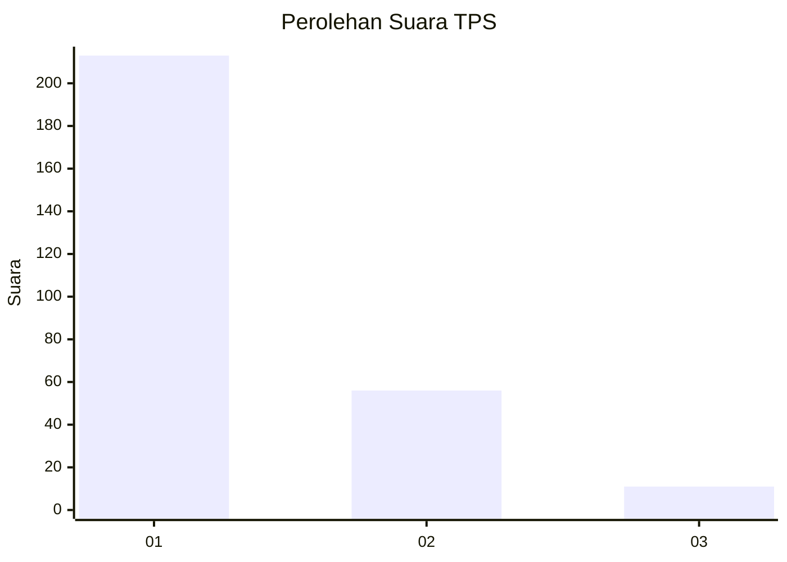
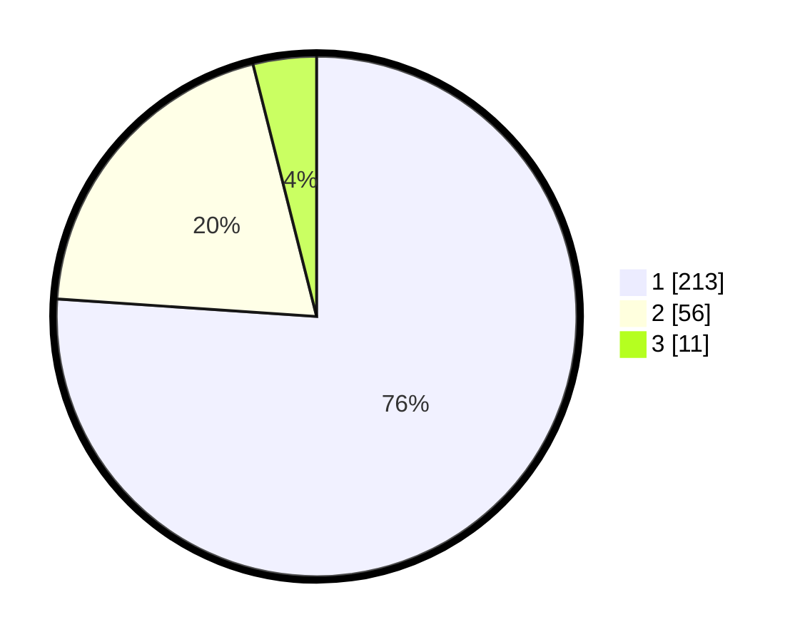

# Hasil

## Grafik

## Tabel

| No. | Nama Paslon    | Suara | Suara (raw) | Persentase |
|:--- |:-------------- | -----:| -----------:| ----------:|
| 1   | ANIES MUHAIMIN | 213   | [213][p-1]  | 76,07      |
| 2   | PRABOWO GIBRAN | 56    | [56][p-2]   | 20,00      |
| 3   | GANJAR MAHFUD  | 11    | [11][p-3]   | 3,93       |

[p-1]: https://github.com/gigit-pemilu/pemilu-2024-35-jawa-timur/blob/main/pilpres/hitung-suara/sub/35-jawa-timur/sub/27-sampang/sub/05-omben/sub/2011-kamondung/sub/003-tps/sub/paslon-1.txt
[p-2]: https://github.com/gigit-pemilu/pemilu-2024-35-jawa-timur/blob/main/pilpres/hitung-suara/sub/35-jawa-timur/sub/27-sampang/sub/05-omben/sub/2011-kamondung/sub/003-tps/sub/paslon-2.txt
[p-3]: https://github.com/gigit-pemilu/pemilu-2024-35-jawa-timur/blob/main/pilpres/hitung-suara/sub/35-jawa-timur/sub/27-sampang/sub/05-omben/sub/2011-kamondung/sub/003-tps/sub/paslon-3.txt

## Foto C Plano

https://sirekap-obj-formc.kpu.go.id/6b5c/pemilu/ppwp/35/27/05/20/11/3527052011003-20240215-092648--a9fb9bcd-7163-4f31-ab1e-363dd656c2d4.jpg

https://sirekap-obj-formc.kpu.go.id/6b5c/pemilu/ppwp/35/27/05/20/11/3527052011003-20240215-093031--9b07136f-52e1-4014-9c75-efc22667a9e3.jpg

https://sirekap-obj-formc.kpu.go.id/6b5c/pemilu/ppwp/35/27/05/20/11/3527052011003-20240215-092857--05883410-e2b5-46b9-b95d-acc60be7ea34.jpg

## Metadata

| Key        | Value               |
| ---------- | ------------------- |
| Time Stamp | 2024-02-16 22:30:00 |

