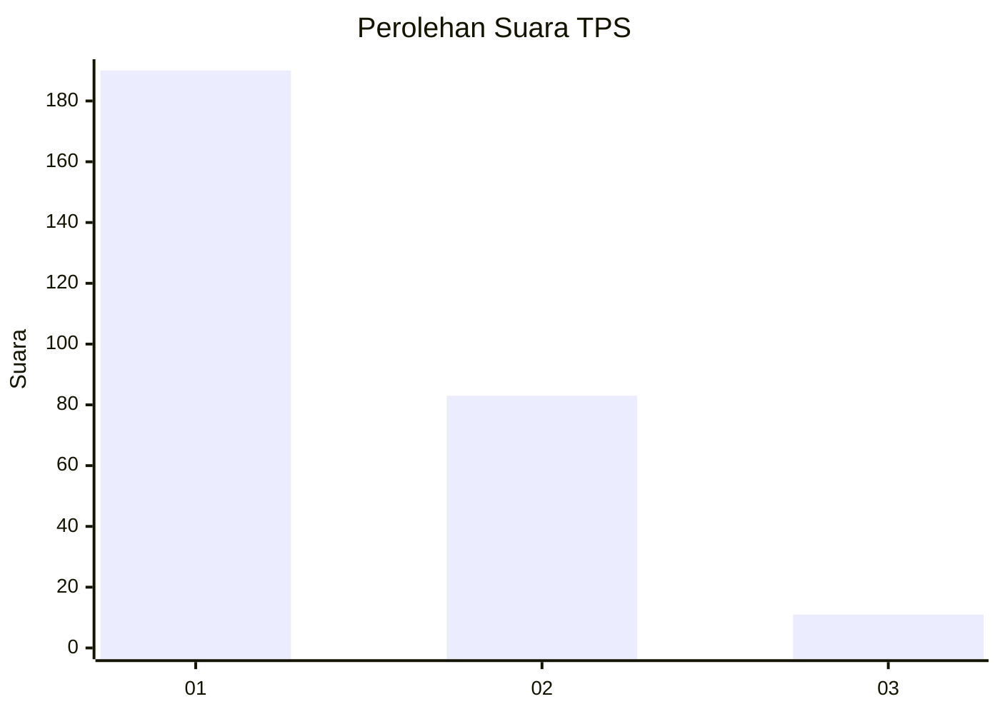
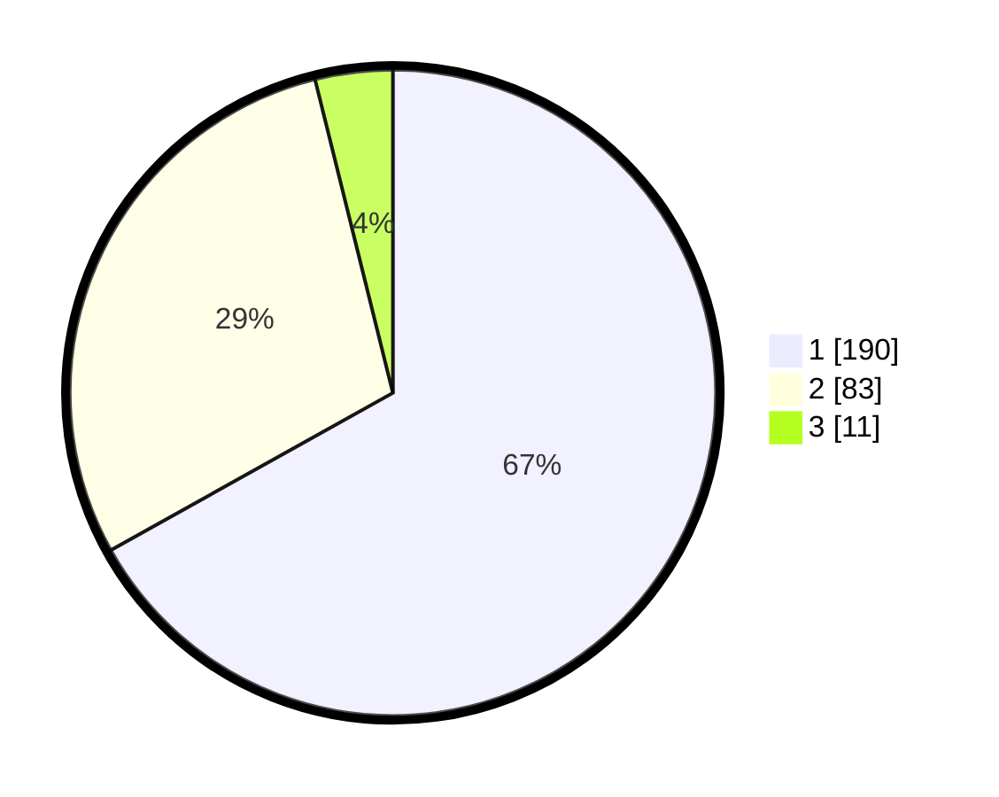

# Hasil

## Grafik

## Tabel

| No. | Nama Paslon    | Suara | Suara (raw) | Persentase |
|:--- |:-------------- | -----:| -----------:| ----------:|
| 1   | ANIES MUHAIMIN | 190   | [190][p-1]  | 66,90      |
| 2   | PRABOWO GIBRAN | 83    | [83][p-2]   | 29,23      |
| 3   | GANJAR MAHFUD  | 11    | [11][p-3]   | 3,87       |

[p-1]: https://github.com/gigit-pemilu/pemilu-2024-35-jawa-timur/blob/main/pilpres/hitung-suara/sub/35-jawa-timur/sub/27-sampang/sub/05-omben/sub/2011-kamondung/sub/004-tps/sub/paslon-1.txt
[p-2]: https://github.com/gigit-pemilu/pemilu-2024-35-jawa-timur/blob/main/pilpres/hitung-suara/sub/35-jawa-timur/sub/27-sampang/sub/05-omben/sub/2011-kamondung/sub/004-tps/sub/paslon-2.txt
[p-3]: https://github.com/gigit-pemilu/pemilu-2024-35-jawa-timur/blob/main/pilpres/hitung-suara/sub/35-jawa-timur/sub/27-sampang/sub/05-omben/sub/2011-kamondung/sub/004-tps/sub/paslon-3.txt

## Foto C Plano

https://sirekap-obj-formc.kpu.go.id/53ae/pemilu/ppwp/35/27/05/20/11/3527052011004-20240215-083618--3ec35f13-83d0-4102-922f-b23d3c8892af.jpg

https://sirekap-obj-formc.kpu.go.id/53ae/pemilu/ppwp/35/27/05/20/11/3527052011004-20240215-083413--07079d59-ca38-4ad0-b267-cc9e8fc5bd91.jpg

https://sirekap-obj-formc.kpu.go.id/53ae/pemilu/ppwp/35/27/05/20/11/3527052011004-20240215-083536--523aca94-d645-4b46-9a05-1f643aba9c9b.jpg

## Metadata

| Key        | Value               |
| ---------- | ------------------- |
| Time Stamp | 2024-02-16 22:30:00 |

