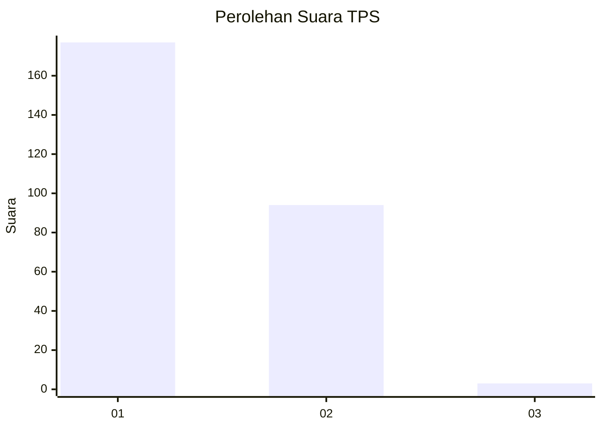
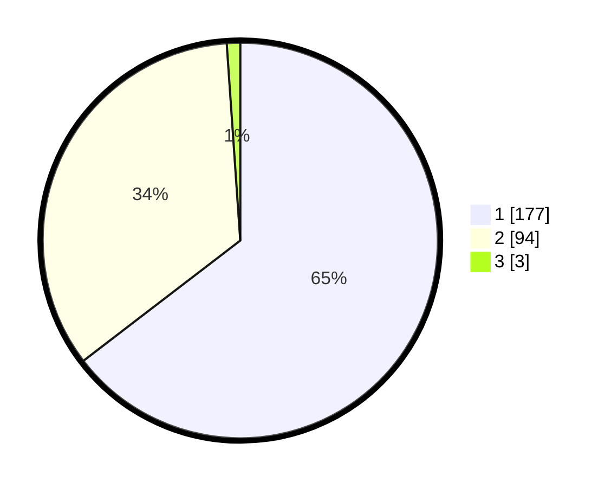

# Hasil

## Grafik

## Tabel

| No. | Nama Paslon    | Suara | Suara (raw) | Persentase |
|:--- |:-------------- | -----:| -----------:| ----------:|
| 1   | ANIES MUHAIMIN | 177   | [177][p-1]  | 64,60      |
| 2   | PRABOWO GIBRAN | 94    | [94][p-2]   | 34,31      |
| 3   | GANJAR MAHFUD  | 3     | [3][p-3]    | 1,09       |

[p-1]: https://github.com/gigit-pemilu/pemilu-2024/blob/main/pilpres/hitung-suara/sub/35-jawa-timur/sub/27-sampang/sub/05-omben/sub/2011-kamondung/sub/005-tps/sub/paslon-1.txt
[p-2]: https://github.com/gigit-pemilu/pemilu-2024/blob/main/pilpres/hitung-suara/sub/35-jawa-timur/sub/27-sampang/sub/05-omben/sub/2011-kamondung/sub/005-tps/sub/paslon-2.txt
[p-3]: https://github.com/gigit-pemilu/pemilu-2024/blob/main/pilpres/hitung-suara/sub/35-jawa-timur/sub/27-sampang/sub/05-omben/sub/2011-kamondung/sub/005-tps/sub/paslon-3.txt

## Foto C Plano

https://sirekap-obj-formc.kpu.go.id/f86d/pemilu/ppwp/35/27/05/20/11/3527052011005-20240215-094725--660ae6f4-a501-4057-af47-832a638cff9f.jpg

https://sirekap-obj-formc.kpu.go.id/f86d/pemilu/ppwp/35/27/05/20/11/3527052011005-20240215-095002--f314a16d-5d00-4368-9b62-f028250b6f53.jpg

https://sirekap-obj-formc.kpu.go.id/f86d/pemilu/ppwp/35/27/05/20/11/3527052011005-20240215-095050--b0f2cc99-0b5a-476a-a3b7-e716dc32cc72.jpg

## Metadata

| Key        | Value               |
| ---------- | ------------------- |
| Time Stamp | 2024-02-16 22:30:00 |

