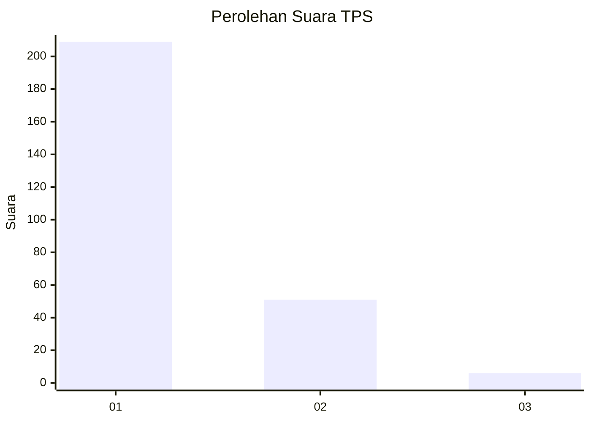
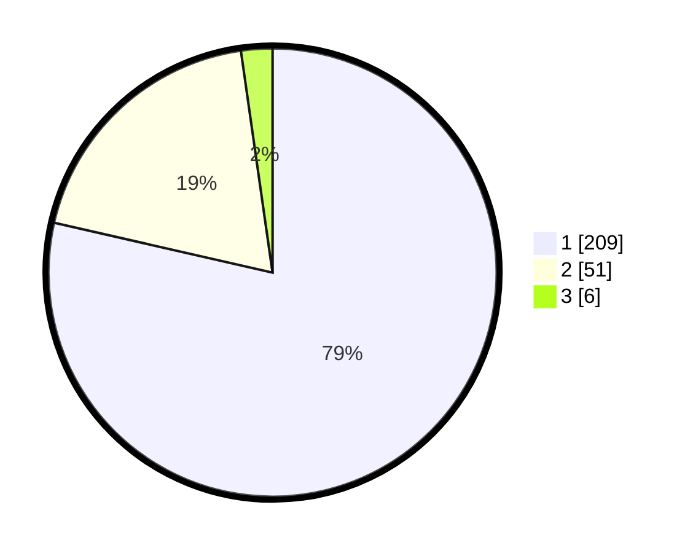

# Hasil

## Grafik

## Tabel

| No. | Nama Paslon    | Suara | Suara (raw) | Persentase |
|:--- |:-------------- | -----:| -----------:| ----------:|
| 1   | ANIES MUHAIMIN | 209   | [209][p-1]  | 78,57      |
| 2   | PRABOWO GIBRAN | 51    | [51][p-2]   | 19,17      |
| 3   | GANJAR MAHFUD  | 6     | [6][p-3]    | 2,26       |

[p-1]: https://github.com/gigit-pemilu/pemilu-2024/blob/main/pilpres/hitung-suara/sub/35-jawa-timur/sub/27-sampang/sub/05-omben/sub/2011-kamondung/sub/007-tps/sub/paslon-1.txt
[p-2]: https://github.com/gigit-pemilu/pemilu-2024/blob/main/pilpres/hitung-suara/sub/35-jawa-timur/sub/27-sampang/sub/05-omben/sub/2011-kamondung/sub/007-tps/sub/paslon-2.txt
[p-3]: https://github.com/gigit-pemilu/pemilu-2024/blob/main/pilpres/hitung-suara/sub/35-jawa-timur/sub/27-sampang/sub/05-omben/sub/2011-kamondung/sub/007-tps/sub/paslon-3.txt

## Foto C Plano

https://sirekap-obj-formc.kpu.go.id/d628/pemilu/ppwp/35/27/05/20/11/3527052011007-20240215-072748--9ef1bfbe-c45f-42bc-b230-8374f1679116.jpg

https://sirekap-obj-formc.kpu.go.id/d628/pemilu/ppwp/35/27/05/20/11/3527052011007-20240215-075516--5974dea7-438c-4cde-9e33-f0b726e0ad47.jpg

https://sirekap-obj-formc.kpu.go.id/d628/pemilu/ppwp/35/27/05/20/11/3527052011007-20240215-075702--f53d3720-c554-4f38-8d00-f6be593946d4.jpg

## Metadata

| Key        | Value               |
| ---------- | ------------------- |
| Time Stamp | 2024-02-16 22:30:00 |

