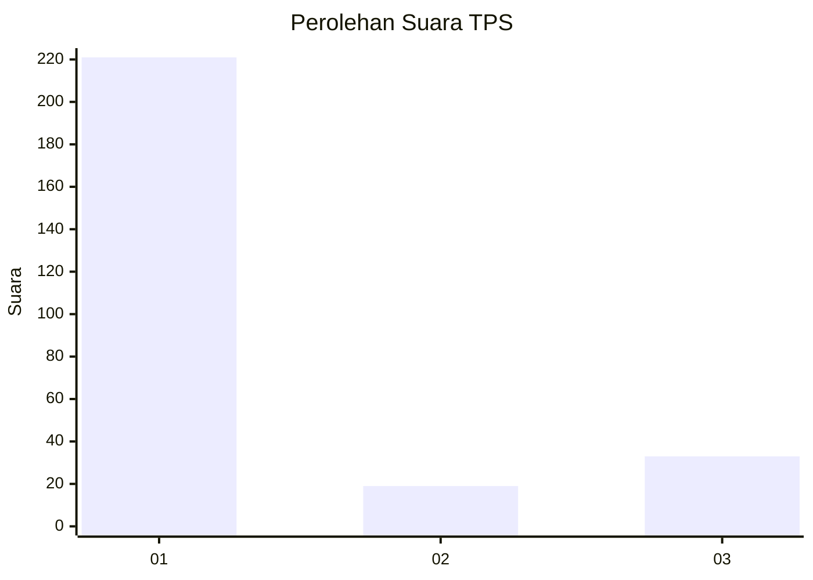
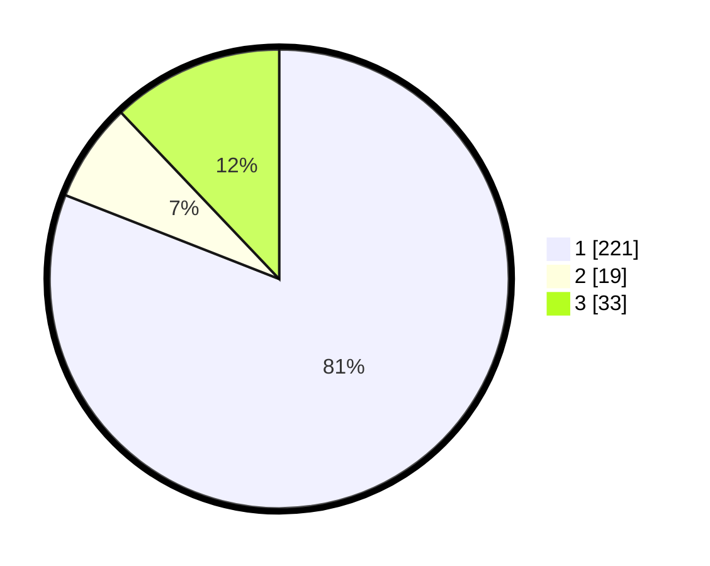

# Hasil

## Grafik

## Tabel

| No. | Nama Paslon    | Suara | Suara (raw) | Persentase |
|:--- |:-------------- | -----:| -----------:| ----------:|
| 1   | ANIES MUHAIMIN | 221   | [221][p-1]  | 80,95      |
| 2   | PRABOWO GIBRAN | 19    | [19][p-2]   | 6,96       |
| 3   | GANJAR MAHFUD  | 33    | [33][p-3]   | 12,09      |

[p-1]: https://github.com/gigit-pemilu/pemilu-2024-35-jawa-timur/blob/main/pilpres/hitung-suara/sub/35-jawa-timur/sub/27-sampang/sub/05-omben/sub/2011-kamondung/sub/010-tps/sub/paslon-1.txt
[p-2]: https://github.com/gigit-pemilu/pemilu-2024-35-jawa-timur/blob/main/pilpres/hitung-suara/sub/35-jawa-timur/sub/27-sampang/sub/05-omben/sub/2011-kamondung/sub/010-tps/sub/paslon-2.txt
[p-3]: https://github.com/gigit-pemilu/pemilu-2024-35-jawa-timur/blob/main/pilpres/hitung-suara/sub/35-jawa-timur/sub/27-sampang/sub/05-omben/sub/2011-kamondung/sub/010-tps/sub/paslon-3.txt

## Foto C Plano

https://sirekap-obj-formc.kpu.go.id/2481/pemilu/ppwp/35/27/05/20/11/3527052011010-20240215-102713--da3a08b1-fa2f-4501-b313-5377c4848f10.jpg

https://sirekap-obj-formc.kpu.go.id/2481/pemilu/ppwp/35/27/05/20/11/3527052011010-20240215-102819--44af1011-b9a0-4a2a-996a-748ed9718c17.jpg

https://sirekap-obj-formc.kpu.go.id/2481/pemilu/ppwp/35/27/05/20/11/3527052011010-20240215-102949--2955b7aa-9a8e-4e5e-9b3f-7bd71490dea8.jpg

## Metadata

| Key        | Value               |
| ---------- | ------------------- |
| Time Stamp | 2024-02-16 22:30:00 |

