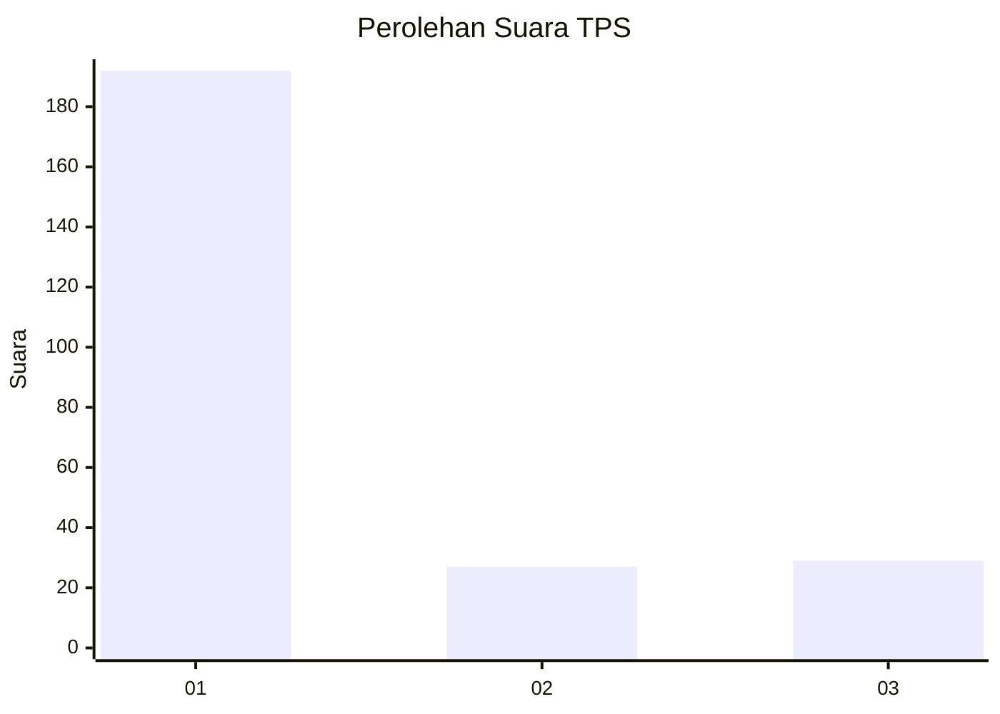
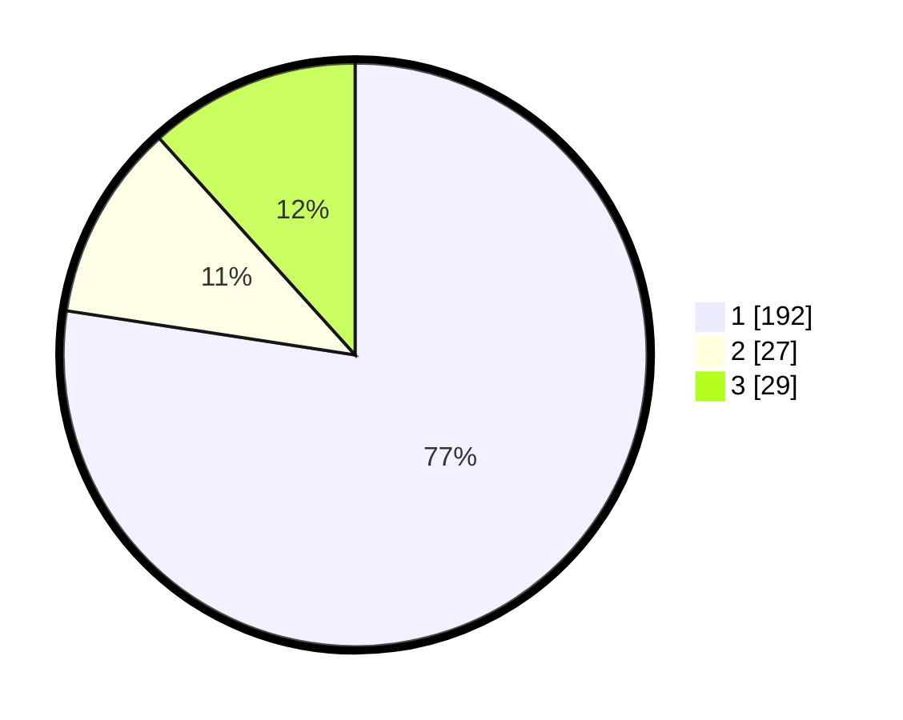

# Hasil

## Grafik

## Tabel

| No. | Nama Paslon    | Suara | Suara (raw) | Persentase |
|:--- |:-------------- | -----:| -----------:| ----------:|
| 1   | ANIES MUHAIMIN | 192   | [192][p-1]  | 77,42      |
| 2   | PRABOWO GIBRAN | 27    | [27][p-2]   | 10,89      |
| 3   | GANJAR MAHFUD  | 29    | [29][p-3]   | 11,69      |

[p-1]: https://github.com/gigit-pemilu/pemilu-2024-35-jawa-timur/blob/main/pilpres/hitung-suara/sub/35-jawa-timur/sub/27-sampang/sub/05-omben/sub/2011-kamondung/sub/011-tps/sub/paslon-1.txt
[p-2]: https://github.com/gigit-pemilu/pemilu-2024-35-jawa-timur/blob/main/pilpres/hitung-suara/sub/35-jawa-timur/sub/27-sampang/sub/05-omben/sub/2011-kamondung/sub/011-tps/sub/paslon-2.txt
[p-3]: https://github.com/gigit-pemilu/pemilu-2024-35-jawa-timur/blob/main/pilpres/hitung-suara/sub/35-jawa-timur/sub/27-sampang/sub/05-omben/sub/2011-kamondung/sub/011-tps/sub/paslon-3.txt

## Foto C Plano

https://sirekap-obj-formc.kpu.go.id/d129/pemilu/ppwp/35/27/05/20/11/3527052011011-20240215-111606--492f3804-ae38-4818-b928-237a8149575f.jpg

https://sirekap-obj-formc.kpu.go.id/d129/pemilu/ppwp/35/27/05/20/11/3527052011011-20240215-111742--ef9c3b65-6943-42a7-b884-9fb521adc9cf.jpg

https://sirekap-obj-formc.kpu.go.id/d129/pemilu/ppwp/35/27/05/20/11/3527052011011-20240215-111926--7a5e00ed-f8a1-4239-a1c0-6667b83ed861.jpg

## Metadata

| Key        | Value               |
| ---------- | ------------------- |
| Time Stamp | 2024-02-17 10:00:02 |

