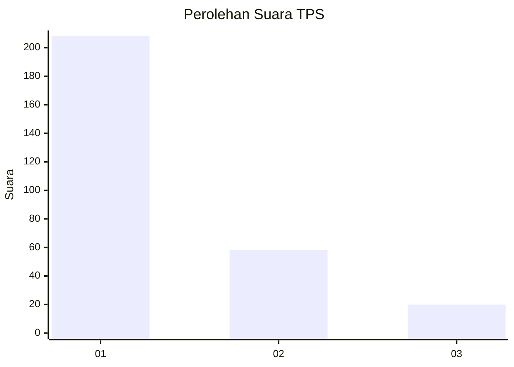
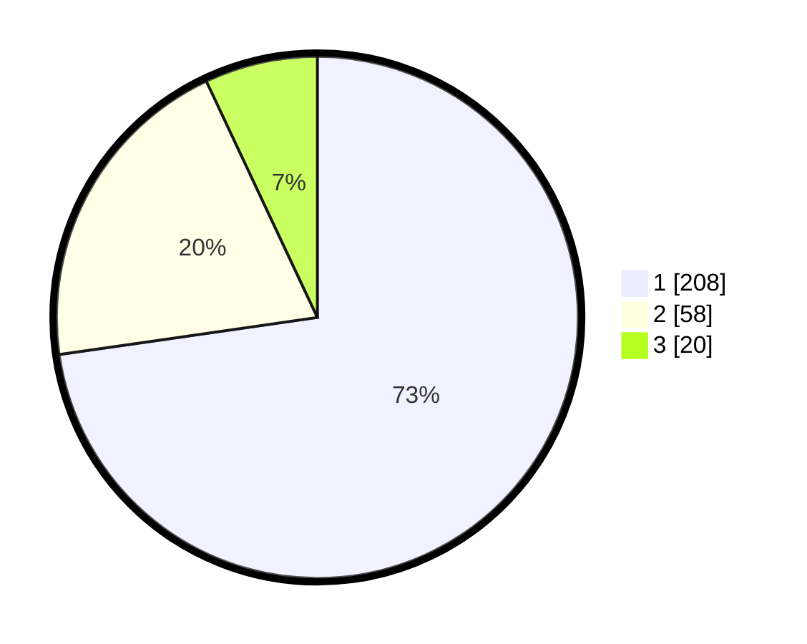

# Hasil

## Grafik

## Tabel

| No. | Nama Paslon    | Suara | Suara (raw) | Persentase |
|:--- |:-------------- | -----:| -----------:| ----------:|
| 1   | ANIES MUHAIMIN | 208   | [208][p-1]  | 72,73      |
| 2   | PRABOWO GIBRAN | 58    | [58][p-2]   | 20,28      |
| 3   | GANJAR MAHFUD  | 20    | [20][p-3]   | 6,99       |

[p-1]: https://github.com/gigit-pemilu/pemilu-2024-35-jawa-timur/blob/main/pilpres/hitung-suara/sub/35-jawa-timur/sub/27-sampang/sub/05-omben/sub/2011-kamondung/sub/013-tps/sub/paslon-1.txt
[p-2]: https://github.com/gigit-pemilu/pemilu-2024-35-jawa-timur/blob/main/pilpres/hitung-suara/sub/35-jawa-timur/sub/27-sampang/sub/05-omben/sub/2011-kamondung/sub/013-tps/sub/paslon-2.txt
[p-3]: https://github.com/gigit-pemilu/pemilu-2024-35-jawa-timur/blob/main/pilpres/hitung-suara/sub/35-jawa-timur/sub/27-sampang/sub/05-omben/sub/2011-kamondung/sub/013-tps/sub/paslon-3.txt

## Foto C Plano

https://sirekap-obj-formc.kpu.go.id/511a/pemilu/ppwp/35/27/05/20/11/3527052011013-20240215-085925--06026fa1-8566-47ff-a68b-460b122f85ba.jpg

https://sirekap-obj-formc.kpu.go.id/511a/pemilu/ppwp/35/27/05/20/11/3527052011013-20240215-090047--adc46611-ec7d-4058-a4de-765bc928e8e0.jpg

https://sirekap-obj-formc.kpu.go.id/511a/pemilu/ppwp/35/27/05/20/11/3527052011013-20240215-090131--a4c46590-1c72-499f-8408-bf28d22c4465.jpg

## Metadata

| Key        | Value               |
| ---------- | ------------------- |
| Time Stamp | 2024-02-16 08:00:28 |

