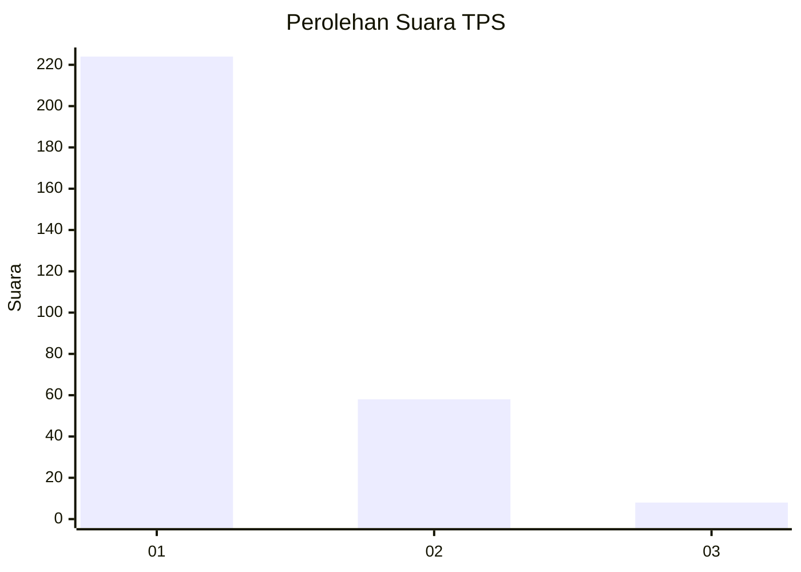
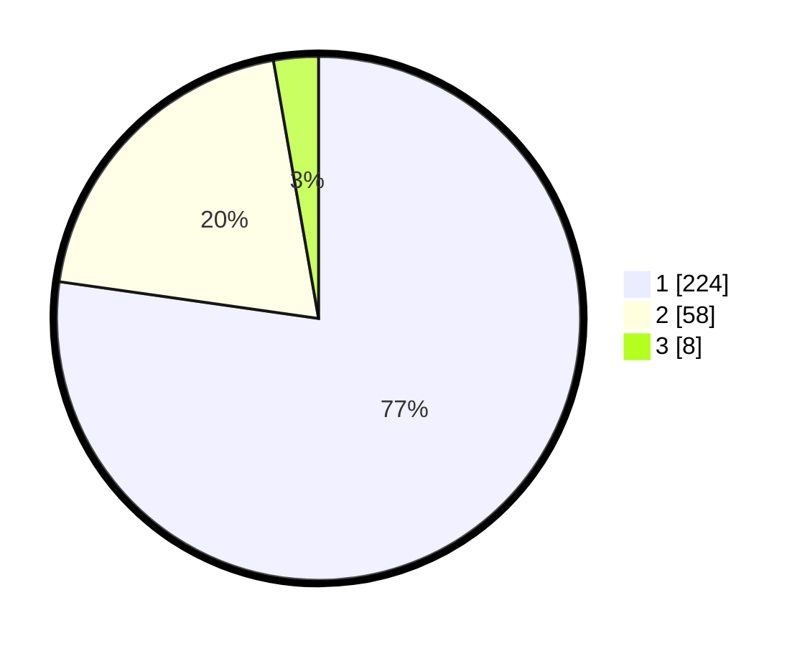

# Hasil

## Grafik

## Tabel

| No. | Nama Paslon    | Suara | Suara (raw) | Persentase |
|:--- |:-------------- | -----:| -----------:| ----------:|
| 1   | ANIES MUHAIMIN | 224   | [224][p-1]  | 77,24      |
| 2   | PRABOWO GIBRAN | 58    | [58][p-2]   | 20,00      |
| 3   | GANJAR MAHFUD  | 8     | [8][p-3]    | 2,76       |

[p-1]: https://github.com/gigit-pemilu/pemilu-2024-35-jawa-timur/blob/main/pilpres/hitung-suara/sub/35-jawa-timur/sub/27-sampang/sub/05-omben/sub/2011-kamondung/sub/014-tps/sub/paslon-1.txt
[p-2]: https://github.com/gigit-pemilu/pemilu-2024-35-jawa-timur/blob/main/pilpres/hitung-suara/sub/35-jawa-timur/sub/27-sampang/sub/05-omben/sub/2011-kamondung/sub/014-tps/sub/paslon-2.txt
[p-3]: https://github.com/gigit-pemilu/pemilu-2024-35-jawa-timur/blob/main/pilpres/hitung-suara/sub/35-jawa-timur/sub/27-sampang/sub/05-omben/sub/2011-kamondung/sub/014-tps/sub/paslon-3.txt

## Foto C Plano

https://sirekap-obj-formc.kpu.go.id/9868/pemilu/ppwp/35/27/05/20/11/3527052011014-20240215-114431--e984eb44-081c-4ca0-a900-911353694a8b.jpg

https://sirekap-obj-formc.kpu.go.id/9868/pemilu/ppwp/35/27/05/20/11/3527052011014-20240215-082401--3ab77c41-316e-4c4c-b411-135e2abc9d15.jpg

https://sirekap-obj-formc.kpu.go.id/9868/pemilu/ppwp/35/27/05/20/11/3527052011014-20240215-082555--5250d535-1943-4136-ac17-35446aa8be4b.jpg

## Metadata

| Key        | Value               |
| ---------- | ------------------- |
| Time Stamp | 2024-02-17 10:00:02 |

