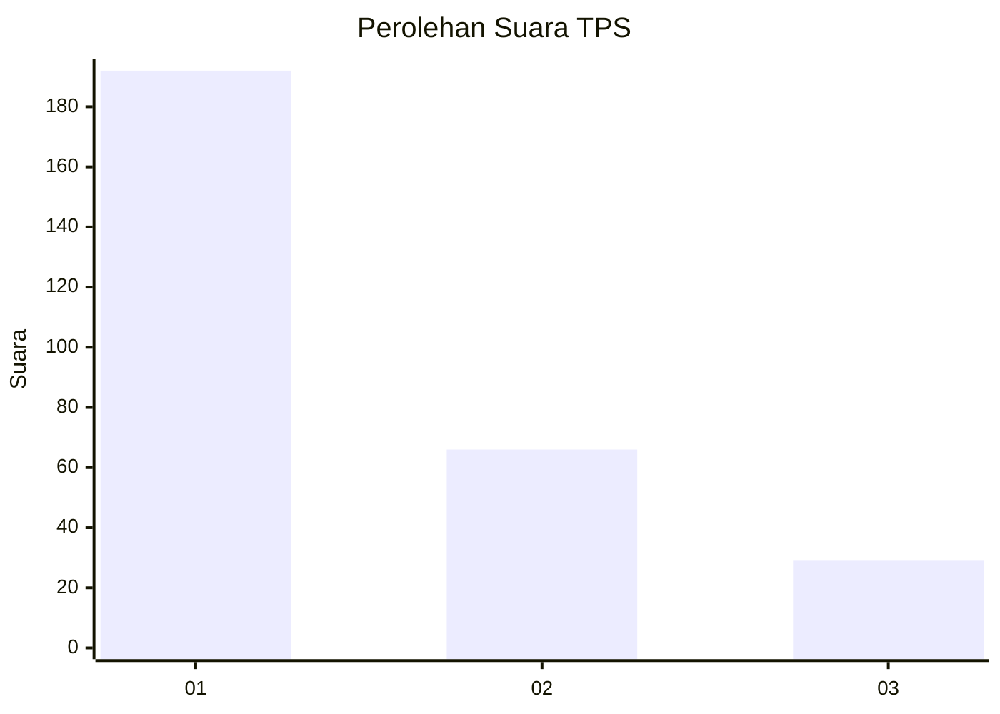
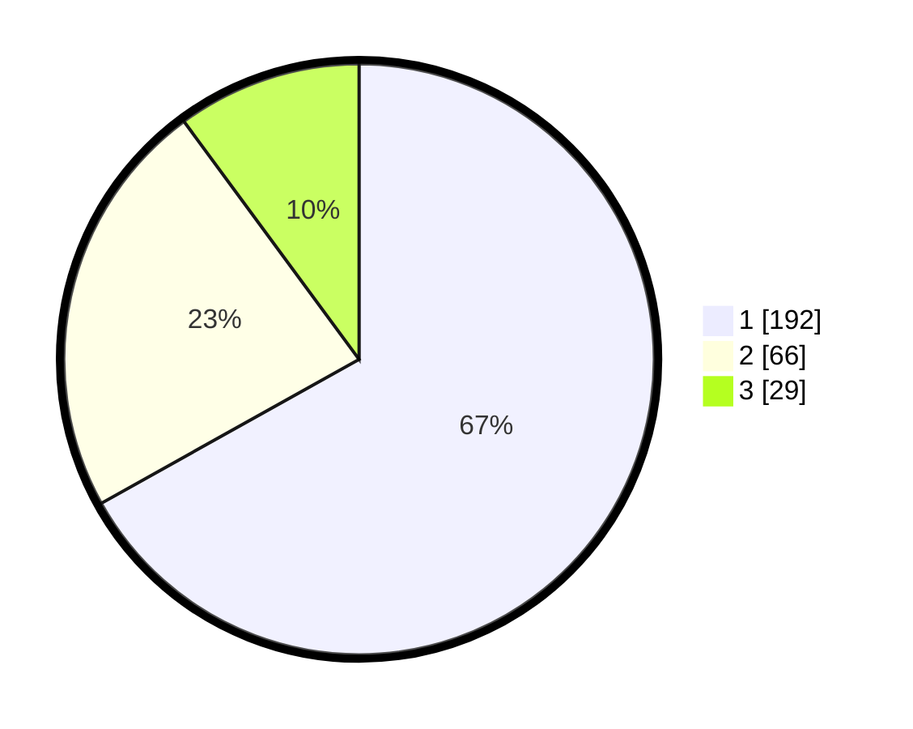

# Hasil

## Grafik

## Tabel

| No. | Nama Paslon    | Suara | Suara (raw) | Persentase |
|:--- |:-------------- | -----:| -----------:| ----------:|
| 1   | ANIES MUHAIMIN | 192   | [192][p-1]  | 66,90      |
| 2   | PRABOWO GIBRAN | 66    | [66][p-2]   | 23,00      |
| 3   | GANJAR MAHFUD  | 29    | [29][p-3]   | 10,10      |

[p-1]: https://github.com/gigit-pemilu/pemilu-2024-35-jawa-timur/blob/main/pilpres/hitung-suara/sub/35-jawa-timur/sub/27-sampang/sub/05-omben/sub/2011-kamondung/sub/015-tps/sub/paslon-1.txt
[p-2]: https://github.com/gigit-pemilu/pemilu-2024-35-jawa-timur/blob/main/pilpres/hitung-suara/sub/35-jawa-timur/sub/27-sampang/sub/05-omben/sub/2011-kamondung/sub/015-tps/sub/paslon-2.txt
[p-3]: https://github.com/gigit-pemilu/pemilu-2024-35-jawa-timur/blob/main/pilpres/hitung-suara/sub/35-jawa-timur/sub/27-sampang/sub/05-omben/sub/2011-kamondung/sub/015-tps/sub/paslon-3.txt

## Foto C Plano

https://sirekap-obj-formc.kpu.go.id/ada8/pemilu/ppwp/35/27/05/20/11/3527052011015-20240214-225206--2a0aadfa-aa91-4146-b21e-5037b679be57.jpg

https://sirekap-obj-formc.kpu.go.id/ada8/pemilu/ppwp/35/27/05/20/11/3527052011015-20240214-225357--16ff615a-a117-4114-bff6-19836f33f86a.jpg

https://sirekap-obj-formc.kpu.go.id/ada8/pemilu/ppwp/35/27/05/20/11/3527052011015-20240214-225511--d6b758aa-95fd-4d52-84a7-47e19716a3ad.jpg

## Metadata

| Key        | Value               |
| ---------- | ------------------- |
| Time Stamp | 2024-02-24 22:31:28 |

