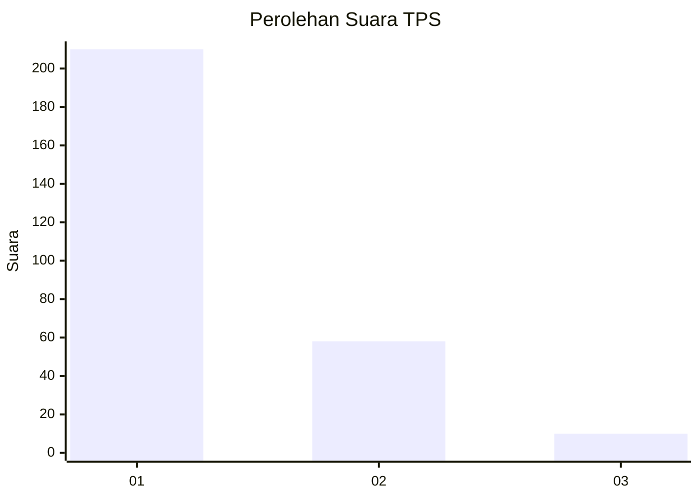
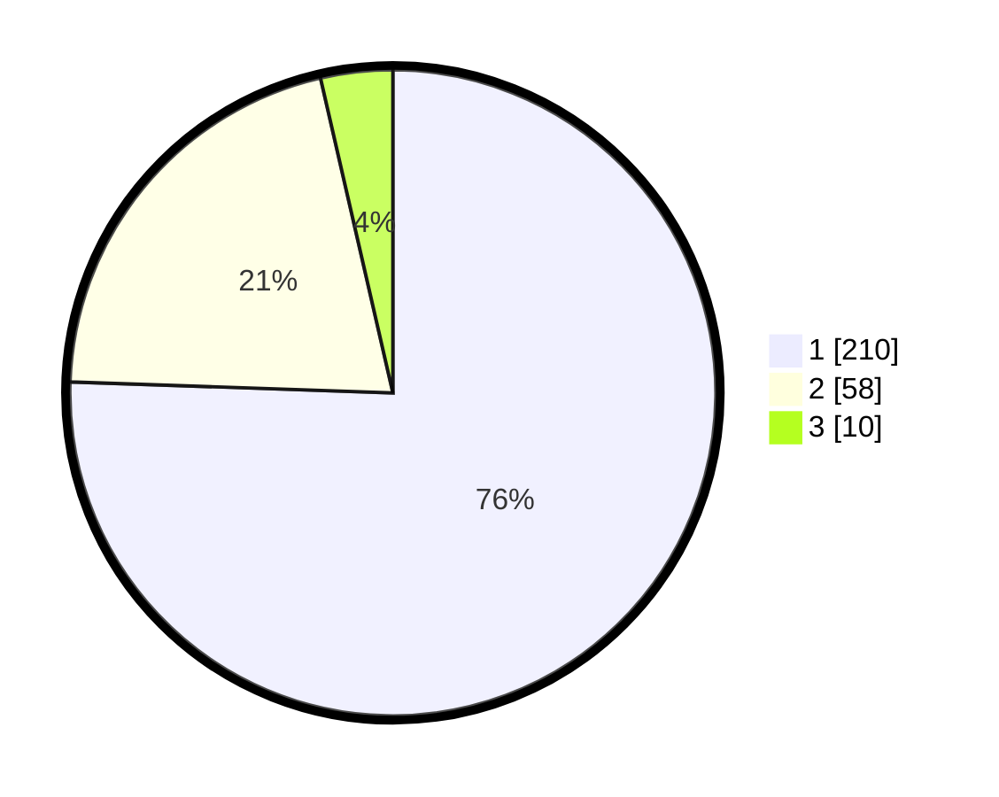

# Hasil

## Grafik

## Tabel

| No. | Nama Paslon    | Suara | Suara (raw) | Persentase |
|:--- |:-------------- | -----:| -----------:| ----------:|
| 1   | ANIES MUHAIMIN | 210   | [210][p-1]  | 75,54      |
| 2   | PRABOWO GIBRAN | 58    | [58][p-2]   | 20,86      |
| 3   | GANJAR MAHFUD  | 10    | [10][p-3]   | 3,60       |

[p-1]: https://github.com/gigit-pemilu/pemilu-2024/blob/main/pilpres/hitung-suara/sub/35-jawa-timur/sub/27-sampang/sub/05-omben/sub/2011-kamondung/sub/017-tps/sub/paslon-1.txt
[p-2]: https://github.com/gigit-pemilu/pemilu-2024/blob/main/pilpres/hitung-suara/sub/35-jawa-timur/sub/27-sampang/sub/05-omben/sub/2011-kamondung/sub/017-tps/sub/paslon-2.txt
[p-3]: https://github.com/gigit-pemilu/pemilu-2024/blob/main/pilpres/hitung-suara/sub/35-jawa-timur/sub/27-sampang/sub/05-omben/sub/2011-kamondung/sub/017-tps/sub/paslon-3.txt

## Foto C Plano

https://sirekap-obj-formc.kpu.go.id/3ced/pemilu/ppwp/35/27/05/20/11/3527052011017-20240215-074408--981e245f-db5c-4d4c-903b-8f4599241c6b.jpg

https://sirekap-obj-formc.kpu.go.id/3ced/pemilu/ppwp/35/27/05/20/11/3527052011017-20240215-074510--35f56764-d3b4-4792-9228-1aed2e3c21dc.jpg

https://sirekap-obj-formc.kpu.go.id/3ced/pemilu/ppwp/35/27/05/20/11/3527052011017-20240215-074530--18e2aa88-71f4-470a-b2a0-d64b44f6796a.jpg

## Metadata

| Key        | Value               |
| ---------- | ------------------- |
| Time Stamp | 2024-02-16 22:30:00 |

