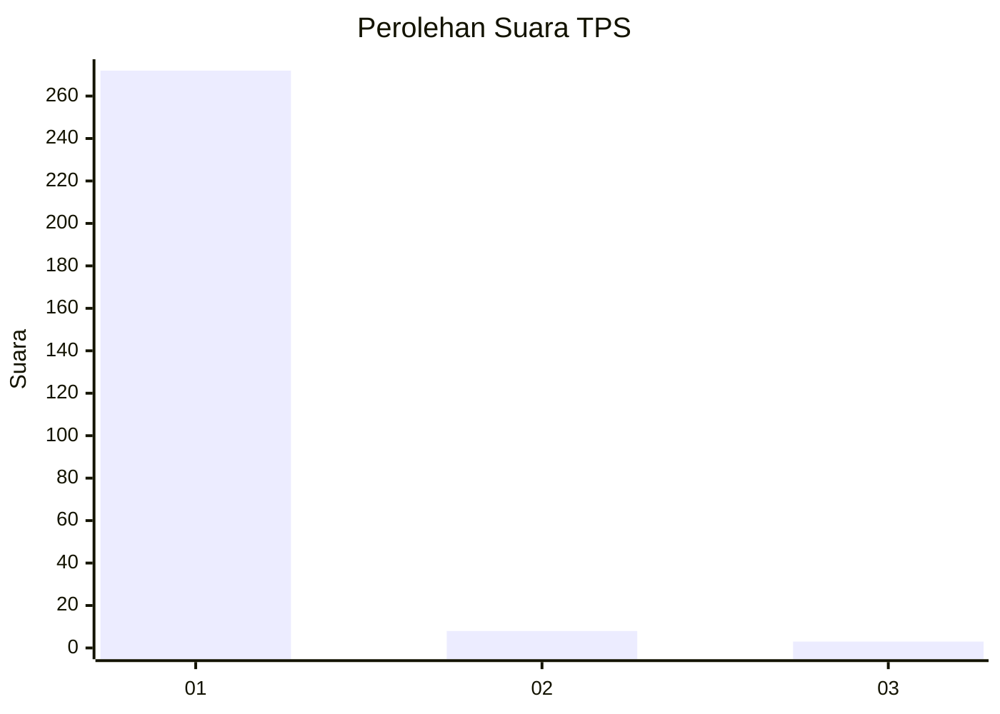
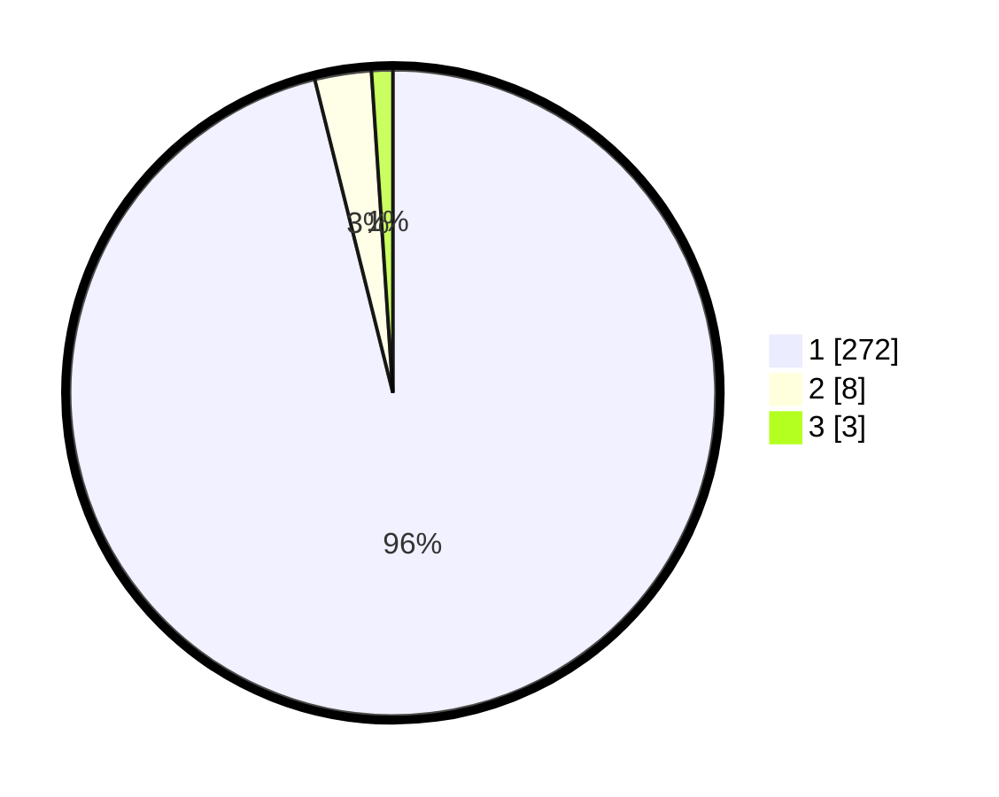

# Hasil

## Grafik

## Tabel

| No. | Nama Paslon    | Suara | Suara (raw) | Persentase |
|:--- |:-------------- | -----:| -----------:| ----------:|
| 1   | ANIES MUHAIMIN | 272   | [272][p-1]  | 96,11      |
| 2   | PRABOWO GIBRAN | 8     | [8][p-2]    | 2,83       |
| 3   | GANJAR MAHFUD  | 3     | [3][p-3]    | 1,06       |

[p-1]: https://github.com/gigit-pemilu/pemilu-2024-35-jawa-timur/blob/main/pilpres/hitung-suara/sub/35-jawa-timur/sub/27-sampang/sub/05-omben/sub/2011-kamondung/sub/018-tps/sub/paslon-1.txt
[p-2]: https://github.com/gigit-pemilu/pemilu-2024-35-jawa-timur/blob/main/pilpres/hitung-suara/sub/35-jawa-timur/sub/27-sampang/sub/05-omben/sub/2011-kamondung/sub/018-tps/sub/paslon-2.txt
[p-3]: https://github.com/gigit-pemilu/pemilu-2024-35-jawa-timur/blob/main/pilpres/hitung-suara/sub/35-jawa-timur/sub/27-sampang/sub/05-omben/sub/2011-kamondung/sub/018-tps/sub/paslon-3.txt

## Foto C Plano

https://sirekap-obj-formc.kpu.go.id/378d/pemilu/ppwp/35/27/05/20/11/3527052011018-20240214-204241--cb83e4a9-b758-4166-b2a1-4c7bdba7a805.jpg

https://sirekap-obj-formc.kpu.go.id/378d/pemilu/ppwp/35/27/05/20/11/3527052011018-20240214-204529--3fa9d932-d3aa-4daf-a63e-03ba1c4b194d.jpg

https://sirekap-obj-formc.kpu.go.id/378d/pemilu/ppwp/35/27/05/20/11/3527052011018-20240214-205207--7bdf1edf-663e-4dcf-a8f0-dede3265f811.jpg

## Metadata

| Key        | Value               |
| ---------- | ------------------- |
| Time Stamp | 2024-02-17 10:00:02 |

