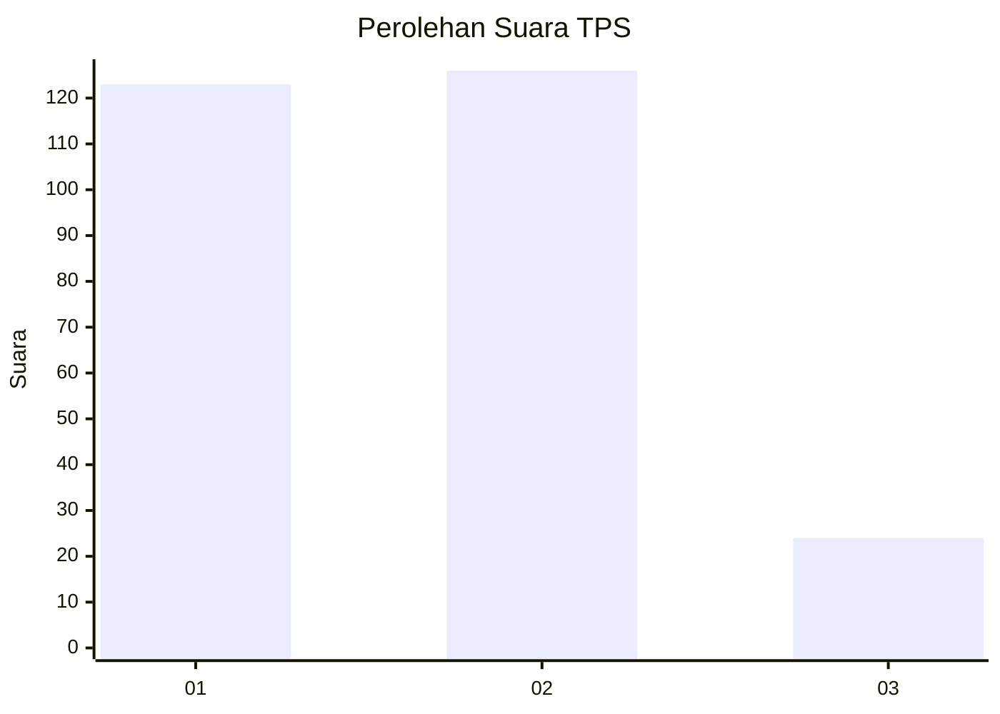
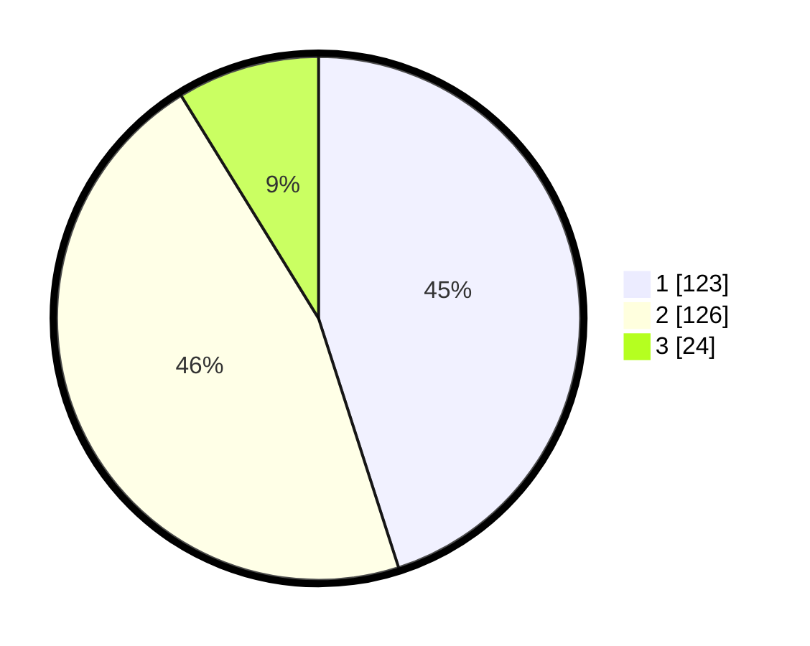

# Hasil

## Grafik

## Tabel

| No. | Nama Paslon    | Suara | Suara (raw) | Persentase |
|:--- |:-------------- | -----:| -----------:| ----------:|
| 1   | ANIES MUHAIMIN | 123   | [123][p-1]  | 45,05      |
| 2   | PRABOWO GIBRAN | 126   | [126][p-2]  | 46,15      |
| 3   | GANJAR MAHFUD  | 24    | [24][p-3]   | 8,79       |

[p-1]: https://github.com/gigit-pemilu/pemilu-2024-35-jawa-timur/blob/main/pilpres/hitung-suara/sub/35-jawa-timur/sub/27-sampang/sub/05-omben/sub/2012-omben/sub/004-tps/sub/paslon-1.txt
[p-2]: https://github.com/gigit-pemilu/pemilu-2024-35-jawa-timur/blob/main/pilpres/hitung-suara/sub/35-jawa-timur/sub/27-sampang/sub/05-omben/sub/2012-omben/sub/004-tps/sub/paslon-2.txt
[p-3]: https://github.com/gigit-pemilu/pemilu-2024-35-jawa-timur/blob/main/pilpres/hitung-suara/sub/35-jawa-timur/sub/27-sampang/sub/05-omben/sub/2012-omben/sub/004-tps/sub/paslon-3.txt

## Foto C Plano

https://sirekap-obj-formc.kpu.go.id/895a/pemilu/ppwp/35/27/05/20/12/3527052012004-20240214-215437--c4c0b8a3-c038-44e9-b4f0-704661aeb295.jpg

https://sirekap-obj-formc.kpu.go.id/895a/pemilu/ppwp/35/27/05/20/12/3527052012004-20240214-212742--cc2fc0de-95c3-44f6-8aa0-57568943f13f.jpg

https://sirekap-obj-formc.kpu.go.id/895a/pemilu/ppwp/35/27/05/20/12/3527052012004-20240214-211942--f714468c-2da5-4366-aeec-40349aab322e.jpg

## Metadata

| Key        | Value               |
| ---------- | ------------------- |
| Time Stamp | 2024-02-17 10:00:02 |

