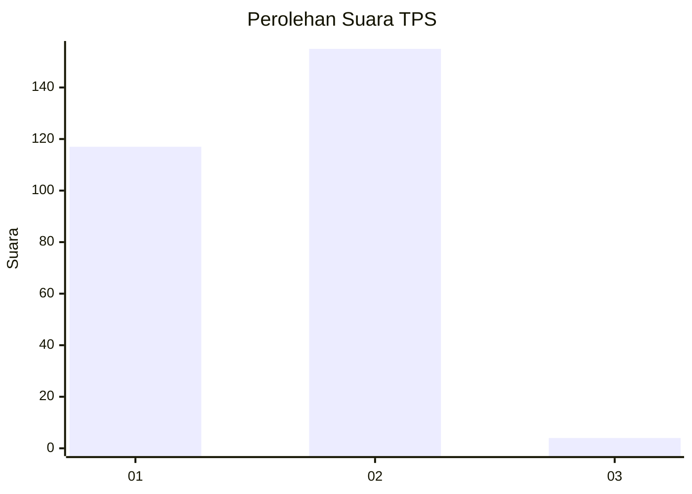
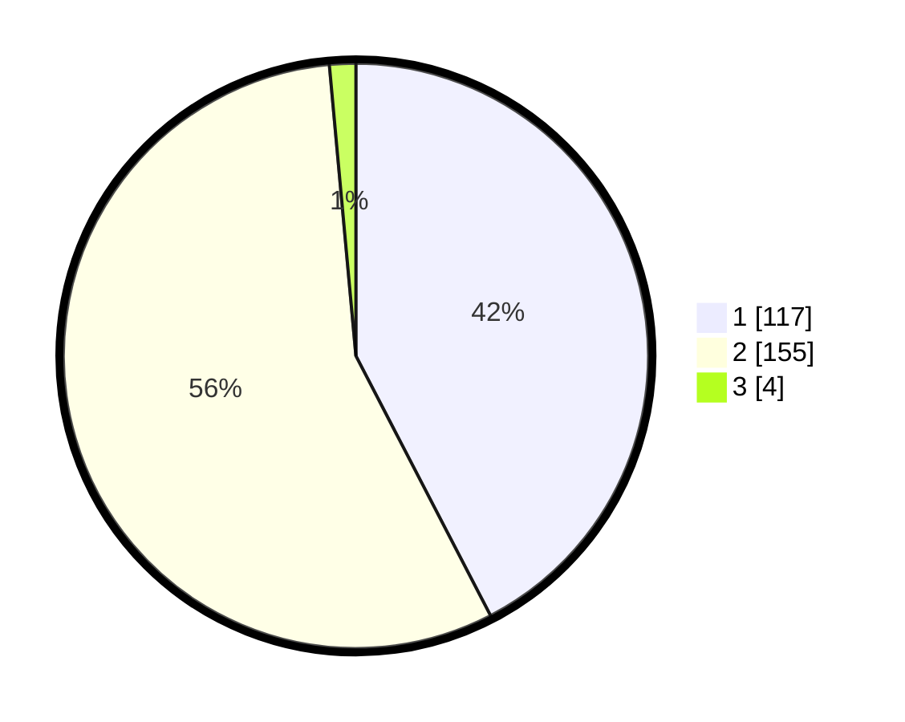

# Hasil

## Grafik

## Tabel

| No. | Nama Paslon    | Suara | Suara (raw) | Persentase |
|:--- |:-------------- | -----:| -----------:| ----------:|
| 1   | ANIES MUHAIMIN | 117   | [117][p-1]  | 42,39      |
| 2   | PRABOWO GIBRAN | 155   | [155][p-2]  | 56,16      |
| 3   | GANJAR MAHFUD  | 4     | [4][p-3]    | 1,45       |

[p-1]: https://github.com/gigit-pemilu/pemilu-2024/blob/main/pilpres/hitung-suara/sub/35-jawa-timur/sub/27-sampang/sub/05-omben/sub/2012-omben/sub/005-tps/sub/paslon-1.txt
[p-2]: https://github.com/gigit-pemilu/pemilu-2024/blob/main/pilpres/hitung-suara/sub/35-jawa-timur/sub/27-sampang/sub/05-omben/sub/2012-omben/sub/005-tps/sub/paslon-2.txt
[p-3]: https://github.com/gigit-pemilu/pemilu-2024/blob/main/pilpres/hitung-suara/sub/35-jawa-timur/sub/27-sampang/sub/05-omben/sub/2012-omben/sub/005-tps/sub/paslon-3.txt

## Foto C Plano

https://sirekap-obj-formc.kpu.go.id/0eac/pemilu/ppwp/35/27/05/20/12/3527052012005-20240214-233801--88384812-60bc-4711-9630-274f9272565e.jpg

https://sirekap-obj-formc.kpu.go.id/0eac/pemilu/ppwp/35/27/05/20/12/3527052012005-20240214-234033--d11777ba-8edf-438a-92ec-dfe8e0483c67.jpg

https://sirekap-obj-formc.kpu.go.id/0eac/pemilu/ppwp/35/27/05/20/12/3527052012005-20240214-235622--b451a585-4388-42eb-9e11-8fcfc5d944c7.jpg

## Metadata

| Key        | Value               |
| ---------- | ------------------- |
| Time Stamp | 2024-02-16 22:30:00 |

