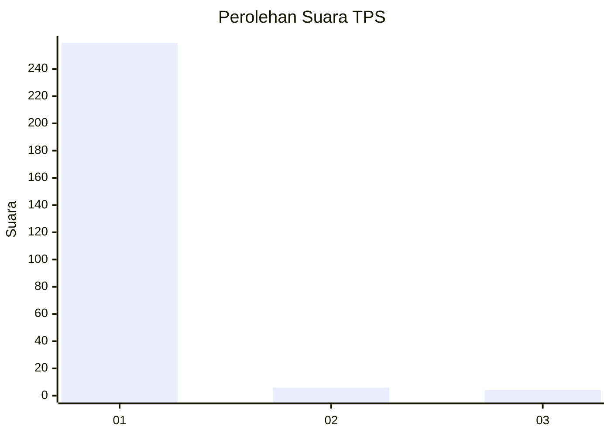
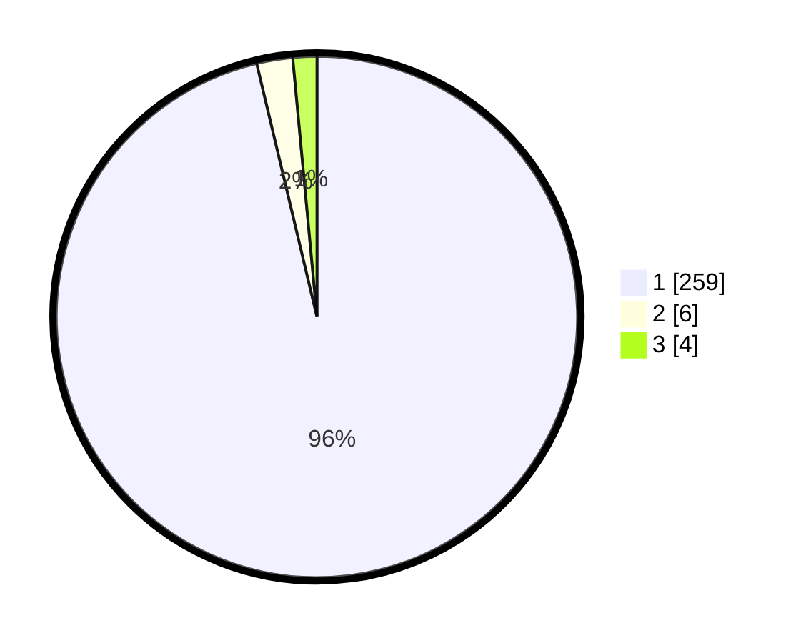

# Hasil

## Grafik

## Tabel

| No. | Nama Paslon    | Suara | Suara (raw) | Persentase |
|:--- |:-------------- | -----:| -----------:| ----------:|
| 1   | ANIES MUHAIMIN | 259   | [259][p-1]  | 96,28      |
| 2   | PRABOWO GIBRAN | 6     | [6][p-2]    | 2,23       |
| 3   | GANJAR MAHFUD  | 4     | [4][p-3]    | 1,49       |

[p-1]: https://github.com/gigit-pemilu/pemilu-2024/blob/main/pilpres/hitung-suara/sub/35-jawa-timur/sub/27-sampang/sub/05-omben/sub/2014-angsokah/sub/005-tps/sub/paslon-1.txt
[p-2]: https://github.com/gigit-pemilu/pemilu-2024/blob/main/pilpres/hitung-suara/sub/35-jawa-timur/sub/27-sampang/sub/05-omben/sub/2014-angsokah/sub/005-tps/sub/paslon-2.txt
[p-3]: https://github.com/gigit-pemilu/pemilu-2024/blob/main/pilpres/hitung-suara/sub/35-jawa-timur/sub/27-sampang/sub/05-omben/sub/2014-angsokah/sub/005-tps/sub/paslon-3.txt

## Foto C Plano

https://sirekap-obj-formc.kpu.go.id/975d/pemilu/ppwp/35/27/05/20/14/3527052014005-20240215-020355--7c6a67d8-d55c-4351-b799-e66452277afd.jpg

https://sirekap-obj-formc.kpu.go.id/975d/pemilu/ppwp/35/27/05/20/14/3527052014005-20240215-020742--20d850b1-3114-4027-9bb9-1059b6d0e637.jpg

https://sirekap-obj-formc.kpu.go.id/975d/pemilu/ppwp/35/27/05/20/14/3527052014005-20240215-021605--b5d36f3e-857a-43fd-8814-b1c5d97c3a5b.jpg

## Metadata

| Key        | Value               |
| ---------- | ------------------- |
| Time Stamp | 2024-02-25 12:00:00 |

