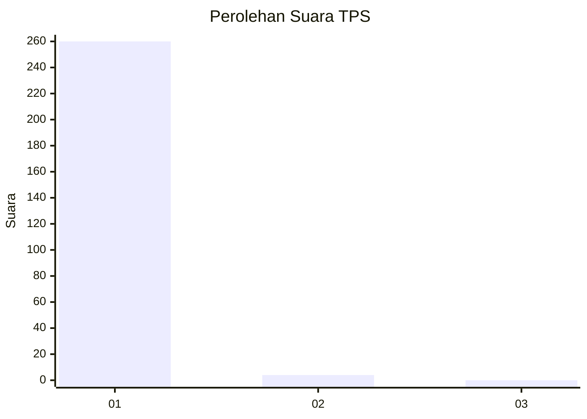
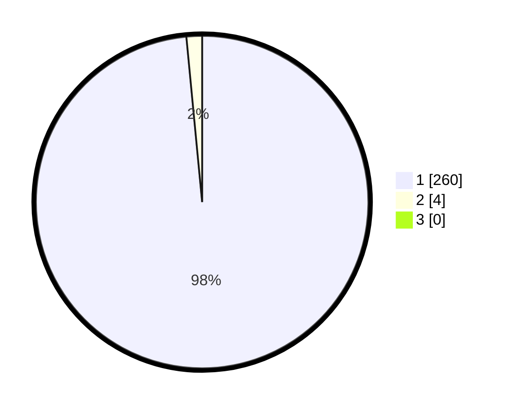

# Hasil

## Grafik

## Tabel

| No. | Nama Paslon    | Suara | Suara (raw) | Persentase |
|:--- |:-------------- | -----:| -----------:| ----------:|
| 1   | ANIES MUHAIMIN | 260   | [260][p-1]  | 98,48      |
| 2   | PRABOWO GIBRAN | 4     | [4][p-2]    | 1,52       |
| 3   | GANJAR MAHFUD  | 0     | [0][p-3]    | 0,00       |

[p-1]: https://github.com/gigit-pemilu/pemilu-2024-35-jawa-timur/blob/main/pilpres/hitung-suara/sub/35-jawa-timur/sub/27-sampang/sub/05-omben/sub/2014-angsokah/sub/006-tps/sub/paslon-1.txt
[p-2]: https://github.com/gigit-pemilu/pemilu-2024-35-jawa-timur/blob/main/pilpres/hitung-suara/sub/35-jawa-timur/sub/27-sampang/sub/05-omben/sub/2014-angsokah/sub/006-tps/sub/paslon-2.txt
[p-3]: https://github.com/gigit-pemilu/pemilu-2024-35-jawa-timur/blob/main/pilpres/hitung-suara/sub/35-jawa-timur/sub/27-sampang/sub/05-omben/sub/2014-angsokah/sub/006-tps/sub/paslon-3.txt

## Foto C Plano

https://sirekap-obj-formc.kpu.go.id/0420/pemilu/ppwp/35/27/05/20/14/3527052014006-20240215-120650--80a980f8-0508-4582-a49b-aef8af500c7b.jpg

https://sirekap-obj-formc.kpu.go.id/0420/pemilu/ppwp/35/27/05/20/14/3527052014006-20240215-120659--099b5be1-8abb-45c2-808e-91c24e30dd93.jpg

https://sirekap-obj-formc.kpu.go.id/0420/pemilu/ppwp/35/27/05/20/14/3527052014006-20240215-120708--cd3ee25e-f879-45b1-af37-7678c187ecd8.jpg

## Metadata

| Key        | Value               |
| ---------- | ------------------- |
| Time Stamp | 2024-02-16 22:30:00 |

