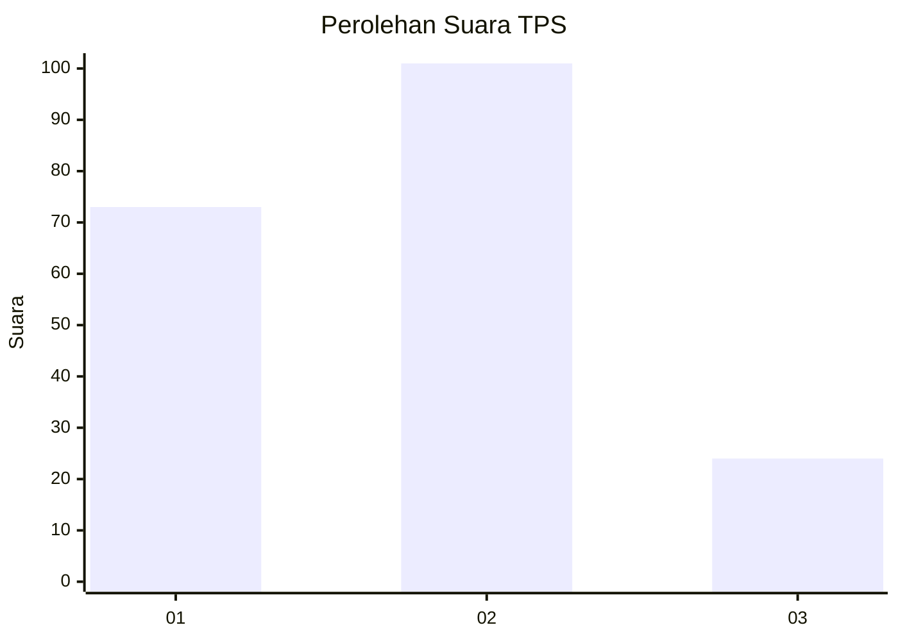
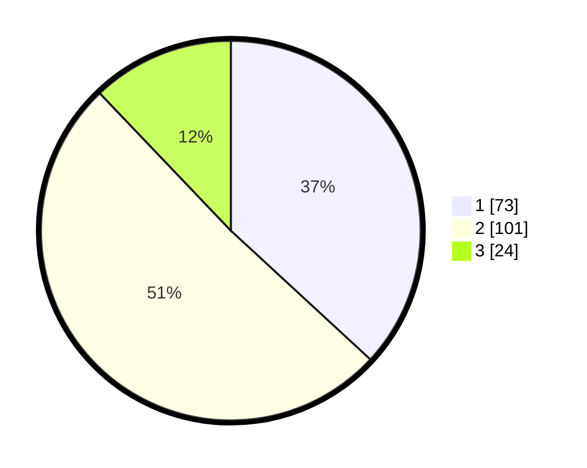

# Hasil

## Grafik

## Tabel

| No. | Nama Paslon    | Suara | Suara (raw) | Persentase |
|:--- |:-------------- | -----:| -----------:| ----------:|
| 1   | ANIES MUHAIMIN | 73    | [73][p-1]   | 36,87      |
| 2   | PRABOWO GIBRAN | 101   | [101][p-2]  | 51,01      |
| 3   | GANJAR MAHFUD  | 24    | [24][p-3]   | 12,12      |

[p-1]: https://github.com/gigit-pemilu/pemilu-2024-35-jawa-timur/blob/main/pilpres/hitung-suara/sub/35-jawa-timur/sub/27-sampang/sub/05-omben/sub/2014-angsokah/sub/009-tps/sub/paslon-1.txt
[p-2]: https://github.com/gigit-pemilu/pemilu-2024-35-jawa-timur/blob/main/pilpres/hitung-suara/sub/35-jawa-timur/sub/27-sampang/sub/05-omben/sub/2014-angsokah/sub/009-tps/sub/paslon-2.txt
[p-3]: https://github.com/gigit-pemilu/pemilu-2024-35-jawa-timur/blob/main/pilpres/hitung-suara/sub/35-jawa-timur/sub/27-sampang/sub/05-omben/sub/2014-angsokah/sub/009-tps/sub/paslon-3.txt

## Foto C Plano

https://sirekap-obj-formc.kpu.go.id/9462/pemilu/ppwp/35/27/05/20/14/3527052014009-20240215-072014--d7152948-54ad-4e2e-b315-e5f7bbf66ddd.jpg

https://sirekap-obj-formc.kpu.go.id/9462/pemilu/ppwp/35/27/05/20/14/3527052014009-20240215-075111--5b2f0c81-29c3-401d-b38d-5ac674daf44a.jpg

https://sirekap-obj-formc.kpu.go.id/9462/pemilu/ppwp/35/27/05/20/14/3527052014009-20240215-074921--8892d001-c213-476e-a6e6-10ca3a493fa3.jpg

## Metadata

| Key        | Value               |
| ---------- | ------------------- |
| Time Stamp | 2024-02-16 22:30:00 |

