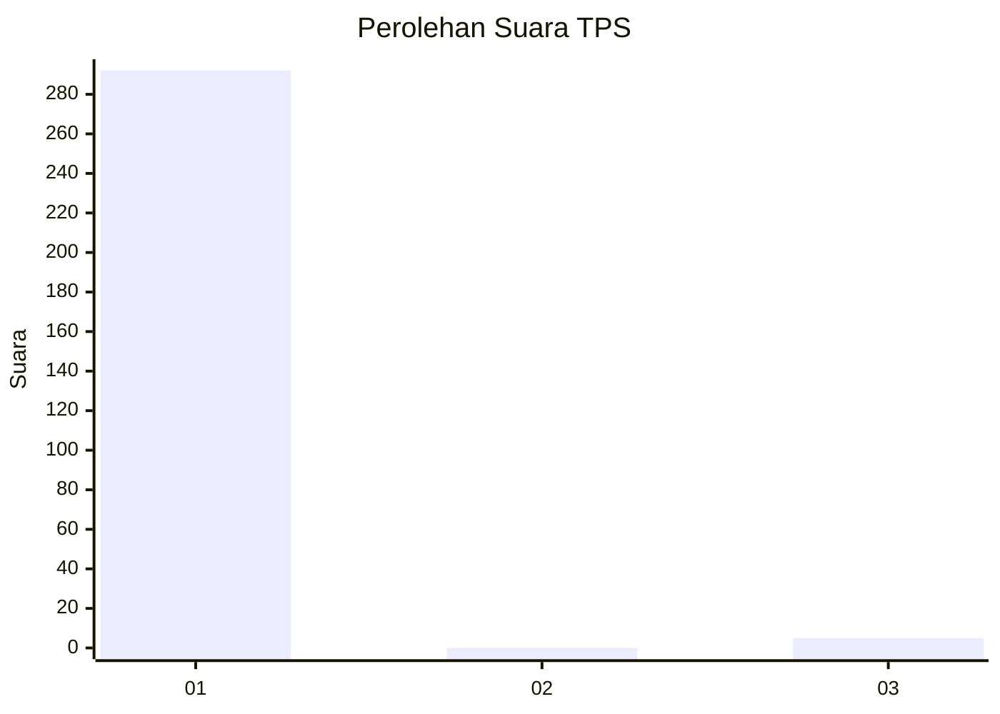
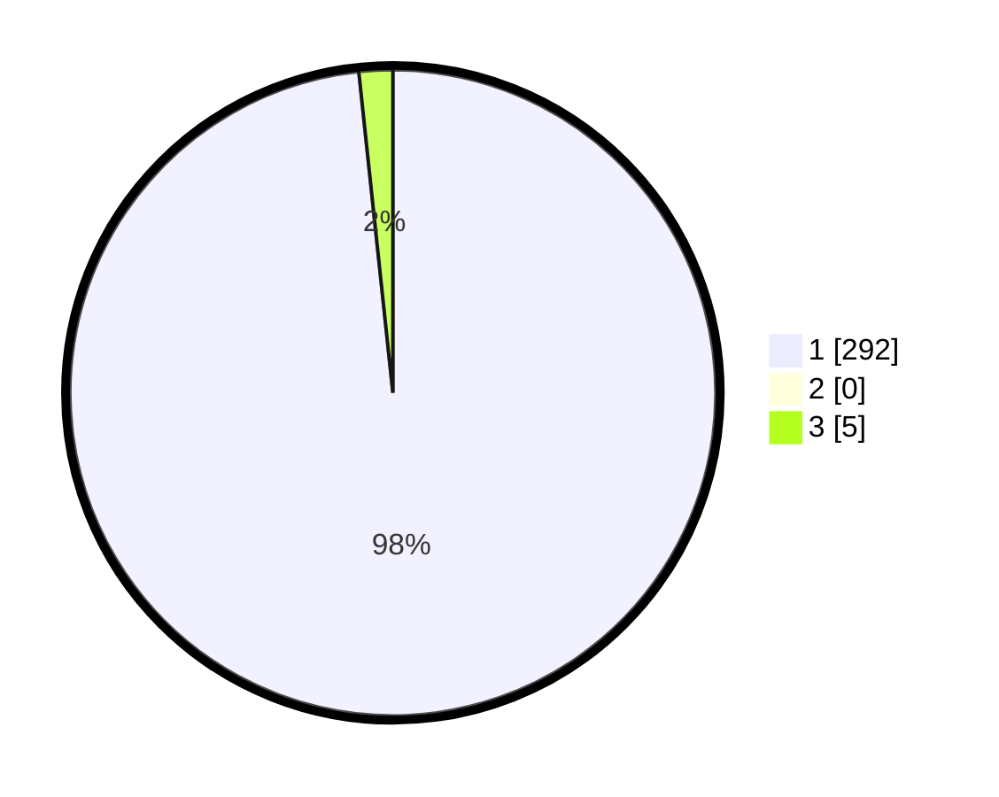

# Hasil

## Grafik

## Tabel

| No. | Nama Paslon    | Suara | Suara (raw) | Persentase |
|:--- |:-------------- | -----:| -----------:| ----------:|
| 1   | ANIES MUHAIMIN | 292   | [292][p-1]  | 98,32      |
| 2   | PRABOWO GIBRAN | 0     | [0][p-2]    | 0,00       |
| 3   | GANJAR MAHFUD  | 5     | [5][p-3]    | 1,68       |

[p-1]: https://github.com/gigit-pemilu/pemilu-2024/blob/main/pilpres/hitung-suara/sub/35-jawa-timur/sub/27-sampang/sub/05-omben/sub/2015-jranguan/sub/003-tps/sub/paslon-1.txt
[p-2]: https://github.com/gigit-pemilu/pemilu-2024/blob/main/pilpres/hitung-suara/sub/35-jawa-timur/sub/27-sampang/sub/05-omben/sub/2015-jranguan/sub/003-tps/sub/paslon-2.txt
[p-3]: https://github.com/gigit-pemilu/pemilu-2024/blob/main/pilpres/hitung-suara/sub/35-jawa-timur/sub/27-sampang/sub/05-omben/sub/2015-jranguan/sub/003-tps/sub/paslon-3.txt

## Foto C Plano

https://sirekap-obj-formc.kpu.go.id/dd00/pemilu/ppwp/35/27/05/20/15/3527052015003-20240214-194456--24101d12-2c7d-401b-baf8-a88c3e25aae9.jpg

https://sirekap-obj-formc.kpu.go.id/dd00/pemilu/ppwp/35/27/05/20/15/3527052015003-20240214-192651--692b0744-aa3b-49e6-8055-6ecd17c4781e.jpg

https://sirekap-obj-formc.kpu.go.id/dd00/pemilu/ppwp/35/27/05/20/15/3527052015003-20240214-192830--ae036c99-b6f8-455f-8e22-caa7ab80de97.jpg

## Metadata

| Key        | Value               |
| ---------- | ------------------- |
| Time Stamp | 2024-02-16 02:00:27 |

