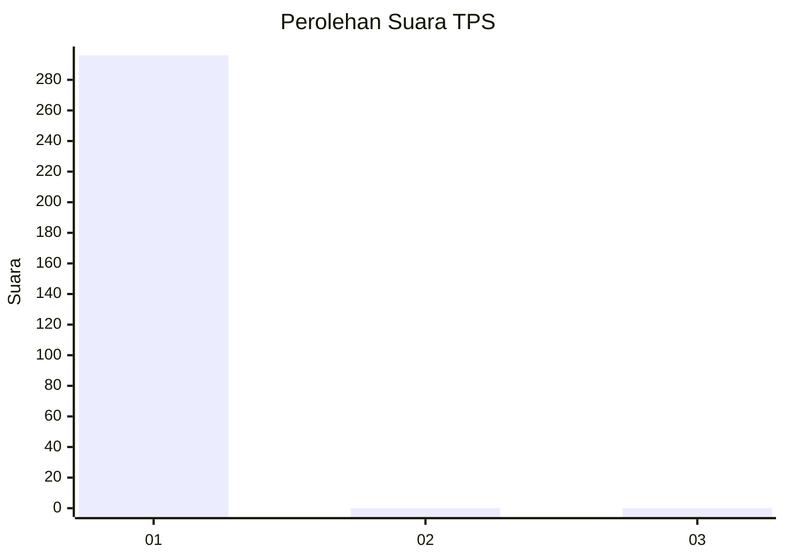
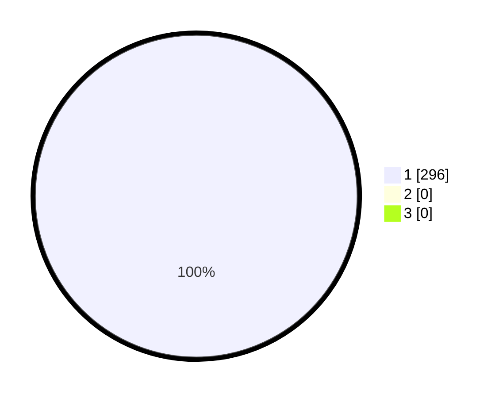

# Hasil

## Grafik

## Tabel

| No. | Nama Paslon    | Suara | Suara (raw) | Persentase |
|:--- |:-------------- | -----:| -----------:| ----------:|
| 1   | ANIES MUHAIMIN | 296   | [296][p-1]  | 100,00     |
| 2   | PRABOWO GIBRAN | 0     | [0][p-2]    | 0,00       |
| 3   | GANJAR MAHFUD  | 0     | [0][p-3]    | 0,00       |

[p-1]: https://github.com/gigit-pemilu/pemilu-2024/blob/main/pilpres/hitung-suara/sub/35-jawa-timur/sub/27-sampang/sub/05-omben/sub/2015-jranguan/sub/008-tps/sub/paslon-1.txt
[p-2]: https://github.com/gigit-pemilu/pemilu-2024/blob/main/pilpres/hitung-suara/sub/35-jawa-timur/sub/27-sampang/sub/05-omben/sub/2015-jranguan/sub/008-tps/sub/paslon-2.txt
[p-3]: https://github.com/gigit-pemilu/pemilu-2024/blob/main/pilpres/hitung-suara/sub/35-jawa-timur/sub/27-sampang/sub/05-omben/sub/2015-jranguan/sub/008-tps/sub/paslon-3.txt

## Foto C Plano

https://sirekap-obj-formc.kpu.go.id/9b9c/pemilu/ppwp/35/27/05/20/15/3527052015008-20240214-194301--4c6862f5-e563-43a3-88ec-1d40e0f47fe3.jpg

https://sirekap-obj-formc.kpu.go.id/9b9c/pemilu/ppwp/35/27/05/20/15/3527052015008-20240214-194404--0a378528-d715-4cbb-b788-305d96164b8e.jpg

https://sirekap-obj-formc.kpu.go.id/9b9c/pemilu/ppwp/35/27/05/20/15/3527052015008-20240214-194456--eb461eb8-001f-4aa2-8b28-42c0cc9eaa54.jpg

## Metadata

| Key        | Value               |
| ---------- | ------------------- |
| Time Stamp | 2024-02-16 22:30:00 |

