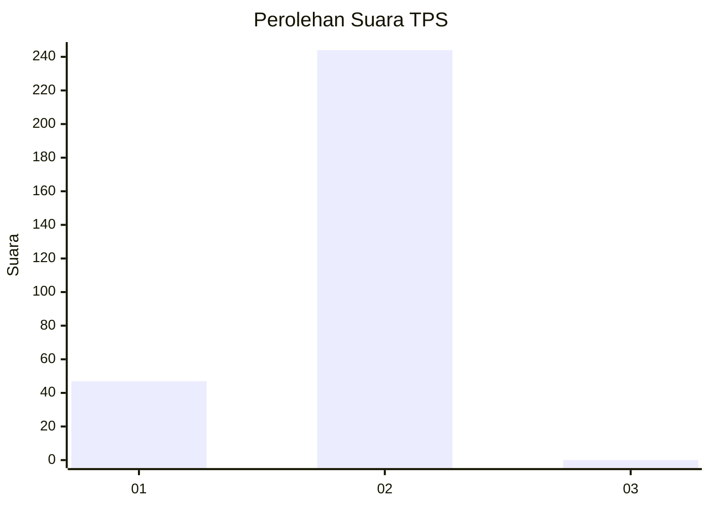
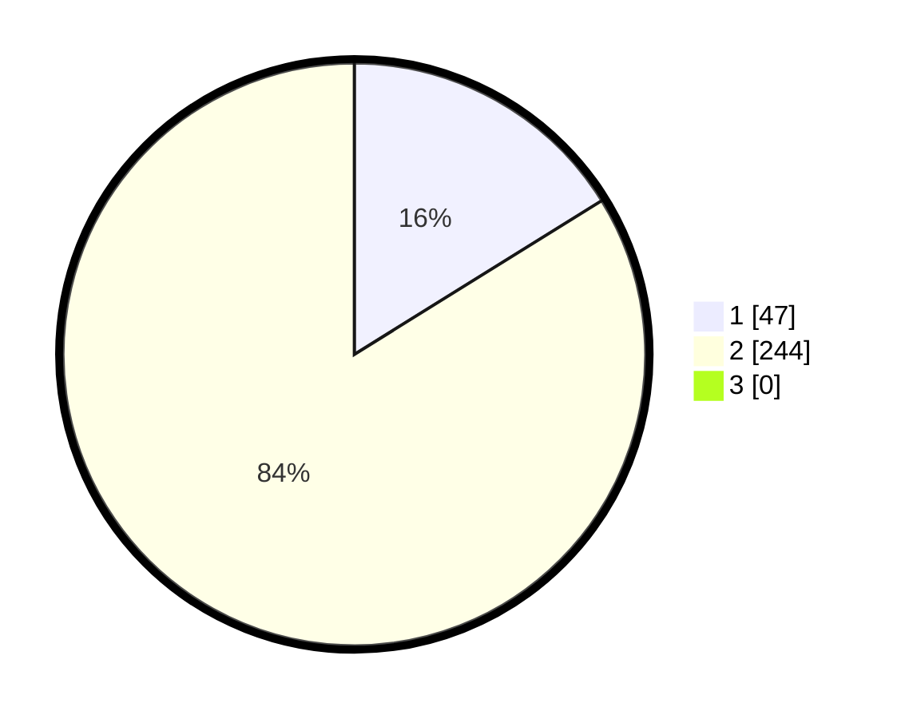

# Hasil

## Grafik

## Tabel

| No. | Nama Paslon    | Suara | Suara (raw) | Persentase |
|:--- |:-------------- | -----:| -----------:| ----------:|
| 1   | ANIES MUHAIMIN | 47    | [47][p-1]   | 16,15      |
| 2   | PRABOWO GIBRAN | 244   | [244][p-2]  | 83,85      |
| 3   | GANJAR MAHFUD  | 0     | [0][p-3]    | 0,00       |

[p-1]: https://github.com/gigit-pemilu/pemilu-2024/blob/main/pilpres/hitung-suara/sub/35-jawa-timur/sub/27-sampang/sub/05-omben/sub/2016-rongdalam/sub/003-tps/sub/paslon-1.txt
[p-2]: https://github.com/gigit-pemilu/pemilu-2024/blob/main/pilpres/hitung-suara/sub/35-jawa-timur/sub/27-sampang/sub/05-omben/sub/2016-rongdalam/sub/003-tps/sub/paslon-2.txt
[p-3]: https://github.com/gigit-pemilu/pemilu-2024/blob/main/pilpres/hitung-suara/sub/35-jawa-timur/sub/27-sampang/sub/05-omben/sub/2016-rongdalam/sub/003-tps/sub/paslon-3.txt

## Foto C Plano

https://sirekap-obj-formc.kpu.go.id/d767/pemilu/ppwp/35/27/05/20/16/3527052016003-20240215-083802--fac565fe-daa8-49a5-81fb-c36d5fe57116.jpg

https://sirekap-obj-formc.kpu.go.id/d767/pemilu/ppwp/35/27/05/20/16/3527052016003-20240215-083842--2c9ed3ca-277b-4fc0-adf0-9c347226c54a.jpg

https://sirekap-obj-formc.kpu.go.id/d767/pemilu/ppwp/35/27/05/20/16/3527052016003-20240215-083938--d2be92c6-4547-4181-8314-355c7a8098a7.jpg

## Metadata

| Key        | Value               |
| ---------- | ------------------- |
| Time Stamp | 2024-02-16 02:00:27 |

