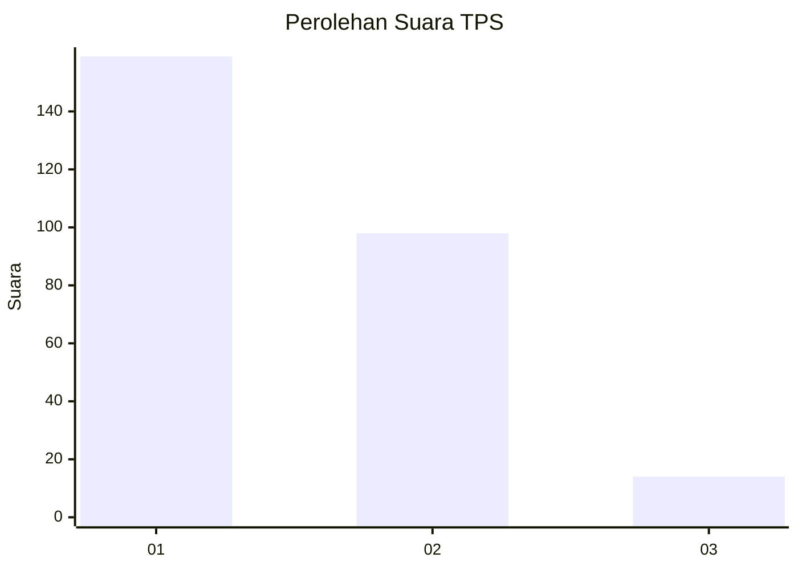
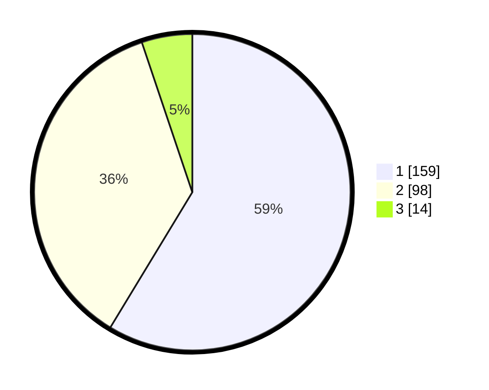

# Hasil

## Grafik

## Tabel

| No. | Nama Paslon    | Suara | Suara (raw) | Persentase |
|:--- |:-------------- | -----:| -----------:| ----------:|
| 1   | ANIES MUHAIMIN | 159   | [159][p-1]  | 58,67      |
| 2   | PRABOWO GIBRAN | 98    | [98][p-2]   | 36,16      |
| 3   | GANJAR MAHFUD  | 14    | [14][p-3]   | 5,17       |

[p-1]: https://github.com/gigit-pemilu/pemilu-2024-35-jawa-timur/blob/main/pilpres/hitung-suara/sub/35-jawa-timur/sub/27-sampang/sub/05-omben/sub/2016-rongdalam/sub/005-tps/sub/paslon-1.txt
[p-2]: https://github.com/gigit-pemilu/pemilu-2024-35-jawa-timur/blob/main/pilpres/hitung-suara/sub/35-jawa-timur/sub/27-sampang/sub/05-omben/sub/2016-rongdalam/sub/005-tps/sub/paslon-2.txt
[p-3]: https://github.com/gigit-pemilu/pemilu-2024-35-jawa-timur/blob/main/pilpres/hitung-suara/sub/35-jawa-timur/sub/27-sampang/sub/05-omben/sub/2016-rongdalam/sub/005-tps/sub/paslon-3.txt

## Foto C Plano

https://sirekap-obj-formc.kpu.go.id/45cd/pemilu/ppwp/35/27/05/20/16/3527052016005-20240215-095218--fac0f521-d830-4653-ab3c-98cc10a18e62.jpg

https://sirekap-obj-formc.kpu.go.id/45cd/pemilu/ppwp/35/27/05/20/16/3527052016005-20240215-095554--f4a01320-6076-4732-b095-d2dbfb8c0285.jpg

https://sirekap-obj-formc.kpu.go.id/45cd/pemilu/ppwp/35/27/05/20/16/3527052016005-20240215-095938--03aaf529-a9b8-4606-9e72-3dac2c293f50.jpg

## Metadata

| Key        | Value               |
| ---------- | ------------------- |
| Time Stamp | 2024-02-15 18:00:26 |

